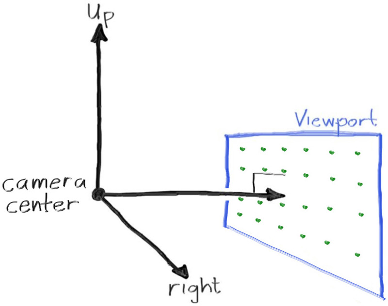

# 射线、简易相机与背景

## 射线类（ray）

所有的光线追踪器都有一个共同点：拥有一个表示“射线”的类，以及一个计算沿着该射线能看到什么颜色的函数。我们可以将射线视为一个函数：

**P(t) = A + t·b**

这里的 **P(t)** 是三维空间中的一个点，表示射线上的某个位置；**A** 是射线的起点（origin），**b** 是射线的方向（direction）；**t** 是一个实数（代码中为 `double`）。通过改变 **t**，我们就可以在射线上任意移动点的位置。负的 **t** 值表示 A 点前方，正的 **t** 表示 A 点之后的方向，这也正是“射线”一词的来源——射线只考虑 A 点之后的那一部分空间。


我们用一个类来表示射线，并实现一个函数 `ray::at(t)` 表示上面的 P(t)：

```cpp
#ifndef RAY_H
#define RAY_H

#include "vec3.h"

class ray {
  public:
    ray() {}

    ray(const point3& origin, const vec3& direction) : orig(origin), dir(direction) {}

    const point3& origin() const  { return orig; }
    const vec3& direction() const { return dir; }

    point3 at(double t) const {
        return orig + t * dir;
    }

  private:
    point3 orig;
    vec3 dir;
};

#endif
```

这就是 `ray.h` 文件中定义的 `ray` 类。

（注：对于不熟悉 C++ 的人来说，这些成员函数 `ray::origin()` 和 `ray::direction()` 返回的是对成员变量的常量引用。调用者可以直接使用引用，也可以复制出一个可修改的变量。）

* * *

## 向场景中发射射线

现在我们可以开始编写一个光线追踪器了。其核心思想是：

1. 计算从“眼睛”穿过每个像素的射线；
    
2. 判断射线与哪些物体相交；
    
3. 计算最近相交点的颜色。
    

在开发初期，我们先从一个简单的相机开始。

在调试过程中，使用方形图像（如 1:1）时容易将 x 和 y 混淆，所以我们选择一个非方形图像，最常见的是 16:9。16:9 的宽高比意味着：

**width / height = 16 / 9 ≈ 1.7778**

例如：800 × 400 就是 2:1 的宽高比。

我们通常指定图像的宽度和宽高比，然后计算出高度。这样我们可以通过调整宽度来缩放图像，而不会破坏原有的宽高比。同时我们确保高度至少为 1。

除了图像尺寸，还需要设置一个**虚拟视口**（viewport），这个视口是三维世界中的一个矩形，代表图像像素分布的范围。如果像素之间的水平与垂直间距相同，视口的宽高比就和图像一致。

我们设定视口高度为 2.0，根据宽高比来计算视口宽度：

```cpp
auto aspect_ratio = 16.0 / 9.0;
int image_width = 400;

int image_height = int(image_width / aspect_ratio);
image_height = (image_height < 1) ? 1 : image_height;

auto viewport_height = 2.0;
auto viewport_width = viewport_height * (double(image_width)/image_height);
```

注意：不能直接用 `aspect_ratio * viewport_height`，因为 `aspect_ratio` 是一个理想值，而 `image_height` 是取整后的整数，可能导致实际宽高比略有偏差。

* * *

接下来定义相机中心：一个在三维空间中的点，所有射线从这里发出（也叫“眼点”）。相机中心到视口中心的向量与视口正交。我们设置该距离为 1，称为“焦距”（focal length）。

默认使用右手坐标系，相机在 (0,0,0)，Y 轴向上，X 轴向右，Z 轴负方向为视线方向。



* * *


图像坐标系通常是左上为原点，Y 轴向下，而三维空间中 Y 向上，因此两者不一致。

我们将从图像的左上角像素 (0,0) 开始，逐行逐列地扫描每个像素。为了实现这一过程，需要定义：

* 从左到右的向量 `Vu`（viewport_u）
    
* 从上到下的向量 `Vv`（viewport_v）
    
* 像素步长（Δu 和 Δv）
    

我们定义好视口左上角的位置，并计算第一个像素中心位置：

```cpp
auto focal_length = 1.0;
auto viewport_height = 2.0;
auto viewport_width = viewport_height * (double(image_width)/image_height);
auto camera_center = point3(0, 0, 0);

auto viewport_u = vec3(viewport_width, 0, 0);
auto viewport_v = vec3(0, -viewport_height, 0);

auto pixel_delta_u = viewport_u / image_width;
auto pixel_delta_v = viewport_v / image_height;

auto viewport_upper_left = camera_center
                         - vec3(0, 0, focal_length) - viewport_u/2 - viewport_v/2;
auto pixel00_loc = viewport_upper_left + 0.5 * (pixel_delta_u + pixel_delta_v);
```

* * *

然后开始渲染：

```cpp
std::cout << "P3\n" << image_width << " " << image_height << "\n255\n";

for (int j = 0; j < image_height; j++) {
    std::clog << "\rScanlines remaining: " << (image_height - j) << ' ' << std::flush;
    for (int i = 0; i < image_width; i++) {
        auto pixel_center = pixel00_loc + (i * pixel_delta_u) + (j * pixel_delta_v);
        auto ray_direction = pixel_center - camera_center;
        ray r(camera_center, ray_direction);

        color pixel_color = ray_color(r);
        write_color(std::cout, pixel_color);
    }
}
std::clog << "\rDone.                 \n";
```

上面我们暂时没有将 `ray_direction` 单位化，这是为了让代码更简洁高效。

* * *

## 实现渐变背景

现在来填充 `ray_color(ray)` 函数，创建一个简单的蓝-白渐变背景。我们对射线方向单位化后，使用 y 分量做线性插值：

```cpp
color ray_color(const ray& r) {
    vec3 unit_direction = unit_vector(r.direction());
    auto a = 0.5*(unit_direction.y() + 1.0);
    return (1.0-a)*color(1.0, 1.0, 1.0) + a*color(0.5, 0.7, 1.0);
}
```

当 a=1.0 时为蓝色；a=0.0 时为白色；中间为线性混合。

这个过程就是图形学中常用的“线性插值”（linear interpolation 或 lerp）：

**blended = (1-a)·start + a·end**

这样就得到了一个从白色渐变到蓝色的背景效果。

