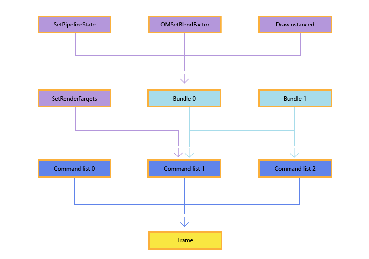

创建和记录命令列表与 Bundle
=================

2025年3月5日

本主题介绍了在 Direct3D 12 应用程序中如何录制命令列表和 Bundle。命令列表和 Bundle 都允许应用程序记录绘制调用或状态更改调用，供稍后在图形处理单元（GPU）上执行。

除了命令列表之外，API 利用 GPU 硬件中已有的功能，添加了第二级命令列表，称为 **Bundle**。Bundle 的目的是允许应用程序将少量 API 命令组合在一起，供以后执行。在创建 Bundle 时，驱动程序会尽可能多地进行预处理，以便后续执行时代价低廉。Bundle 设计为可以多次使用和重用。而命令列表通常只执行一次，但命令列表也可以多次执行（只要应用程序确保前一次执行完成后再提交新的执行）。

一般来说，API 调用构建成 Bundle，Bundle 和 API 调用构建成命令列表，多个命令列表构建成一帧，关系如下图所示。图中还展示了 Bundle 1 在命令列表 1 和命令列表 2 中的重用，图中 API 方法名仅为示例，实际可以使用许多不同的 API 调用。



在创建和执行 Bundle 与直接命令列表时存在不同限制，这些差异将在本主题中多次提及。

* * *

创建命令列表
------

直接命令列表和 Bundle 通过调用 `ID3D12Device::CreateCommandList` 或 `ID3D12Device4::CreateCommandList1` 创建。

推荐使用 `ID3D12Device4::CreateCommandList1` 来创建已关闭的命令列表，而不是先创建新列表然后马上关闭，这样可以避免创建带分配器和管线状态对象（PSO）但不使用它们所带来的低效。

`ID3D12Device::CreateCommandList` 需要以下参数：

### D3D12_COMMAND_LIST_TYPE

指定创建的命令列表类型。可为直接命令列表、Bundle、计算命令列表或复制命令列表。

### ID3D12CommandAllocator

命令分配器允许应用管理为命令列表分配的内存。分配器通过调用 `CreateCommandAllocator` 创建。创建命令列表时，分配器的命令列表类型（由 `D3D12_COMMAND_LIST_TYPE` 指定）必须与命令列表类型匹配。一个分配器同一时刻只能与一个正在录制的命令列表关联，但一个分配器可以用来创建任意数量的 `GraphicsCommandList` 对象。

为了回收分配器分配的内存，应用调用 `ID3D12CommandAllocator::Reset`。这允许分配器用于新的命令，但不会缩减底层内存大小。调用前必须确保 GPU 不再执行任何与该分配器关联的命令列表，否则调用会失败。另外，此 API 不是线程安全的，不能在多个线程同时对同一分配器调用。

### ID3D12PipelineState

命令列表的初始管线状态。在 Direct3D 12 中，大多数图形管线状态通过 `ID3D12PipelineState` 对象在命令列表中设置。应用通常会创建大量管线状态对象（通常在应用初始化时），然后通过调用 `ID3D12GraphicsCommandList::SetPipelineState` 更新当前绑定状态。更多信息参见《Direct3D 12 中的图形管线状态管理》。

注意，Bundle 不会继承其父直接命令列表中之前设置的管线状态。

如果此参数为 `NULL`，则使用默认状态。

* * *


录制命令列表
------

命令列表创建后会立即处于录制状态。你也可以通过调用 `ID3D12GraphicsCommandList::Reset` 来重用已存在的命令列表，该操作同样会将命令列表置于录制状态。与 `ID3D12CommandAllocator::Reset` 不同，`Reset` 可以在命令列表仍在执行时调用。常见做法是提交一个命令列表后，立即重置它，以重用已分配的内存进行下一个命令列表的录制。注意：每个命令分配器同时最多只能有一个命令列表处于录制状态。

命令列表处于录制状态时，只需调用 `ID3D12GraphicsCommandList` 接口的方法添加命令。许多方法都对应常见的 Direct3D 功能，对熟悉 Direct3D 11 的开发者来说很直观；而其他 API 是 Direct3D 12 新增的。

命令添加完成后，通过调用 `Close` 方法结束录制，使命令列表退出录制状态。

命令分配器的内存会增长但不会缩小，因此建议考虑使用分配器池来提高应用效率。你可以在重置分配器前录制多个命令列表，但任意时刻针对同一分配器只能有一个命令列表处于录制状态。可以把每个命令列表想象成拥有分配器的一部分，表示 `ID3D12CommandQueue::ExecuteCommandLists` 会执行这部分命令。

一个简单的分配器池策略是准备大约 `numCommandLists * MaxFrameLatency` 个分配器。例如，如果录制 6 个命令列表且允许最多 3 帧延迟，则合理预计需要 18 到 20 个分配器。更高级的策略是在同一线程上重用分配器，数量为 `numRecordingThreads * MaxFrameLatency`。比如，线程 A 录制 2 个列表，线程 B 2 个，线程 C 1 个，线程 D 1 个，则可合理预计 12 到 14 个分配器。

使用 Fence（栅栏）来判断何时可以重用某个分配器。

命令列表执行后可以立即重置，因此命令列表也很容易被池化，每次调用 `ID3D12CommandQueue::ExecuteCommandLists` 后，将其放回池中。

* * *

示例
--

以下代码片段演示了命令列表的创建和录制。示例中用到了以下 Direct3D 12 特性：

* **管线状态对象（Pipeline State Objects）**  
    用于在命令列表内设置渲染管线的大部分状态参数。详情参见《Direct3D 12 中的图形管线状态管理》。
    
* **描述符堆（Descriptor Heap）**  
    应用使用描述符堆管理管线绑定到内存资源。
    
* **资源屏障（Resource Barrier）**  
    用于管理资源状态转换，比如从渲染目标视图（Render Target View）切换到着色器资源视图（Shader Resource View）。详情参见《使用资源屏障同步资源状态》。
    
```c

void D3D12HelloTriangle::LoadAssets()
{
    // Create an empty root signature.
    {
        CD3DX12_ROOT_SIGNATURE_DESC rootSignatureDesc;
        rootSignatureDesc.Init(0, nullptr, 0, nullptr, D3D12_ROOT_SIGNATURE_FLAG_ALLOW_INPUT_ASSEMBLER_INPUT_LAYOUT);

        ComPtr<ID3DBlob> signature;
        ComPtr<ID3DBlob> error;
        ThrowIfFailed(D3D12SerializeRootSignature(&rootSignatureDesc, D3D_ROOT_SIGNATURE_VERSION_1, &signature, &error));
        ThrowIfFailed(m_device->CreateRootSignature(0, signature->GetBufferPointer(), signature->GetBufferSize(), IID_PPV_ARGS(&m_rootSignature)));
    }

    // Create the pipeline state, which includes compiling and loading shaders.
    {
        ComPtr<ID3DBlob> vertexShader;
        ComPtr<ID3DBlob> pixelShader;

        #if defined(_DEBUG)
                // Enable better shader debugging with the graphics debugging tools.
                UINT compileFlags = D3DCOMPILE_DEBUG | D3DCOMPILE_SKIP_OPTIMIZATION;
        #else
                UINT compileFlags = 0;
        #endif

        ThrowIfFailed(D3DCompileFromFile(GetAssetFullPath(L"shaders.hlsl").c_str(), nullptr, nullptr, "VSMain", "vs_5_0", compileFlags, 0, &vertexShader, nullptr));
        ThrowIfFailed(D3DCompileFromFile(GetAssetFullPath(L"shaders.hlsl").c_str(), nullptr, nullptr, "PSMain", "ps_5_0", compileFlags, 0, &pixelShader, nullptr));

        // Define the vertex input layout.
        D3D12_INPUT_ELEMENT_DESC inputElementDescs[] =
        {
            { "POSITION", 0, DXGI_FORMAT_R32G32B32_FLOAT, 0, 0, D3D12_INPUT_CLASSIFICATION_PER_VERTEX_DATA, 0 },
            { "COLOR", 0, DXGI_FORMAT_R32G32B32A32_FLOAT, 0, 12, D3D12_INPUT_CLASSIFICATION_PER_VERTEX_DATA, 0 }
        };

        // Describe and create the graphics pipeline state object (PSO).
        D3D12_GRAPHICS_PIPELINE_STATE_DESC psoDesc = {};
        psoDesc.InputLayout = { inputElementDescs, _countof(inputElementDescs) };
        psoDesc.pRootSignature = m_rootSignature.Get();
        psoDesc.VS = { reinterpret_cast<UINT8*>(vertexShader->GetBufferPointer()), vertexShader->GetBufferSize() };
        psoDesc.PS = { reinterpret_cast<UINT8*>(pixelShader->GetBufferPointer()), pixelShader->GetBufferSize() };
        psoDesc.RasterizerState = CD3DX12_RASTERIZER_DESC(D3D12_DEFAULT);
        psoDesc.BlendState = CD3DX12_BLEND_DESC(D3D12_DEFAULT);
        psoDesc.DepthStencilState.DepthEnable = FALSE;
        psoDesc.DepthStencilState.StencilEnable = FALSE;
        psoDesc.SampleMask = UINT_MAX;
        psoDesc.PrimitiveTopologyType = D3D12_PRIMITIVE_TOPOLOGY_TYPE_TRIANGLE;
        psoDesc.NumRenderTargets = 1;
        psoDesc.RTVFormats[0] = DXGI_FORMAT_R8G8B8A8_UNORM;
        psoDesc.SampleDesc.Count = 1;
        ThrowIfFailed(m_device->CreateGraphicsPipelineState(&psoDesc, IID_PPV_ARGS(&m_pipelineState)));
    }

    // Create the command list.
    ThrowIfFailed(m_device->CreateCommandList(0, D3D12_COMMAND_LIST_TYPE_DIRECT, m_commandAllocator.Get(), m_pipelineState.Get(), IID_PPV_ARGS(&m_commandList)));

    // Command lists are created in the recording state, but there is nothing
    // to record yet. The main loop expects it to be closed, so close it now.
    ThrowIfFailed(m_commandList->Close());

    // Create the vertex buffer.
    {
        // Define the geometry for a triangle.
        Vertex triangleVertices[] =
        {
            { { 0.0f, 0.25f * m_aspectRatio, 0.0f }, { 1.0f, 0.0f, 0.0f, 1.0f } },
            { { 0.25f, -0.25f * m_aspectRatio, 0.0f }, { 0.0f, 1.0f, 0.0f, 1.0f } },
            { { -0.25f, -0.25f * m_aspectRatio, 0.0f }, { 0.0f, 0.0f, 1.0f, 1.0f } }
        };

        const UINT vertexBufferSize = sizeof(triangleVertices);

        // Note: using upload heaps to transfer static data like vert buffers is not 
        // recommended. Every time the GPU needs it, the upload heap will be marshalled 
        // over. Please read up on Default Heap usage. An upload heap is used here for 
        // code simplicity and because there are very few verts to actually transfer.
        ThrowIfFailed(m_device->CreateCommittedResource(
            &CD3DX12_HEAP_PROPERTIES(D3D12_HEAP_TYPE_UPLOAD),
            D3D12_HEAP_FLAG_NONE,
            &CD3DX12_RESOURCE_DESC::Buffer(vertexBufferSize),
            D3D12_RESOURCE_STATE_GENERIC_READ,
            nullptr,
            IID_PPV_ARGS(&m_vertexBuffer)));

        // Copy the triangle data to the vertex buffer.
        UINT8* pVertexDataBegin;
        CD3DX12_RANGE readRange(0, 0);        // We do not intend to read from this resource on the CPU.
        ThrowIfFailed(m_vertexBuffer->Map(0, &readRange, reinterpret_cast<void**>(&pVertexDataBegin)));
        memcpy(pVertexDataBegin, triangleVertices, sizeof(triangleVertices));
        m_vertexBuffer->Unmap(0, nullptr);

        // Initialize the vertex buffer view.
        m_vertexBufferView.BufferLocation = m_vertexBuffer->GetGPUVirtualAddress();
        m_vertexBufferView.StrideInBytes = sizeof(Vertex);
        m_vertexBufferView.SizeInBytes = vertexBufferSize;
    }

    // Create synchronization objects and wait until assets have been uploaded to the GPU.
    {
        ThrowIfFailed(m_device->CreateFence(0, D3D12_FENCE_FLAG_NONE, IID_PPV_ARGS(&m_fence)));
        m_fenceValue = 1;

        // Create an event handle to use for frame synchronization.
        m_fenceEvent = CreateEvent(nullptr, FALSE, FALSE, nullptr);
        if (m_fenceEvent == nullptr)
        {
            ThrowIfFailed(HRESULT_FROM_WIN32(GetLastError()));
        }

        // Wait for the command list to execute; we are reusing the same command 
        // list in our main loop but for now, we just want to wait for setup to 
        // complete before continuing.
        WaitForPreviousFrame();
    }
}

```

创建并记录命令列表后，可使用命令队列执行命令列表。更多信息，请参阅执行和同步命令列表。

* * *


* * *

引用计数（Reference Counting）
------------------------

大多数 D3D12 API 遵循 COM 规范，继续使用**引用计数机制**。  
一个显著的例外是 **图形命令列表（ID3D12GraphicsCommandList）相关 API**。所有传递给 `ID3D12GraphicsCommandList` 的对象，命令列表**不会持有其引用**。  
这意味着应用程序必须自行确保：**提交给 GPU 执行的命令列表中引用的资源未被销毁**。

* * *

命令列表错误处理（Command List Errors）
-----------------------------

大多数 `ID3D12GraphicsCommandList` 上的方法不会直接返回错误。命令列表在录制过程中遇到的错误，会**延迟到调用 `ID3D12GraphicsCommandList::Close` 时报告**。

唯一的例外是 `DXGI_ERROR_DEVICE_REMOVED` 错误，它甚至会**延迟得更晚**才报告。  
注意：这与 D3D11 不同，后者在许多参数验证失败时会默默忽略错误，并且不会返回给调用者。

应用程序可能在以下 API 中遇到 `DXGI_ERROR_DEVICE_REMOVED`：

* 任何资源创建方法
    
* `ID3D12Resource::Map`
    
* `IDXGISwapChain1::Present1`
    
* `GetDeviceRemovedReason`
    

* * *

命令列表 API 限制（Command List API Restrictions）
------------------------------------------

某些命令列表 API 只能用于特定类型的命令列表。下表列出了各类 API 在不同命令列表类型下是否有效：

| API 名称 | Graphics | Compute | Copy | Bundle | Render Pass 中 |
| --- | --- | --- | --- | --- | --- |
| AtomicCopyBufferUINT | ✅ | ✅ | ✅ |  |  |
| AtomicCopyBufferUINT64 | ✅ | ✅ | ✅ |  |  |
| BeginQuery | ✅ |  |  |  | ✅ |
| BeginRenderPass | ✅ |  |  |  |  |
| BuildRaytracingAccelerationStructure | ✅ | ✅ |  |  |  |
| ClearDepthStencilView | ✅ |  |  |  |  |
| ClearRenderTargetView | ✅ |  |  |  |  |
| ClearState | ✅ | ✅ |  |  |  |
| ClearUnorderedAccessViewFloat | ✅ | ✅ |  |  |  |
| ClearUnorderedAccessViewUint | ✅ | ✅ |  |  |  |
| CopyBufferRegion | ✅ | ✅ | ✅ |  |  |
| CopyRaytracingAccelerationStructure | ✅ | ✅ |  |  |  |
| CopyResource | ✅ | ✅ | ✅ |  |  |
| CopyTextureRegion | ✅ | ✅ | ✅ |  |  |
| CopyTiles | ✅ | ✅ | ✅ |  |  |
| DiscardResource | ✅ | ✅ |  |  |  |
| Dispatch | ✅ | ✅ |  |  | ✅ |
| DispatchRays | ✅ | ✅ |  |  | ✅ |
| DrawIndexedInstanced | ✅ |  |  | ✅ | ✅ |
| DrawInstanced | ✅ |  |  | ✅ | ✅ |
| EmitRaytracingAccelerationStructurePostbuildInfo | ✅ | ✅ |  |  |  |
| EndQuery | ✅ | ✅ | ✅ |  | ✅ |
| EndRenderPass | ✅ |  |  |  | ✅ |
| ExecuteBundle | ✅ |  |  |  | ✅ |
| ExecuteIndirect | ✅ | ✅ |  | ✅ | ✅ |
| ExecuteMetaCommand | ✅ | ✅ |  |  |  |
| IASetIndexBuffer | ✅ |  |  | ✅ | ✅ |
| IASetPrimitiveTopology | ✅ |  |  | ✅ | ✅ |
| IASetVertexBuffers | ✅ |  |  | ✅ | ✅ |
| InitializeMetaCommand | ✅ | ✅ |  |  |  |
| OMSetBlendFactor | ✅ |  |  | ✅ | ✅ |
| OMSetDepthBounds | ✅ |  |  | ✅ | ✅ |
| OMSetRenderTargets | ✅ |  |  |  |  |
| OMSetStencilRef | ✅ |  |  | ✅ | ✅ |
| ResolveQueryData | ✅ | ✅ | ✅ |  |  |
| ResolveSubresource | ✅ |  |  |  |  |
| ResolveSubresourceRegion | ✅ |  |  |  |  |
| ResourceBarrier | ✅ | ✅ | ✅ |  | ✅ |
| RSSetScissorRects | ✅ |  |  |  | ✅ |
| RSSetShadingRate | ✅ |  |  | ✅ | ✅ |
| RSSetShadingRateImage | ✅ |  |  | ✅ | ✅ |
| RSSetViewports | ✅ |  |  |  | ✅ |
| SetComputeRoot32BitConstant | ✅ | ✅ |  | ✅ | ✅ |
| SetComputeRoot32BitConstants | ✅ | ✅ |  | ✅ | ✅ |
| SetComputeRootConstantBufferView | ✅ | ✅ |  | ✅ | ✅ |
| SetComputeRootDescriptorTable | ✅ | ✅ |  | ✅ | ✅ |
| SetComputeRootShaderResourceView | ✅ | ✅ |  | ✅ | ✅ |
| SetComputeRootSignature | ✅ | ✅ |  | ✅ | ✅ |
| SetComputeRootUnorderedAccessView | ✅ | ✅ |  | ✅ | ✅ |
| SetDescriptorHeaps | ✅ | ✅ |  | ✅ | ✅ |
| SetGraphicsRoot32BitConstant | ✅ |  |  | ✅ | ✅ |
| SetGraphicsRoot32BitConstants | ✅ |  |  | ✅ | ✅ |
| SetGraphicsRootConstantBufferView | ✅ |  |  | ✅ | ✅ |
| SetGraphicsRootDescriptorTable | ✅ |  |  | ✅ | ✅ |
| SetGraphicsRootShaderResourceView | ✅ |  |  | ✅ | ✅ |
| SetGraphicsRootSignature | ✅ |  |  | ✅ | ✅ |
| SetGraphicsRootUnorderedAccessView | ✅ |  |  | ✅ | ✅ |
| SetPipelineState | ✅ | ✅ |  | ✅ | ✅ |
| SetPipelineState1 | ✅ | ✅ |  | ✅ |  |
| SetPredication | ✅ | ✅ |  |  | ✅ |
| SetProtectedResourceSession | ✅ | ✅ | ✅ |  |  |
| SetSamplePositions | ✅ |  |  | ✅ | ✅ |
| SetViewInstanceMask | ✅ |  |  | ✅ | ✅ |
| SOSetTargets | ✅ |  |  |  | ✅ |
| WriteBufferImmediate | ✅ | ✅ | ✅ | ✅ | ✅ |

* * *


Bundle 限制（Bundle Restrictions）
------------------------------

这些限制使得 Direct3D 12 驱动程序能在 **记录阶段** 完成大部分与 Bundle 相关的工作，从而使得后续调用 `ExecuteBundle` API 时开销极低。

> 所有被 Bundle 引用的**管线状态对象（PSO）**必须具有：
> 
> * 相同的渲染目标格式（Render Target Formats）
>     
> * 相同的深度缓冲格式（Depth Buffer Format）
>     
> * 相同的采样描述（Sample Description）
>     

* * *

以下 **命令列表 API 调用** **禁止** 在 `D3D12_COMMAND_LIST_TYPE_BUNDLE` 类型的命令列表中使用：

* 所有 `Clear` 方法（如 `ClearRenderTargetView`、`ClearDepthStencilView`）
    
* 所有 `Copy` 方法（如 `CopyResource`、`CopyBufferRegion`）
    
* `DiscardResource`
    
* `ExecuteBundle`（即 Bundle 中不能再调用其他 Bundle）
    
* `ResourceBarrier`
    
* `ResolveSubresource`
    
* `SetPredication`
    
* `BeginQuery`
    
* `EndQuery`
    
* `SOSetTargets`
    
* `OMSetRenderTargets`
    
* `RSSetViewports`
    
* `RSSetScissorRects`
    

> ⚠️ 虽然可以在 Bundle 中调用 `SetDescriptorHeaps`，但要求：  
> **Bundle 中设置的描述符堆必须与调用该 Bundle 的命令列表中的描述符堆相匹配。**

* * *

### 调用限制行为说明：

* 如果 Bundle 中调用了上述**不允许的 API**，运行时将**直接忽略该调用（调用被丢弃）**。
    
* 如果启用了 **调试层（Debug Layer）**，会**报告错误信息**提示违反规则。
    

* * *