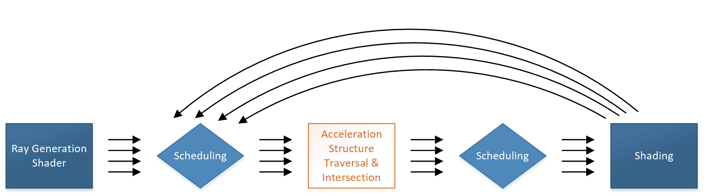

# 引言（Intro）

---

本文档介绍了在 D3D12 中对光线追踪（Raytracing）的支持，该功能在架构上被视为与计算（Compute）和图形栅格化（Rasterization）并列的**一等公民（first-class peer）**。类似于栅格化管线，光线追踪管线也在**可编程性**与**固定功能**之间取得了平衡——可编程性使应用程序更具表现力，而固定功能则最大化地提高了实现效率。

---

# 概述（Overview）

---

该系统的设计允许实现方式**独立处理每一条光线**。这包括多种类型的着色器（将在下文介绍），每种着色器在执行时**仅能访问单个输入光线**，并且**不能依赖于其他光线的处理顺序或状态**。

某些类型的着色器在一次调用中**可以生成多条光线**，并可在需要时查看生成光线的处理结果。但无论如何，这些正在处理的光线（in-flight rays）**之间永远不能相互依赖**。

**这种光线间的独立性带来了高度并行处理的可能性。**  为了利用这种并行性，典型的实现会在执行时**在调度与其他任务之间取得平衡**。

* * *

> （上图仅为实现方式的一个粗略示意，请勿做过度解读。）

执行过程中的**调度部分**是**硬编码**的，或至少是以**不透明的方式实现的，以便可根据硬件定制**。实现中通常会采用一些策略，如**对任务进行排序，以增强线程间的执行一致性（coherence）**。  
从 API 的角度看，**光线调度是内建的功能**，无需应用层干预。

* * *

光线追踪中的任务类型
----------

光线追踪中的任务由**固定功能与（部分）可编程功能**组合而成：

* **最大规模的固定功能任务**是对**由应用提供的几何体构建出的加速结构进行遍历**，目的是**高效地查找潜在的光线交点**。
    
* 对**三角形的光线交点测试**也通过固定功能支持。
    

* * *

着色器可编程性
-------

在以下几个方面，着色器为应用程序提供了可编程的能力：

* **生成光线**（Ray Generation）
    
* **判断隐式几何体的交点**（相对于三角形交点的固定功能）
    
* **处理光线交点**（例如表面着色）、或**处理未命中情况**（Miss Shader）
    

此外，应用程序还可以高度自定义——

* 控制**在特定情况下使用哪些着色器**
    
* 管理**每次着色器调用可访问的资源**（如纹理）
    

* * *