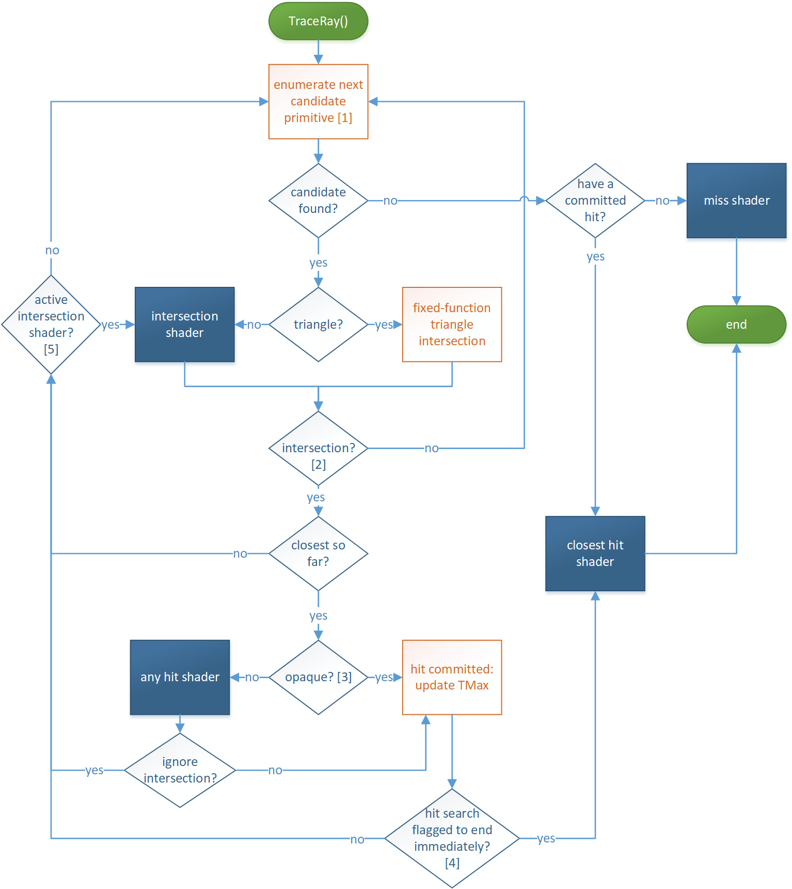

* * *

任意命中着色器（Any Hit Shaders）
========================

当一条射线在其路径上与某个几何实例相交时，可以定义一个专门的着色器在任意位置运行，这个着色器被称为 **任意命中着色器（any hit shader）**。

任意命中着色器可以：

* 读取相交属性；
    
* 修改射线负载（ray payload）；
    
* 指示忽略此次命中（`IgnoreHit()`）；
    
* 接受命中并继续（通过结束执行）；
    
* 接受命中并通知系统停止寻找更多相交（`AcceptHitAndEndSearch()`）。
    

> ⚠️ 注意：对于一条射线路径上的多个相交点，**任意命中着色器的执行顺序是不确定的**。如果某个任意命中着色器接受了命中，它的 T 值会成为新的 TMax。因此，取决于相交被找到的顺序，任意命中着色器的执行次数可能不同。

系统不会同时对一条射线执行多个任意命中着色器，因此它们可以**安全地修改射线负载**，不用担心与其他着色器冲突。

### 使用场景示例：

当几何体具有透明度时，任意命中着色器很有用。比如在阴影检测中，若任意命中着色器发现当前命中是一个不透明物体，可以指示系统接受该命中并停止继续寻找其他命中（即只关心路径上是否有遮挡物）。

不过在很多场合并不需要任意命中着色器，这可以提高执行效率。若某个几何实例没有指定任意命中着色器，则当有命中发生时，系统会**直接接受该命中并更新当前射线区间的 TMax 值**。

> ❌ 任意命中着色器**不能追踪新射线**，否则系统将面临巨大的计算负担。

👉 [HLSL 相关细节请参考这里](#)

* * *

最近命中着色器（Closest Hit Shaders）
============================

当某个几何体产生了该射线路径上**最近的被接受的命中**，可以为其定义一个独特的着色器，这就是**最近命中着色器（closest hit shader）**。

最近命中着色器可以：

* 读取相交属性；
    
* 修改射线负载；
    
* 生成新的射线。
    

### 典型用途：

评估表面颜色并将其结果用于射线负载或写入内存（例如通过 UAV）。

> 🚨 任意命中着色器（若存在）**会在最近命中着色器之前执行**。  
> 如果某个几何实例的最近命中点同时定义了任意命中着色器和最近命中着色器，则**任意命中着色器总是先执行**。

👉 [HLSL 相关细节请参考这里](#)

* * *

未命中着色器（Miss Shaders）
====================

对于未与任何几何体相交的射线，可以指定一个 **未命中着色器（miss shader）**。

未命中着色器可以：

* 修改射线负载；
    
* 生成新的射线。
    

由于没有发生相交，**无法获取相交属性**。

👉 [HLSL 相关细节请参考这里](#)

* * *

命中组（Hit Groups）
===============

一个 **命中组（hit group）** 是一组着色器的集合，包含以下组成部分：

* 0 或 1 个 相交着色器（Intersection Shader）
    
* 0 或 1 个 任意命中着色器（Any Hit Shader）
    
* 0 或 1 个 最近命中着色器（Closest Hit Shader）
    

场景中某个几何体的每个实例都会引用一个命中组以提供其着色器逻辑。

> 💡 组的意义在于：允许系统对其进行高效的编译与执行，以便在射线与几何体交互时更快处理。

### 特别说明：

* **射线生成着色器** 和 **未命中着色器** 不属于命中组，因为它们不直接与几何体交互。
    
* 如果命中组包含相交着色器，则**只能用于程序化几何体（procedural primitives）**。
    
* 若命中组不包含相交着色器，则**只能用于三角形几何体（triangle geometry）**。
    

### 空命中组：

命中组也可以**完全不包含任何着色器**，只需将其着色器标识符设为 `NULL`。此类情况会被当作**不透明几何体处理**。

这种空命中组在某些应用场景下非常有用，比如当应用程序不关心命中的处理，仅关心未命中着色器何时触发。

* * *


* * *

TraceRay 控制流程（TraceRay Control Flow）
====================================

当着色器调用 `TraceRay()` 时，系统会经历以下几个阶段：



🎯 射线追踪流程图说明：
-------------

### [1] 加速结构遍历（Traversal）

系统搜索加速结构，**保守地列举出可能与射线相交的图元（primitive）**：

* 如果图元被射线命中，且在当前射线区间内，系统保证最终一定会列举出该图元。
    
* 如果图元未被命中或超出当前射线区间，可能会被忽略。
    
* **注意：TMax 会在命中被提交时更新**（这是遍历中的内部行为，对应用不可见）。
    

* * *

### [2] 相交着色器回调

如果正在运行的是相交着色器，并调用了 `ReportHit()`，则命中将被处理，随后控制流会通过 [5] 返回相交着色器。

* * *

### [3] 判断是否为不透明（Opaque）

系统通过以下方式判断几何是否为不透明：

* 检查几何体及其实例的标志位；
    
* 检查射线的标志；
    
* 如果没有定义任意命中着色器，也会被视为不透明。
    

* * *

### [4] 终止搜索

在以下任一条件满足时，系统将终止进一步的命中搜索：

* 设置了射线标志 `RAY_FLAG_ACCEPT_FIRST_HIT_AND_END_SEARCH`；
    
* 任意命中着色器调用了 `AcceptHitAndEndSearch()`。
    

> 若存在命中，系统将选择离原点最近的那个命中并执行最近命中着色器（除非设置了 `RAY_FLAG_SKIP_CLOSEST_HIT_SHADER` 来跳过）。

* * *

### [5] 程序化图元继续执行相交着色器

若命中的图元不是三角形，并存在相交着色器，则该着色器可继续运行（比如调用多个 `ReportHit()`）。

* * *

🚩 每条射线的标志位（Ray Flags）
----------------------

`TraceRay()` 提供了多个 **射线标志位** 来控制透明度、剔除、以及提前终止行为等。

### 🌑 示例：基于透明阴影的射线配置

如果应用程序希望追踪射线到远处的光源，并只对未命中几何体的射线执行光照计算（比如用尾递归），可以：

```cpp
TraceRay(
  ..., 
  RAY_FLAG_ACCEPT_FIRST_HIT_AND_END_SEARCH | 
  RAY_FLAG_SKIP_CLOSEST_HIT_SHADER, 
  ...
);
```

* 若遇到几何体命中（不一定是最近的），处理会因 `ACCEPT_FIRST_HIT_AND_END_SEARCH` 终止。
    
* 因为设置了 `SKIP_CLOSEST_HIT_SHADER`，不会执行最近命中着色器。
    
* 若未命中任何几何体，则执行 **miss shader**，计算光照贡献。
    

> 也可以通过设置 `RAY_FLAG_FORCE_OPAQUE` 来跳过任意命中着色器。

* * *

🧩 实例遮罩（Instance Masking）
-------------------------

每个顶层加速结构中的几何体实例都包含一个 **8 位的用户定义 `InstanceMask`**。

调用 `TraceRay()` 时可传入一个 **`InstanceInclusionMask`**，系统会进行：

```cpp
if ((InstanceMask & InstanceInclusionMask) == 0) {
    // 忽略此相交
}
```

### ✅ 优势：

允许在**单一加速结构中定义不同几何子集**，无需为每个子集创建独立结构。

例如可以用于：

* 排除某些对象不参与阴影投射；
    
* 同时保持它们在主渲染中可见。
    

* * *

📞 可调用着色器（Callable Shaders）
---------------------------

**可调用着色器** 设计用于处理复杂的着色器组合网络，虽然执行效率可能稍逊。

### 特性：

* 通过用户定义的函数表（`CallableShaderTable`）进行索引和调用；
    
* 表由 `DispatchRays()` 传入 GPU 虚拟地址；
    
* 通过 HLSL 中的 `CallShader()` 调用；
    
* 每次调用就像是子程序调用，具有参数传入和传出；
    
* 调用返回后继续执行主着色器逻辑；
    
* **可调用着色器与其他着色器分开编译**，编译器不会假设调用者和被调用者的行为，只依赖定义的函数签名；
    
* 使用一段受控栈空间保存参数或状态（见后文 Pipeline Stack）；
    
* 调度方式类似 ray tracing 着色器，而非传统内联函数。
    

### ⚠️ 注意事项：

* 若只是想执行一个非常小的程序，调度开销可能不划算；
    
* 没有此功能时，可以模拟方式：通过追踪一个 guaranteed miss 的射线，强制触发 miss shader，并传递参数；
    
* 但这会浪费资源，因此 callable shader 提供了更优雅的实现方式。
    

* * *

🔗 资源绑定（Resource Binding）
-------------------------

由于射线可能穿越场景任意位置，因此 ray tracing 中必须：

* **同时可用所有相关着色器及其资源绑定**；
    
* 着色器标识符（Shader Identifier）也视为资源绑定的一部分；
    
* 和传统绑定方式一样：包括 descriptor tables、root descriptor、root constants 等；
    

> 🔄 绑定的 `Descriptor Heap`（通过 `SetDescriptorHeaps()` 设置）在 RayTracing、Graphics 和 Compute 之间共享。

* * *


* * *

本地根签名 vs 全局根签名（Local vs Global Root Signatures）
===============================================

在 Ray Tracing 中，着色器的资源绑定可以通过以下两种根签名方式之一或同时使用：

### ✅ 本地根签名（Local Root Signature）

* 参数来自 **Shader Table**（后文详述）；
    
* 允许每个着色器使用独立的参数；
    
* 更适合按实例设置不同资源。
    

### ✅ 全局根签名（Global Root Signature）

* 参数通过 `SetComputeRootSignature()` 绑定；
    
* 在所有 ray tracing 着色器和 CommandList 上 **共享使用**；
    
* 与传统 Compute Pipeline 的根签名一致。
    

* * *

🚦使用规则
------

* 一组协同工作的 RayTracing 着色器可使用**不同的本地根签名**；
    
* 但必须共用 **同一个全局根签名**；
    
* 不同的 PSO（Pipeline State Object）集合可以有不同的全局根签名，只要在 `DispatchRays()` 调用中所涉及的所有着色器都使用当前绑定的全局根签名即可。
    

* * *

📏 资源绑定限制
---------

* 本地根签名的大小限制为：**最大 Shader Record 步长 4096 字节 - 32 字节（shader identifier） = 4064 字节**；
    
* 本地根签名中声明的寄存器绑定（如 `t0`, `u0` 等）**不能与全局根签名重叠**；
    
* 本地根签名中也可以定义静态采样器（Static Sampler）；
    
    * 若多个本地根签名使用同名采样器（例如 `s0`），则**其定义必须一致**；
        
    * 全局 + 所有本地根签名中的静态采样器总数不能超过 D3D12 支持的最大数量。
        

### ⚠️ 原因：

这是为了兼容某些驱动实现将静态采样器映射到 Descriptor Heap 固定位置。

* * *

✳️ 着色器标识符（Shader Identifier）
============================

* 每个 ray tracing 着色器（ray generation、miss、hit group、callable）都有一个 **32 字节的唯一标识符**；
    
* 可看作是着色器的指针；
    
* 应用程序通过 API 获取这些标识符；
    
* 如果系统在执行中遇到 NULL 的标识符，将跳过对应着色器，继续执行流程。
    

> 📌 多个功能相同的着色器实例在不同 PSO 或 export 名下，其标识符可能一致，也可能不一致，取决于实现。但行为会保持一致。

* * *

📦 着色器记录（Shader Record）
=======================

格式如下：

```
Shader Record = {
    Shader Identifier,
    Local Root Arguments
}
```

* 是一段由应用程序管理的内存；
    
* 用于存储某个着色器的标识符及其本地根参数；
    
* 如果着色器使用本地根签名，则必须在记录中写入对应参数；
    
* 最大步长为 4096 字节。
    

* * *

🧾 着色器表（Shader Table）
=====================

由一组 Shader Record 构成的连续内存区域：

```plaintext
Shader Table = {
    Shader Record A
    Shader Record B
    ...
}
```

* 起始地址必须 64 字节对齐（`D3D12_RAYTRACING_SHADER_TABLE_BYTE_ALIGNMENT`）；
    
* 没有 API 对象类型代表 Shader Table，只需应用程序提供内存地址即可；
    
* 作为 `DispatchRays()` 参数传入，包括以下几种 Shader Table：
    
    * Ray Generation Shader（仅 1 个 Shader Record）
        
    * Hit Groups
        
    * Miss Shaders
        
    * Callable Shaders
        

* * *

🎯 Shader Table 索引机制
--------------------

**系统如何确定用哪个 Shader Record？**

* 在 `DispatchRays()` 中定义基础地址和步长；
    
* 每个几何体或其实例提供额外偏移；
    
* 在着色器中调用 `TraceRay()` 时还可以通过参数进一步细化索引；
    
* 整个过程实现了灵活的**动态选择执行的着色器及其参数绑定**，而无需修改场景或加速结构。
    

* * *

📌 总结
=====

| 项目 | 本地根签名 | 全局根签名 |
| --- | --- | --- |
| 绑定来源 | Shader Table | CommandList |
| 参数作用域 | 每个 Shader 单独 | 所有 Shader 共享 |
| 可否定义静态采样器 | ✅（定义必须一致） | ✅ |
| 是否可重复使用 | 可在多个 Shader 组合中使用 | 必须统一 |
| 使用场景 | 控制实例特有参数、资源绑定等 | 控制全局资源如常量缓冲等 |

* * *