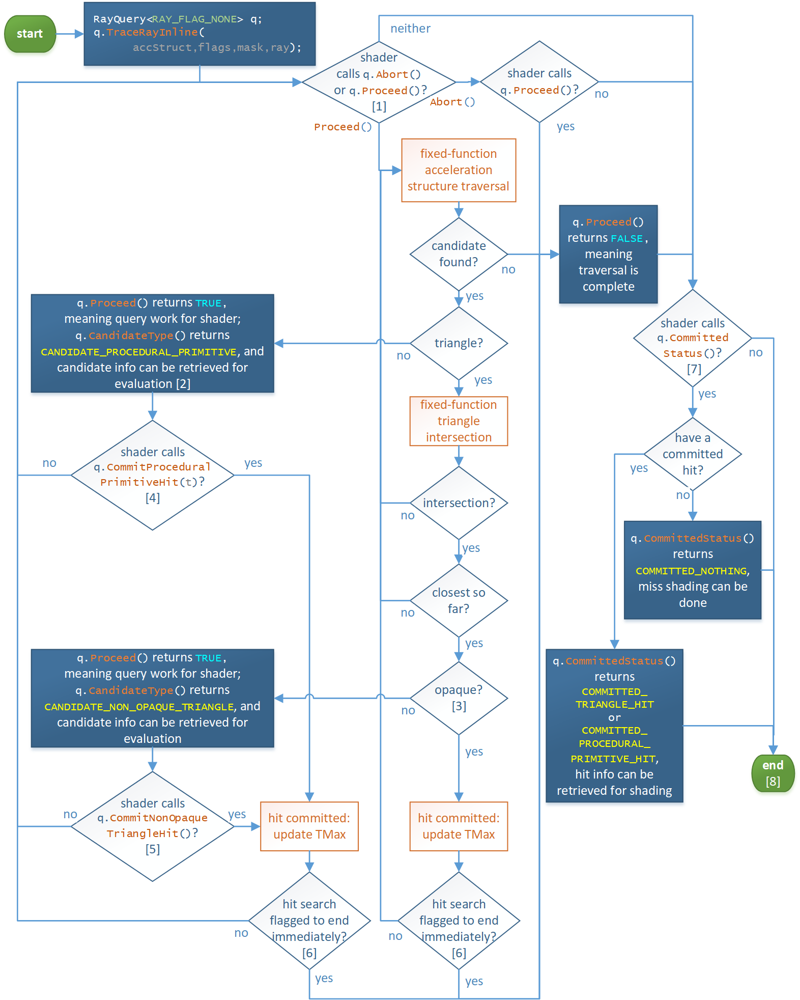
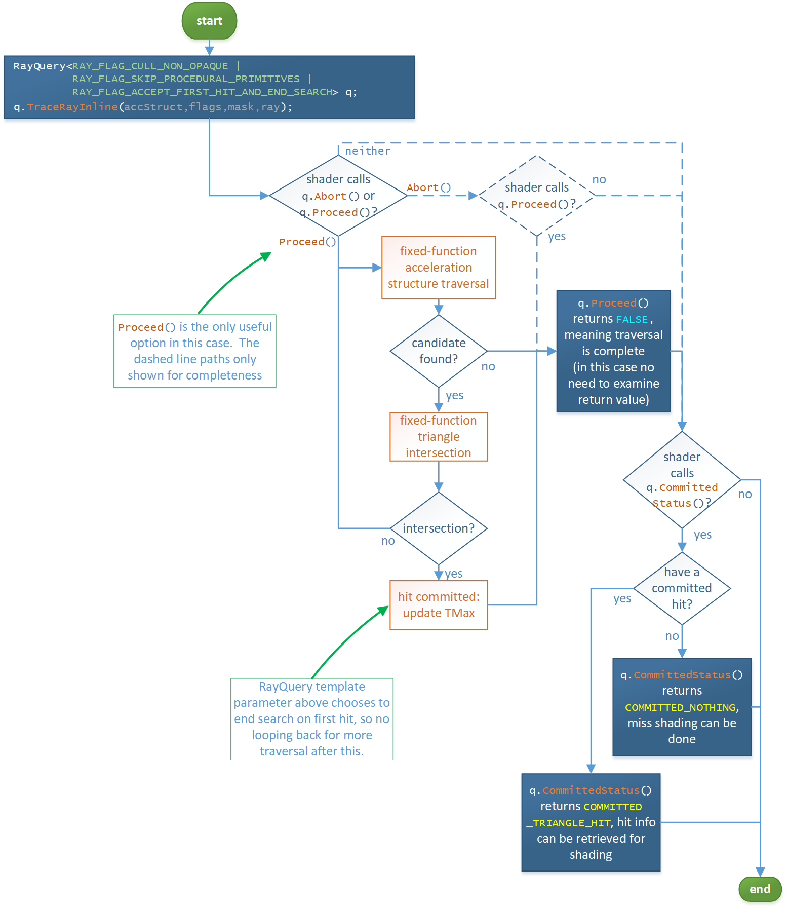

Inline Raytracing（内联光线追踪）
-------------------------

`TraceRayInline()` 是相对于 `TraceRay()` 的另一种光线追踪方式。它的不同之处在于：

* **不需要分离的光线追踪着色器**（例如 ClosestHit、AnyHit、Miss Shader）
    
* **所有着色逻辑都由调用它的着色器自己完成**。  
    尽管方式不同，**两者都使用相同的加速结构（Acceleration Structure）**。
    

* * *

### RayQuery对象：状态机式追踪

在使用 `TraceRayInline()` 时，着色器会创建一个 `RayQuery` 对象，这个对象其实并不执行真正的追踪逻辑，而是：

* 初始化光线追踪的参数
    
* 通过一系列方法调用，由着色器主导控制追踪流程
    

每个 `RayQuery` 对象可以被看作是一个**状态机**，控制光线追踪的流程。  
硬件负责底层的加速结构访问（比如：包围盒和三角形的相交测试），而着色器可以根据遍历到的候选命中数据，自行判断并处理命中或未命中的结果。

这些对象可以在**任意着色器阶段中使用**，包括：

* Compute Shader
    
* Pixel Shader
    
* 甚至是在传统光线追踪的 AnyHit 或 ClosestHit 着色器中
    

这也就意味着，我们**可以在任意地方使用光线追踪技术**，而不局限于固定的光线追踪管线。

* * *

### 为什么要引入这种方式？

1. **更灵活：** 可以在任意着色器中使用，不受管线限制
    
2. **更轻量：** 某些场景下，完整的动态着色器调用（TraceRay + 多种 Shader）可能性能开销过大
    
3. **更可控：** 所有控制逻辑和着色工作都由开发者掌握，有机会进行更多优化
    

**缺点：** 系统无法对这种自定义控制流程做太多性能优化，一切性能好坏几乎完全依赖于应用程序和数据结构本身的设计。

* * *

示例场景：快速阴影检测
-----------

在一个简单场景中，如果只需要判断某一点是否在阴影中（而不考虑透明物体），可以这样使用：

```cpp
// 设置光线标志：
RAY_FLAG_CULL_NON_OPAQUE |
RAY_FLAG_SKIP_PROCEDURAL_PRIMITIVES |
RAY_FLAG_ACCEPT_FIRST_HIT_AND_END_SEARCH
```

只使用三角形构成的加速结构，这种设置可以让系统快速确定是否命中遮挡物，大大简化流程并提高性能。

* * *

TraceRayInline 控制流程（简要说明）
-------------------------

下图展示了使用 RayQuery 对象时的控制流程：



> （注意：橙色框表示硬件固定功能，蓝色框表示控制回到着色器的阶段）

**流程主要阶段如下：**

### [1] RayQuery::Proceed()

* 遍历加速结构，查找可能与光线相交的物体
    
* 命中的候选对象会被“枚举”出来，交由着色器进一步处理
    
* 可选调用 `Abort()` 来提前中断遍历
    

### [2] 程序化图元（非三角形）

* 如果遇到程序化图元（如体积、曲面等），系统无法自动处理
    
* 由着色器手动判断相交情况，并调用 `CommitProceduralPrimitiveHit()` 提交命中
    

### [3] 不透明性判断

* 由系统根据几何体、实例标志和光线标志进行判断
    

### [4] 多次提交处理

* 对于程序化图元，着色器可以多次调用 `CommitProceduralPrimitiveHit()`，系统会更新最近的命中（TMax）
    

### [5] 半透明三角形

* 如果候选为非不透明三角形，系统确认其是当前最近的命中
    
* 着色器可选择是否调用 `CommitNonOpaqueTriangleHit()`，多次调用仅第一次有效
    

### [6] 首次命中立即结束

* 如果启用 `RAY_FLAG_ACCEPT_FIRST_HIT_AND_END_SEARCH`，将停止后续搜索
    

### [7] 查询命中状态

* 可随时调用 `CommittedStatus()` 来获取当前状态（不一定等到遍历完成）
    
* 可以用这个方法来实现自定义跳出循环的逻辑
    

### [8] 任意时刻终止使用

* 着色器可选择停止使用 RayQuery，不再推进状态，也可以重新调用 `TraceRayInline()` 重启一次追踪
    

* * *

精简版控制流程图
--------

如果在创建 RayQuery 时使用特定模板标志（如只判断是否遮挡），可以大幅简化控制流程，  
系统无需依赖着色器参与，也可以直接跳过某些处理路径，从而提升效率。



* * *
