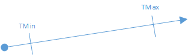
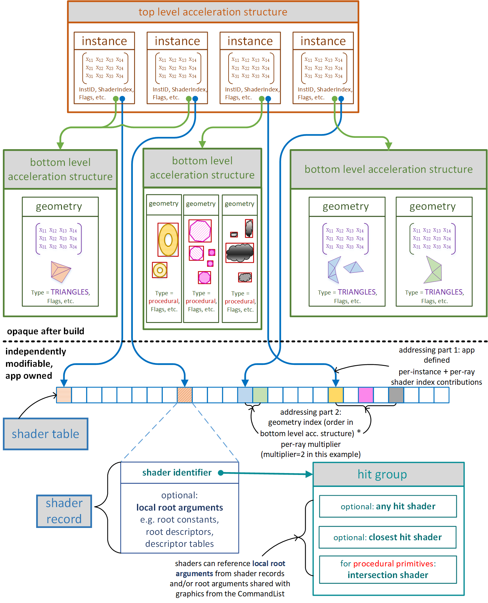

🎯 光线生成着色器（Ray Generation Shaders）
----------------------------------

`DispatchRays()` 会**调度一组光线生成着色器的线程网格（grid）**。

* 每一个光线生成着色器调用（线程）都**知道自己在网格中的位置**；
    
* 每个线程可以通过 `TraceRay()` **生成任意数量的光线**；
    
* 各线程**彼此独立执行**，无先后顺序，也不共享状态；
    

> ❗因此，**线程之间没有定义好的执行顺序**，不可依赖于并行线程间的行为。

> 🔍 HLSL 的详细实现见后文专章。

* * *

💡 光线（Rays）
-----------

一个光线由以下几部分组成：

* **起点（origin）**
    
* **方向（direction）**
    
* **参数区间（TMin, TMax）**：用于表示在哪个区间内寻找交点
    

在这个区间中，光线上的任意位置可表示为：

```
position = origin + T * direction
```

> 📌 注意：**direction 向量不会被归一化（normalize）**。

* * *

### ⛓️ 参数区间的边界细节

光线交点的计算对区间的边界处理略有差异，是否包括 TMin / TMax 端点，**取决于几何体的类型**，这在 `ray extents` 中有更具体的定义。

* * *

### 📦 Payload（负载数据）

每条光线都带有一个**用户自定义的 Payload（负载）**，它有以下特点：

* 随着光线在场景中与几何体交互，可被修改；
    
* 当 `TraceRay()` 返回时，**调用者可访问最终的 Payload 值**。
    

在 **Inline Raytracing（内联光线追踪）** 的模式中：

* 没有显式的 Payload 对象；
    
* 使用的是调用者当前作用域下的**用户变量的一个部分**，由 `RayQuery::TraceRayInline()` 进行追踪和修改。
    


* * *

📏 TMin / TMax 行为详解
-------------------

* `TMin` 是系统跟踪的光线最小交点起点，**在整个光线生命周期内不变**。
    
* `TMax` 则是系统动态维护的最大值：
    
    * 在交点不断被发现的过程中（顺序是随机的），
        
    * **系统自动收缩 TMax**，使其表示**当前找到的最近交点**；
        
    * 最终，当所有交点测试完成后，**TMax 表示最近命中的交点距离**。
        

这个行为在之后的着色器调用（如 Hit Shader）中具有重要作用。

* * *

🎨 光线追踪输出（Raytracing Output）
----------------------------

在光线追踪中，着色器通常通过 **UAV（无序访问视图）** 手动写出最终结果，例如图像中的颜色采样值。

* * *

📉 光线与几何体的交互图（Ray-Geometry Interaction Diagram）
-----------------------------------------------



后续章节将详细解释这张图中涉及的内容，  
包括几何体交互以外的重要概念，如 **Miss Shader（未命中着色器）** 等。

* * *


* * *

🧱 几何体与加速结构（Geometry and Acceleration Structures）
-------------------------------------------------

### 📐 两级加速结构体系

D3D12 中通过 **两级加速结构** 来描述场景中的几何体：

* **底层加速结构（Bottom-Level Acceleration Structure，BLAS）**  
    包含一组基础几何体，是构建场景的基本单位。
    
* **顶层加速结构（Top-Level Acceleration Structure，TLAS）**  
    包含多个底层结构的**实例（Instance）**，用于组织和定位这些几何体。
    

* * *

### 🔹 底层加速结构（BLAS）

每个底层加速结构可以包含任意数量的以下几何体（但**只能是一种类型**）：

1. 三角形网格（Triangle Meshes）
    
2. 程序化图元（Procedural Primitives）：起初仅通过 **轴对齐包围盒（AABB）** 表示
    

通过构造 `D3D12_RAYTRACING_GEOMETRY_DESC` 数组描述这些几何体，  
然后调用 `**BuildRaytracingAccelerationStructure()**`，  
让系统在 GPU 内存中构建一个表示这些几何体的**底层加速结构对象**。

该结构体将用于光线追踪中的交点检测（intersection）。

* * *

### 🔸 顶层加速结构（TLAS）

在构建多个 BLAS 后，应用可通过一组 `D3D12_RAYTRACING_INSTANCE_DESC` 结构体，  
定义这些 BLAS 的**实例（Instance）**。

每个实例指向一个 BLAS，同时包含用于实例化的信息，例如：

* **变换矩阵**（将实例放置到世界空间）
    
* **用户定义的 InstanceID**（供 Shader 识别）
    

> 实例有时也称作 **几何体实例（Geometry Instance）**，用于消歧。

调用 `BuildRaytracingAccelerationStructure()` 并提供这些实例定义后，  
系统将在 GPU 内存中构建顶层加速结构（TLAS）。

该 TLAS 就是**光线追踪系统最终用于光线测试的结构**。

* * *

### 🔁 多个 TLAS 同时使用

应用可以同时使用多个 TLAS，并将其**绑定到着色器中作为输入资源**（通过 HLSL 中的 `RaytracingAccelerationStructure`）。

这样，着色器就可以在不同的几何体集合中发射光线进行追踪。

* * *

### ⚖️ 结构设计的权衡

使用两层结构的好处：

* 使用**大而少的 BLAS** → 优化交点性能；
    
* 使用**小而多的 BLAS + 更多实例** → 提升灵活性（如变换控制、遮挡剔除等）
    

> 📌 详见《Acceleration Structure Properties》章节，了解结构设计的规则与确定性行为。

* * *

🔄 加速结构的更新（Acceleration Structure Updates）
------------------------------------------

应用可通过 `D3D12_RAYTRACING_ACCELERATION_STRUCTURE_BUILD_FLAGS` 控制结构的更新行为：

* 设置为 **可更新（updateable）**
    
* 或对已有结构发起 **增量更新（update）**
    

注意：

* 更新结构的性能虽然**不如从零构建时的最佳性能**，但比完全重建快；
    
* 为了让更新可行，必须遵守一定约束，例如：
    
    * 对于 BLAS 中的三角形几何体，仅允许更新**顶点位置**；
        
    * 对于 TLAS 中的实例描述（如变换矩阵），**更新更灵活**；
        

详见《Acceleration Structure Update Constraints》章节。

* * *

📌 内建光线-三角形交点（Built-in Ray-Triangle Intersection）
-------------------------------------------------

BLAS 中的三角形网格使用系统内建的光线-三角形求交算法。  
当光线与三角形相交时，系统会将**相交点的重心坐标（Barycentric）**传递给后续着色器。

* * *

✨ 交点着色器（Intersection Shaders） - 程序化图元
-------------------------------------

另一种几何体形式是 **程序化图元**，其在 BLAS 中表示为一个 AABB。

当光线击中该包围盒时，系统会调用**用户自定义的交点着色器**来判断是否真正与图元表面相交。  
交点着色器还需定义相交属性（如 T 值）并传递给后续的 Hit Shader。

> 使用交点着色器虽然 **性能不如内建交点计算**，但带来了**更高的灵活性**，适合体积渲染、隐式曲面等复杂场景。

* * *

🧩 交点着色器的注意事项（Minor Intersection Shader Details）
------------------------------------------------

* **交点着色器可能被多次调用**（同一条光线、同一图元），具体取决于实现；
    
* 因此，**不能在其中编写具有副作用的操作**，例如：
    
    * UAV 写操作；
        
    * 每次执行找出不同交点，导致结果不一致；
        

为了保证一致性，可以使用如下 flag：

* `D3D12_RAYTRACING_GEOMETRY_FLAG_NO_DUPLICATE_ANYHIT_INVOCATION`  
    ➜ 系统将保证每次交点只调用一次 Any Hit Shader。
    

* * *