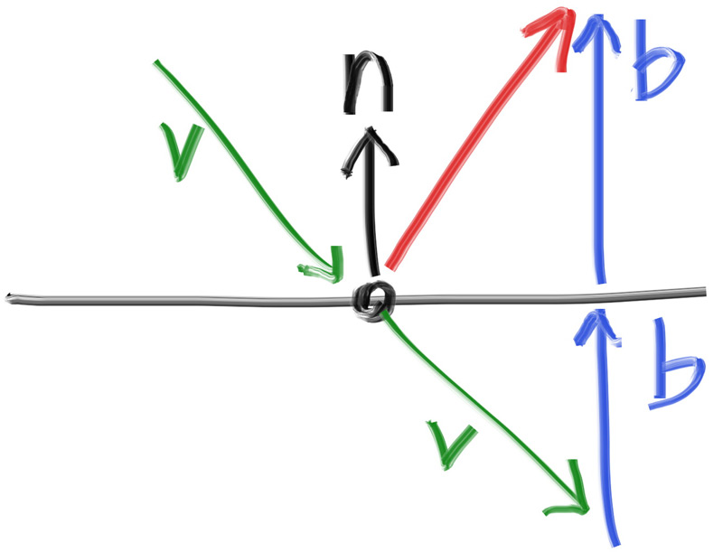
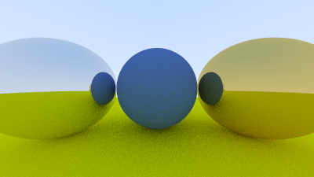
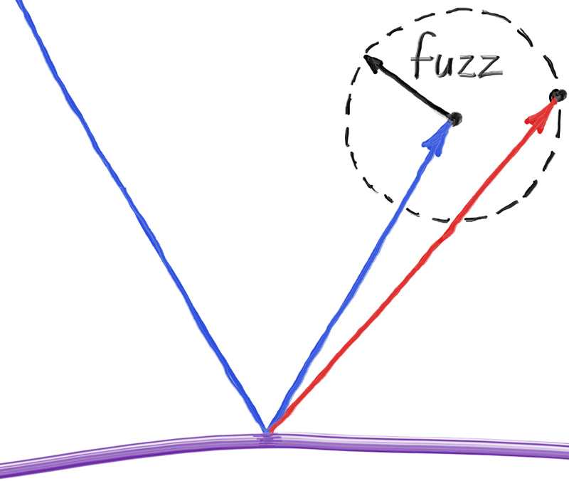
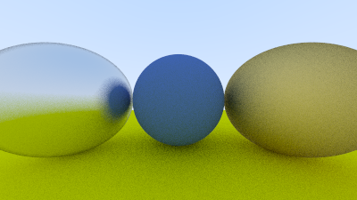

# 10. 金属材质（Metal）

## 10.1. 材质的抽象类设计

如果我们希望不同的物体具有不同的材质，就需要进行一次设计决策。我们可以设计一个通用的材质类型，包含大量参数，这样每种材质类型可以忽略与其无关的参数。这种方法并不差；但另一种方法是定义一个抽象的材质类，以封装各自独特的行为。我更倾向于后者。对于我们的程序来说，材质需要做两件事：

1. 产生一个散射射线（或者声明吸收了入射射线）
2. 如果发生散射，还需要指定该射线的衰减量。

这暗示我们需要定义如下抽象类：

```c
#ifndef MATERIAL_H
#define MATERIAL_H

#include "hittable.h"

class material {
  public:
    virtual ~material() = default;

    virtual bool scatter(
        const ray& r_in, const hit_record& rec, color& attenuation, ray& scattered
    ) const {
        return false;
    }
};

#endif
```

## 10.2 描述光线与物体交点的数据结构

hit_record 是为了避免传递过多参数而创建的结构体，我们可以将所有需要的信息封装在其中。你也可以选择使用多个参数传递，只是编码风格问题。由于 hittable 和 material 类需要相互引用，因此存在循环依赖。我们可以通过在 hittable.h 文件中加入 class material; 来告诉编译器该类稍后会被定义。由于我们只是声明一个指向该类的指针，编译器并不需要知道类的具体定义，从而解决循环引用问题。

```c
class material;

class hit_record {
  public:
    point3 p;
    vec3 normal;
    shared_ptr<material> mat;
    double t;
    bool front_face;

    void set_face_normal(const ray& r, const vec3& outward_normal) {
        front_face = dot(r.direction(), outward_normal) < 0;
        normal = front_face ? outward_normal : -outward_normal;
    }
};
```

hit_record 的作用是打包多个交点参数，以便统一传递。当一条光线击中某个表面（例如一个球体）时，hit_record 中的材质指针会被设置为该球体所关联的材质指针。这样，当 ray_color() 获得 hit_record 时，就可以调用材质的成员函数判断是否以及如何散射射线。为了实现这一点，我们需要在球体类中设置材质指针：

```c
class sphere : public hittable {
  public:
    sphere(const point3& center, double radius) : center(center), radius(std::fmax(0, radius)) {
        // TODO: 初始化材质指针 `mat`
    }

    bool hit(const ray& r, interval ray_t, hit_record& rec) const override {
        ...

        rec.t = root;
        rec.p = r.at(rec.t);
        vec3 outward_normal = (rec.p - center) / radius;
        rec.set_face_normal(r, outward_normal);
        rec.mat = mat;

        return true;
    }

  private:
    point3 center;
    double radius;
    shared_ptr<material> mat;
};
```

## 10.3 模拟光的散射与反射率

在整个书中，我们会频繁使用“反照率”（albedo，拉丁语意为“白度”）这个术语。它在某些学科中有严格的技术定义，但通用地说，它代表的是某种形式的反射系数。反照率会根据材质颜色变化，并且（在之后实现玻璃材质时）还可能依赖于入射角度（即入射射线的方向）。Lambertian（漫反射）材质可以有几种实现策略：总是进行散射，同时按照反照率 R 衰减光线；以概率 1-R 进行散射，但无衰减（未散射的光线视为被吸收）；两种方式混合使用。我们选择第一种：始终散射，并根据反照率衰减，这样实现起来较为简单：

```c
class material {
    ...
};

class lambertian : public material {
  public:
    lambertian(const color& albedo) : albedo(albedo) {}

    bool scatter(const ray& r_in, const hit_record& rec, color& attenuation, ray& scattered)
    const override {
        auto scatter_direction = rec.normal + random_unit_vector();
        scattered = ray(rec.p, scatter_direction);
        attenuation = albedo;
        return true;
    }

  private:
    color albedo;
};
```

上面代码还有第三种可选策略：你可以以固定概率 p 进行散射，并将衰减设为 albedo/p，实现上更具弹性。

注意：如果生成的随机单位向量刚好与法向量方向相反，它们相加可能会抵消为零，导致散射方向向量为零。这样会在后续计算中引起错误（如无穷大或 NaN）。因此我们需要在传递该向量前先进行检测。为此，我们定义一个新的向量方法 vec3::near_zero()，用于检测向量在所有维度上是否接近于零。这个方法会使用 C++ 标准库中的 std::fabs() 函数来获取绝对值：

```c
class vec3 {
    ...

    double length_squared() const {
        return e[0]*e[0] + e[1]*e[1] + e[2]*e[2];
    }

    bool near_zero() const {
        // 如果向量在所有维度上都接近于零，则返回 true
        auto s = 1e-8;
        return (std::fabs(e[0]) < s) && (std::fabs(e[1]) < s) && (std::fabs(e[2]) < s);
    }

    ...
};
```

然后我们更新 lambertian 材质的 scatter() 方法，使其更加健壮：

```c
class lambertian : public material {
  public:
    lambertian(const color& albedo) : albedo(albedo) {}

    bool scatter(const ray& r_in, const hit_record& rec, color& attenuation, ray& scattered)
    const override {
        auto scatter_direction = rec.normal + random_unit_vector();

        // 处理退化的散射方向（如接近零向量）
        if (scatter_direction.near_zero())
            scatter_direction = rec.normal;

        scattered = ray(rec.p, scatter_direction);
        attenuation = albedo;
        return true;
    }

  private:
    color albedo;
};
```

## 10.4 镜面反射（Mirrored Light Reflection）

对于抛光金属材质，射线不会被随机散射，而是按照物理规律发生反射。那么，射线在金属镜面上是如何反射的呢？这就要用到矢量数学了。



在图中，红色的反射射线方向可以表示为：reflected = v + 2b。
v 是入射射线方向（指向表面内侧）；
n 是单位法向量（朝外）；
b 是 v 在 n 上的投影，然后取反（因为我们希望 b 指向表面外侧）；

投影长度由 dot(v, n) 得出；最终的反射公式化简为：

```c
inline vec3 reflect(const vec3& v, const vec3& n) {
    return v - 2*dot(v, n)*n;
}
```

金属材质的 scatter 函数只使用上述反射公式，不引入随机性：


```c
class metal : public material {
  public:
    metal(const color& albedo) : albedo(albedo) {}

    bool scatter(const ray& r_in, const hit_record& rec, color& attenuation, ray& scattered)
    const override {
        vec3 reflected = reflect(r_in.direction(), rec.normal);
        scattered = ray(rec.p, reflected);
        attenuation = albedo;
        return true;
    }

  private:
    color albedo;
};
```

我们需要更新 ray_color() 以支持材质的散射行为：


```c
color ray_color(const ray& r, int depth, const hittable& world) const {
    if (depth <= 0)
        return color(0, 0, 0);

    hit_record rec;

    if (world.hit(r, interval(0.001, infinity), rec)) {
        ray scattered;
        color attenuation;
        if (rec.mat->scatter(r, rec, attenuation, scattered))
            return attenuation * ray_color(scattered, depth - 1, world);
        return color(0, 0, 0);
    }

    vec3 unit_direction = unit_vector(r.direction());
    auto a = 0.5 * (unit_direction.y() + 1.0);
    return (1.0 - a) * color(1.0, 1.0, 1.0) + a * color(0.5, 0.7, 1.0);
}
```

我们需要给球体构造函数增加材质参数，并存储在成员变量中：

```c
class sphere : public hittable {
  public:
    sphere(const point3& center, double radius, shared_ptr<material> mat)
      : center(center), radius(std::fmax(0, radius)), mat(mat) {}

    ...
};
```


## 10.5. 添加金属球体到场景中

现在我们来构建一个包含金属球体的场景：

```c
#include "rtweekend.h"

#include "camera.h"
#include "hittable.h"
#include "hittable_list.h"
#include "material.h"
#include "sphere.h"

int main() {
    hittable_list world;

    auto material_ground = make_shared<lambertian>(color(0.8, 0.8, 0.0));
    auto material_center = make_shared<lambertian>(color(0.1, 0.2, 0.5));
    auto material_left   = make_shared<metal>(color(0.8, 0.8, 0.8));
    auto material_right  = make_shared<metal>(color(0.8, 0.6, 0.2));

    world.add(make_shared<sphere>(point3( 0.0, -100.5, -1.0), 100.0, material_ground));
    world.add(make_shared<sphere>(point3( 0.0,    0.0, -1.2),   0.5, material_center));
    world.add(make_shared<sphere>(point3(-1.0,    0.0, -1.0),   0.5, material_left));
    world.add(make_shared<sphere>(point3( 1.0,    0.0, -1.0),   0.5, material_right));

    camera cam;

    cam.aspect_ratio      = 16.0 / 9.0;
    cam.image_width       = 400;
    cam.samples_per_pixel = 100;
    cam.max_depth         = 50;

    cam.render(world);
}
```




## 10.6. 模糊反射（Fuzzy Reflection）

我们也可以通过使用一个小球来随机化反射方向，从而生成模糊反射效果。具体方法是：在原始反射点为中心，取一个球面上的随机点（单位球），并通过“模糊因子”对其进行缩放，得到新的射线终点。



模糊球越大，反射越模糊。这启示我们可以添加一个“模糊度参数”，它实际上就是球的半径（0 表示无扰动，即完美镜面反射）。注意：当模糊球太大，或者入射角很接近切线时，射线可能会“反射”进入物体内部。我们可以简单地让这类射线被表面吸收掉。另外还需要注意，为了让模糊球的扰动具有合理比例，必须将原始反射向量单位化，因为其长度是任意的。即：带模糊的金属材质类实现

```c
class metal : public material {
  public:
    metal(const color& albedo, double fuzz) 
        : albedo(albedo), fuzz(fuzz < 1 ? fuzz : 1) {}

    bool scatter(const ray& r_in, const hit_record& rec, color& attenuation, ray& scattered)
    const override {
        vec3 reflected = reflect(r_in.direction(), rec.normal);
        reflected = unit_vector(reflected) + (fuzz * random_unit_vector());
        scattered = ray(rec.p, reflected);
        attenuation = albedo;
        return (dot(scattered.direction(), rec.normal) > 0);
    }

  private:
    color albedo;
    double fuzz;
};
```

我们可以尝试为两个金属球分别设定模糊度为 0.3 和 1.0：

```c
int main() {
    ...
    auto material_ground = make_shared<lambertian>(color(0.8, 0.8, 0.0));
    auto material_center = make_shared<lambertian>(color(0.1, 0.2, 0.5));
    auto material_left   = make_shared<metal>(color(0.8, 0.8, 0.8), 0.3);
    auto material_right  = make_shared<metal>(color(0.8, 0.6, 0.2), 1.0);
    ...
}
```




🖼️ 图像 14：模糊金属效果示意图