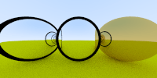
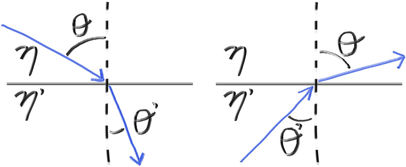
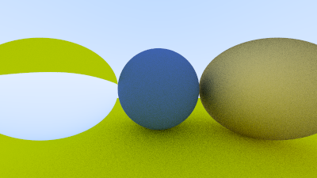
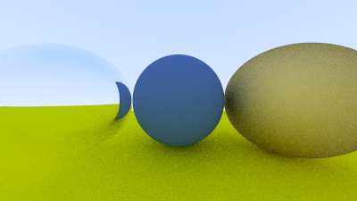
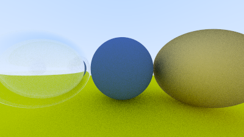

# 11. 电介质

诸如水、玻璃和钻石这类透明材料属于电介质。当光线照射到它们时，会分裂为一束反射光和一束折射（透射）光。我们将通过在反射与折射之间进行随机选择，每次交互只生成一条散射光线来处理这一现象。

术语回顾
反射光线是指光线射到表面后“弹”回的那部分。折射光线则是在从材料外部进入材料内部时发生弯曲（如玻璃或水）。这就是为什么当一支铅笔部分插入水中时，看起来像是弯曲的一样。折射角度的大小由材料的折射率决定。通常这是一个标量值，用于描述光从真空进入材料时弯曲的程度。玻璃的折射率一般在 1.5 到 1.7 之间，钻石约为 2.4，而空气的折射率是 1.000293（接近 1）。当一个透明材料被包裹在另一个透明材料中时，可以使用相对折射率来描述折射现象：即该材料的折射率除以包裹材料的折射率。例如，如果要渲染一个在水下的玻璃球，那么它的有效折射率为 1.5 / 1.333 ≈ 1.125。大多数常见材料的折射率可以通过简单的网络搜索获得。

## 11.1. 折射

调试最困难的部分是折射光线。通常我会首先让所有光线在存在折射可能的情况下全部折射。在这个项目中，我尝试将两个玻璃球放入场景中，结果如下（我还没告诉你这是否正确，但很快会讲）：



这对吗？现实生活中的玻璃球看起来确实有些奇怪。但这并不正确。世界应该是颠倒的，而且不应该有那些奇怪的黑色区域。我打印出了穿过图像中心的光线，它明显是错的。这通常是定位错误的好方法。

## 11.2. 斯涅尔定律

折射现象由斯涅尔定律描述：
<h3>η·sinθ = η′·sinθ′</h3>

其中 θ 和 θ′ 是与法线之间的角度，η 和 η′（读作“eta”和“eta prime”）是折射率。几何关系如图所示：



为了确定折射光线的方向，我们需要解出 sinθ′：

$$
sinθ′ = \frac{η}{η} · sinθ
$$

在表面的折射一侧，存在折射光线 R′ 和法线 n′，并且它们之间存在夹角 θ′。我们可以将 R′ 分解为垂直于 n′ 和平行于 n′ 的分量：

$$
R′ = R′_⊥ + R′_∥
$$

求解这两个分量的表达式为：
$$
R′_⊥ = \frac{η}{η} · (R + |R|cos(θ)n)
$$

$$
R′_∥ = -\sqrt{1 - |R′⊥|²}·n
$$

你可以自己推导一下这些公式，但我们将其视为事实继续进行。接下来的内容不要求你理解这些推导过程。

我们知道右边表达式中除 cosθ 以外的所有值。而两个向量的点积与它们夹角的余弦有关：
$$
a · b = |a||b|·cosθ
$$
如果 a 和 b 是单位向量，则：

a · b = cosθ

现在我们可以将 R′⊥ 表达为已知量：
$$
R′_⊥ = \frac{η}{η′}·(R + (–R·n)·n)
$$

将两部分合并起来后，我们可以写一个函数来计算 R′：

```c
...
inline vec3 reflect(const vec3& v, const vec3& n) {
    return v - 2*dot(v,n)*n;
}

inline vec3 refract(const vec3& uv, const vec3& n, double etai_over_etat) {
    auto cos_theta = std::fmin(dot(-uv, n), 1.0);
    vec3 r_out_perp = etai_over_etat * (uv + cos_theta*n);
    vec3 r_out_parallel = -std::sqrt(std::fabs(1.0 - r_out_perp.length_squared())) * n;
    return r_out_perp + r_out_parallel;
}
```

电介质材料类如下（始终进行折射）：
```c
class dielectric : public material {
  public:
    dielectric(double refraction_index) : refraction_index(refraction_index) {}

    bool scatter(const ray& r_in, const hit_record& rec, color& attenuation, ray& scattered)
    const override {
        attenuation = color(1.0, 1.0, 1.0);
        double ri = rec.front_face ? (1.0 / refraction_index) : refraction_index;

        vec3 unit_direction = unit_vector(r_in.direction());
        vec3 refracted = refract(unit_direction, rec.normal, ri);

        scattered = ray(rec.p, refracted);
        return true;
    }

  private:
    double refraction_index;
};
```

接下来我们通过将左边的球体设置为玻璃（折射率约为 1.5）来更新场景：

```c
auto material_ground = make_shared<lambertian>(color(0.8, 0.8, 0.0));
auto material_center = make_shared<lambertian>(color(0.1, 0.2, 0.5));
auto material_left   = make_shared<dielectric>(1.50);
auto material_right  = make_shared<metal>(color(0.8, 0.6, 0.2), 1.0);
```

图像16：始终折射的玻璃球



## 11.3. 全内反射

折射中的一个实际问题是：对于某些角度，根据斯涅尔定律无法找到解。当光从一个高折射率材料以较大的倾角射向低折射率材料时，折射角可能超过 90°，这就会发生全内反射。

再看一次：
$$
sinθ′ = \frac{η}{η′}· sinθ
$$

如果光从玻璃（η=1.5）进入空气（η′=1.0）：
$$
sinθ′ = \frac{1.5}{1.0} · sinθ
$$
若 sinθ′ > 1，即：
$$
\frac{1.5}{1.0} · sinθ > 1.0
$$


则不再满足等式，也就无法折射。此时，光线将被反射：

```c
if (ri * sin_theta > 1.0) {
    // 必须反射
} else {
    // 可以折射
}
```

这种情况被称为全内反射，在现实中经常出现在固体内部。这也是为什么当你在水下并侧向看水面时，水面像镜子一样反射。我们可以通过以下三角恒等式求出 sinθ：

$$
sinθ = \sqrt{1 - cos²θ}
$$

$$
cosθ = R · n
$$

```c
double cos_theta = std::fmin(dot(-unit_direction, rec.normal), 1.0);
double sin_theta = std::sqrt(1.0 - cos_theta*cos_theta);

if (ri * sin_theta > 1.0) {
    // 必须反射
} else {
    // 可以折射
}
```

更新的电介质类如下：

```c
class dielectric : public material {
  public:
    dielectric(double refraction_index) : refraction_index(refraction_index) {}

    bool scatter(const ray& r_in, const hit_record& rec, color& attenuation, ray& scattered)
    const override {
        attenuation = color(1.0, 1.0, 1.0);
        double ri = rec.front_face ? (1.0 / refraction_index) : refraction_index;

        vec3 unit_direction = unit_vector(r_in.direction());
        double cos_theta = std::fmin(dot(-unit_direction, rec.normal), 1.0);
        double sin_theta = std::sqrt(1.0 - cos_theta*cos_theta);

        bool cannot_refract = ri * sin_theta > 1.0;
        vec3 direction = cannot_refract ?
                         reflect(unit_direction, rec.normal) :
                         refract(unit_direction, rec.normal, ri);

        scattered = ray(rec.p, direction);
        return true;
    }

  private:
    double refraction_index;
};
```

注意：玻璃对光没有衰减，衰减始终为 1。

如何观察全内反射？我们前面的例子中并没有真正发生全内反射。原因是光线进入球体后，角度总会减小，然后从另一侧出去时再变回原来的角度，始终不会触发全内反射。解决方法是让球体的折射率比环境更低，比如把整个世界设为水（折射率约为 1.33），球体设为空气（1.00），模拟气泡：

```c
auto material_ground = make_shared<lambertian>(color(0.8, 0.8, 0.0));
auto material_center = make_shared<lambertian>(color(0.1, 0.2, 0.5));
auto material_left   = make_shared<dielectric>(1.00 / 1.33);
auto material_right  = make_shared<metal>(color(0.8, 0.6, 0.2), 1.0);

```



图像17：气泡在不同角度反射或折射

## 11.4. Schlick 近似

真实玻璃的反射率会随着角度变化——你从倾斜角度看窗户时，会感觉像镜子一样。虽然有一个复杂的公式，但 Christophe Schlick 提供了一个简单且非常准确的近似：加入该近似的完整电介质类如下：

```c
class dielectric : public material {
  public:
    dielectric(double refraction_index) : refraction_index(refraction_index) {}

    bool scatter(const ray& r_in, const hit_record& rec, color& attenuation, ray& scattered)
    const override {
        attenuation = color(1.0, 1.0, 1.0);
        double ri = rec.front_face ? (1.0 / refraction_index) : refraction_index;

        vec3 unit_direction = unit_vector(r_in.direction());
        double cos_theta = std::fmin(dot(-unit_direction, rec.normal), 1.0);
        double sin_theta = std::sqrt(1.0 - cos_theta*cos_theta);

        bool cannot_refract = ri * sin_theta > 1.0;
        vec3 direction;

        if (cannot_refract || reflectance(cos_theta, ri) > random_double())
            direction = reflect(unit_direction, rec.normal);
        else
            direction = refract(unit_direction, rec.normal, ri);

        scattered = ray(rec.p, direction);
        return true;
    }

  private:
    double refraction_index;

    static double reflectance(double cosine, double refraction_index);
};
```

## 11.5. 建模中空玻璃球

现在我们建模一个中空的玻璃球。它由一个较大的玻璃球壳和一个较小的空气球芯组成。光线路径是：进入外壳折射 → 进入空气球再次折射 → 穿过内部 → 从空气球内壁再次折射 → 从玻璃球壳内部出射。外壳使用标准玻璃球（折射率 1.50）。内核材料需相对于包围它的玻璃折射率设置为 1.00 / 1.50 ≈ 0.67：

```c
auto material_ground = make_shared<lambertian>(color(0.8, 0.8, 0.0));
auto material_center = make_shared<lambertian>(color(0.1, 0.2, 0.5));
auto material_left   = make_shared<dielectric>(1.50);
auto material_bubble = make_shared<dielectric>(1.00 / 1.50);
auto material_right  = make_shared<metal>(color(0.8, 0.6, 0.2), 0.0);

world.add(make_shared<sphere>(point3( 0.0, -100.5, -1.0), 100.0, material_ground));
world.add(make_shared<sphere>(point3( 0.0,    0.0, -1.2),   0.5, material_center));
world.add(make_shared<sphere>(point3(-1.0,    0.0, -1.0),   0.5, material_left));
world.add(make_shared<sphere>(point3(-1.0,    0.0, -1.0),   0.4, material_bubble));
world.add(make_shared<sphere>(point3( 1.0,    0.0, -1.0),   0.5, material_right));
```


