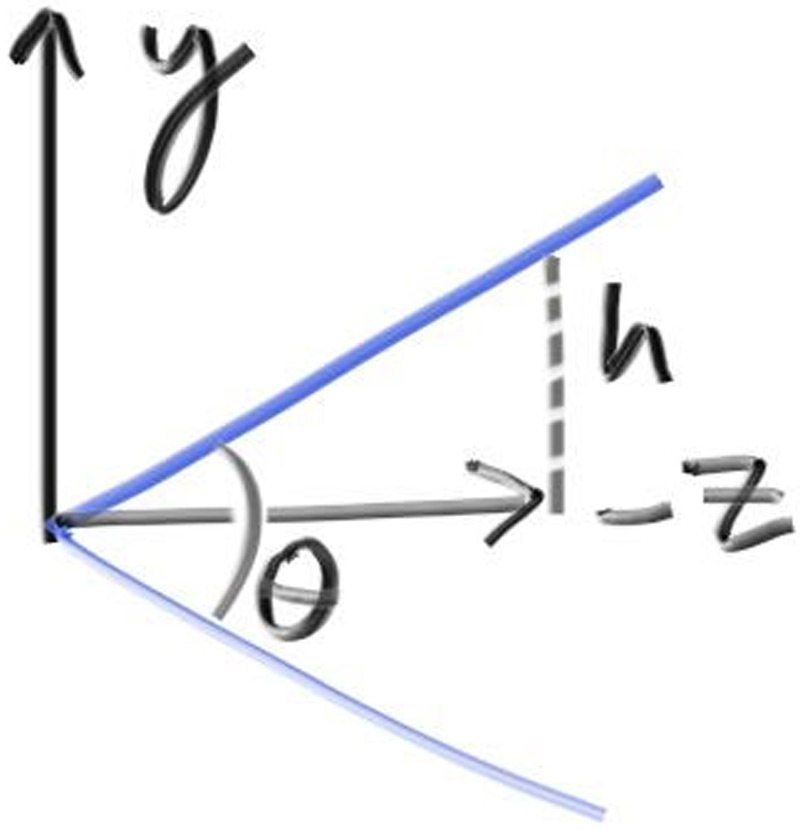
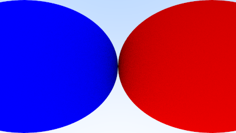
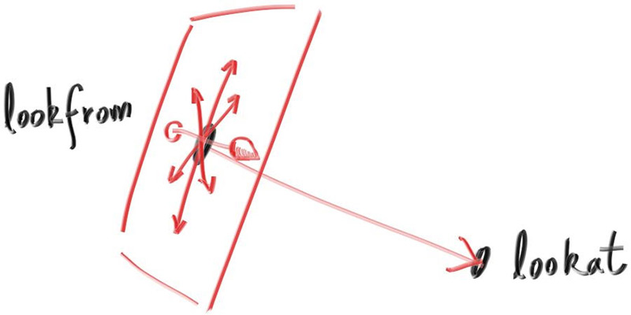
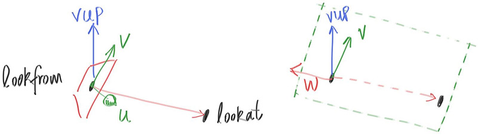
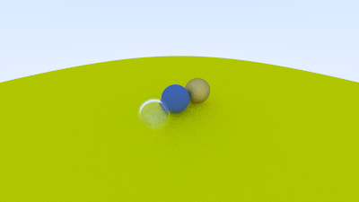
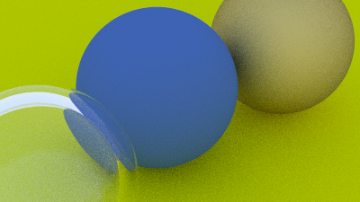

# 12. 可定位相机（Positionable Camera）

像电介质一样，相机也是调试时的一大难点，因此我总是循序渐进地开发它。首先，我们要支持可调节的视野角（fov，field of view）。视野角是指渲染图像从边到边的视觉角度。由于图像通常不是正方形，水平和垂直方向的视野角不同。我总是使用垂直视野角，通常以角度为单位指定，然后在构造函数中将其转换为弧度——这完全是个人喜好问题。

## 12.1. 相机视角几何（Camera Viewing Geometry）

首先，我们依旧让光线从原点发出，朝向 z = -1 平面。当然我们也可以选择 z = -2 或其他任意位置，只要我们根据距离比例设定 h 即可。下面是我们的设置方式：



这意味着 h = tan(θ/2)。此时我们的相机代码变为：


```c
class camera {
  public:
    double aspect_ratio      = 1.0;  // 图像宽高比
    int    image_width       = 100;  // 图像宽度（像素数）
    int    samples_per_pixel = 10;   // 每个像素的随机采样数量
    int    max_depth         = 10;   // 光线最多反弹次数

    double vfov = 90;  // 垂直视野角

    void render(const hittable& world) {
    ...
  private:
    ...
    void initialize() {
        image_height = int(image_width / aspect_ratio);
        image_height = (image_height < 1) ? 1 : image_height;

        pixel_samples_scale = 1.0 / samples_per_pixel;

        center = point3(0, 0, 0);

        // 计算视口尺寸
        auto focal_length = 1.0;
        auto theta = degrees_to_radians(vfov);
        auto h = std::tan(theta/2);
        auto viewport_height = 2 * h * focal_length;
        auto viewport_width = viewport_height * (double(image_width)/image_height);

        // 计算视口边缘向量
        auto viewport_u = vec3(viewport_width, 0, 0);
        auto viewport_v = vec3(0, -viewport_height, 0);

        // 计算像素之间的偏移量
        pixel_delta_u = viewport_u / image_width;
        pixel_delta_v = viewport_v / image_height;

        // 计算左上角像素位置
        auto viewport_upper_left =
            center - vec3(0, 0, focal_length) - viewport_u/2 - viewport_v/2;
        pixel00_loc = viewport_upper_left + 0.5 * (pixel_delta_u + pixel_delta_v);
    }
};
```

我们用一个包含两个相接触球体的简单场景来测试这个新相机，使用 90° 的广角视野：

```c
int main() {
    hittable_list world;

    auto R = std::cos(pi/4);

    auto material_left  = make_shared<lambertian>(color(0,0,1));
    auto material_right = make_shared<lambertian>(color(1,0,0));

    world.add(make_shared<sphere>(point3(-R, 0, -1), R, material_left));
    world.add(make_shared<sphere>(point3( R, 0, -1), R, material_right));

    camera cam;

    cam.aspect_ratio      = 16.0 / 9.0;
    cam.image_width       = 400;
    cam.samples_per_pixel = 100;
    cam.max_depth         = 50;
    cam.vfov = 90;

    cam.render(world);
}
```



## 12.2 相机的定位与定向（Positioning and Orienting the Camera）

为了获得任意视点，我们先定义几个关键点。我们称相机所在的位置为 lookfrom，观察的目标点为 lookat。（当然你也可以用一个方向向量代替目标点。）此外，我们还需要一种方式来指定相机的“滚转角”——即围绕 lookfrom-lookat 轴的旋转。换个方式说，就算你的视角方向不变，你仍然可以绕着“鼻子”旋转头部。因此我们需要一个“向上”的参考方向向量。



我们可以任意指定这个 up 向量，只要它不与视角方向平行即可。把它投影到垂直于视角方向的平面上，就能得到相机相对的向上向量。我们通常称它为“视图向上”（vup）向量。通过几个叉乘与归一化运算，就可以构造出相机坐标系的正交基 (u, v, w)：u: 向右的单位向量 v: 向上的单位向量 w: 反向视角方向的单位向量（因为使用右手坐标系）



在默认的固定相机中，视角是朝向 -Z，而现在则是朝向 -w。我们可以使用世界坐标的 up 向量（如 (0,1,0)）来定义 vup，这样可以保持相机水平，直到你想尝试一些倾斜角度。支持定位与定向的相机实现

```c
class camera {
  public:
    double aspect_ratio      = 1.0;
    int    image_width       = 100;
    int    samples_per_pixel = 10;
    int    max_depth         = 10;

    double vfov     = 90;
    point3 lookfrom = point3(0,0,0);
    point3 lookat   = point3(0,0,-1);
    vec3   vup      = vec3(0,1,0);

  private:
    int    image_height;
    double pixel_samples_scale;
    point3 center;
    point3 pixel00_loc;
    vec3   pixel_delta_u;
    vec3   pixel_delta_v;
    vec3   u, v, w;

    void initialize() {
        image_height = int(image_width / aspect_ratio);
        image_height = (image_height < 1) ? 1 : image_height;

        pixel_samples_scale = 1.0 / samples_per_pixel;
        center = lookfrom;

        // 视口维度
        auto focal_length = (lookfrom - lookat).length();
        auto theta = degrees_to_radians(vfov);
        auto h = std::tan(theta/2);
        auto viewport_height = 2 * h * focal_length;
        auto viewport_width = viewport_height * (double(image_width)/image_height);

        // 构建摄像机坐标系的正交基
        w = unit_vector(lookfrom - lookat);
        u = unit_vector(cross(vup, w));
        v = cross(w, u);

        vec3 viewport_u = viewport_width * u;
        vec3 viewport_v = viewport_height * -v;

        pixel_delta_u = viewport_u / image_width;
        pixel_delta_v = viewport_v / image_height;

        auto viewport_upper_left = center - (focal_length * w) - viewport_u/2 - viewport_v/2;
        pixel00_loc = viewport_upper_left + 0.5 * (pixel_delta_u + pixel_delta_v);
    }
};
```

我们继续使用前面的场景，但使用新的视角参数：

```c
int main() {
    hittable_list world;

    auto material_ground = make_shared<lambertian>(color(0.8, 0.8, 0.0));
    auto material_center = make_shared<lambertian>(color(0.1, 0.2, 0.5));
    auto material_left   = make_shared<dielectric>(1.50);
    auto material_bubble = make_shared<dielectric>(1.00 / 1.50);
    auto material_right  = make_shared<metal>(color(0.8, 0.6, 0.2), 1.0);

    world.add(make_shared<sphere>(point3( 0.0, -100.5, -1.0), 100.0, material_ground));
    world.add(make_shared<sphere>(point3( 0.0,    0.0, -1.2),   0.5, material_center));
    world.add(make_shared<sphere>(point3(-1.0,    0.0, -1.0),   0.5, material_left));
    world.add(make_shared<sphere>(point3(-1.0,    0.0, -1.0),   0.4, material_bubble));
    world.add(make_shared<sphere>(point3( 1.0,    0.0, -1.0),   0.5, material_right));

    camera cam;

    cam.aspect_ratio      = 16.0 / 9.0;
    cam.image_width       = 400;
    cam.samples_per_pixel = 100;
    cam.max_depth         = 50;

    cam.vfov     = 90;
    cam.lookfrom = point3(-2,2,1);
    cam.lookat   = point3(0,0,-1);
    cam.vup      = vec3(0,1,0);

    cam.render(world);
}
```




我们可以通过改变视野角实现“缩放”效果：

```c
cam.vfov = 20;
```


