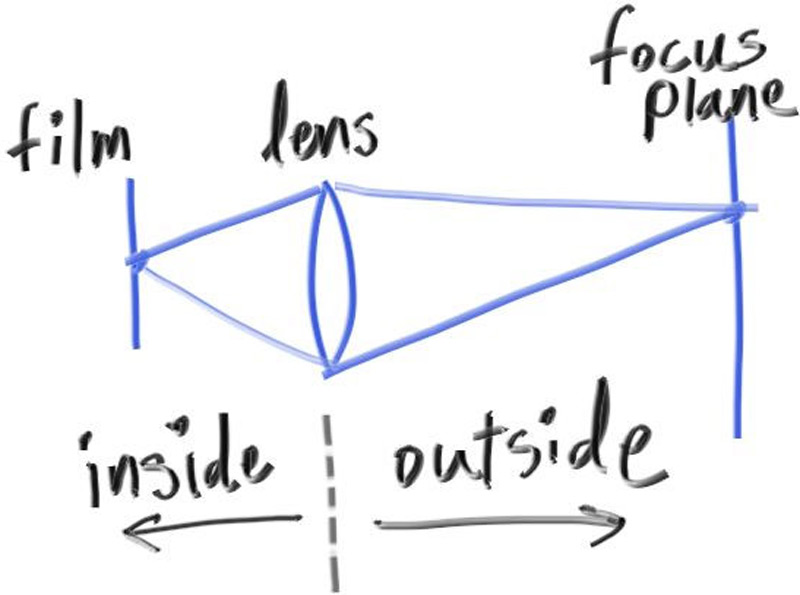
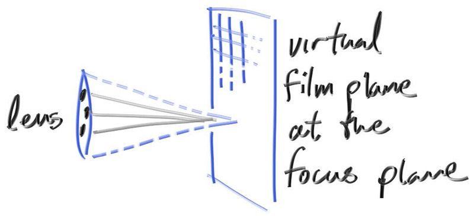
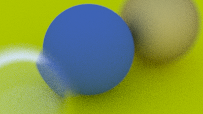

# 13. 散焦模糊（Defocus Blur）

我们现在要介绍最后一个功能：散焦模糊。注意，摄影师通常称之为“景深”（depth of field），但在和做光线追踪的朋友交流时，最好只使用“散焦模糊”这个术语。

真实相机中之所以会有散焦模糊，是因为它们需要一个大孔（而不仅仅是针孔）来采集更多光线。大孔会使所有物体失焦模糊，但如果我们在胶片或传感器前面放置一个镜头，那么在某个特定距离处的物体会处于对焦状态。处于这个距离的物体会清晰成像，离该距离越远的物体则模糊程度越高。你可以将镜头想象为：来自聚焦距离上的某一点的所有光线，经过镜头后会聚焦到图像传感器上的同一个点。

我们称从相机中心到这个清晰成像平面的距离为对焦距离（focus distance）。需要注意的是，对焦距离通常与焦距（focal length）不同 —— 焦距是相机中心到图像平面的距离。然而在我们的模型中，这两者是相同的，因为我们会把像素网格放在对焦平面上，即距相机中心 focus_distance 的地方。

在物理相机中，对焦距离由镜头与胶片/传感器之间的距离控制。这就是为什么当你改变对焦对象时，相机会移动镜头（你的手机可能也是移动传感器）。光圈（aperture）是用来控制镜头开口大小的孔。真实相机中，当你需要更多光线时会开大光圈，但这会使离焦点远的物体更加模糊。而在我们的虚拟相机中，我们可以使用理想的传感器，不需要更多光线，因此只有在需要模拟散焦模糊时才使用光圈。

## 13.1. 薄透镜近似模型（A Thin Lens Approximation）

真实相机使用复杂的复合镜头。我们本可以模拟其顺序：传感器 -> 镜头 -> 光圈，然后计算光线路径，并在计算后将图像倒置（真实成像是倒立的）。但在图形学中，通常使用薄透镜近似模型（thin lens approximation）：


（图 21：相机镜头模型）


我们不需要模拟相机内部，对于渲染相机外部场景而言，这是多余的复杂度。取而代之，我通常从一个**无限薄的圆形“透镜”**发射光线，朝向聚焦平面（距离镜头 focal_length 远处）上目标像素位置射出，确保该平面上的所有物体都处于清晰对焦状态。在实现中，我们将视口放在这个对焦平面上。组合起来：

1. 对焦平面与相机视线方向正交；
2. 对焦距离是相机中心到对焦平面的距离；
3. 视口位于对焦平面上，以相机视线方向为中心；
4. 像素网格位于视口内，处于三维空间中；
5. 图像样本点从当前像素附近的区域随机选择；
6. 相机从透镜上的随机点发出光线，穿过当前样本点。



（图 22：相机聚焦平面）

## 13.2. 生成采样光线（Generating Sample Rays）

在没有散焦模糊的情况下，所有光线都从相机中心（lookfrom）发出。为了实现散焦模糊，我们以相机中心为中心构造一个圆盘。圆盘半径越大，模糊越明显。你可以认为我们最初的相机等价于一个半径为 0 的散焦圆盘（完全无模糊），因此所有光线都从圆盘中心发出。

那么这个散焦圆盘的半径该设多大？因为圆盘大小决定了模糊程度，所以它应当作为相机类的一个参数。我们可以直接使用圆盘半径作为参数，但这会使模糊效果依赖于投影距离。更好的方式是设定一个锥角：以视口中心为锥顶、相机中心为锥底的角度。这样可以在改变对焦距离时获得更一致的模糊效果。

因为我们会从圆盘上随机选择点，需要一个函数来实现：random_in_unit_disk()。这个函数类似于 random_unit_vector()，只是作用于二维空间。

```c
inline vec3 unit_vector(const vec3& u) {
    return v / v.length();
}

inline vec3 random_in_unit_disk() {
    while (true) {
        auto p = vec3(random_double(-1,1), random_double(-1,1), 0);
        if (p.length_squared() < 1)
            return p;
    }
}
```

更新相机使光线从散焦圆盘发出：

```c
class camera {
  public:
    double aspect_ratio      = 1.0;
    int    image_width       = 100;
    int    samples_per_pixel = 10;
    int    max_depth         = 10;

    double vfov     = 90;
    point3 lookfrom = point3(0,0,0);
    point3 lookat   = point3(0,0,-1);
    vec3   vup      = vec3(0,1,0);

    double defocus_angle = 0;
    double focus_dist = 10;

    ...
  private:
    int    image_height;
    double pixel_samples_scale;
    point3 center;
    point3 pixel00_loc;
    vec3   pixel_delta_u;
    vec3   pixel_delta_v;
    vec3   u, v, w;
    vec3   defocus_disk_u;
    vec3   defocus_disk_v;

    void initialize() {
        ...
        auto defocus_radius = focus_dist * std::tan(degrees_to_radians(defocus_angle / 2));
        defocus_disk_u = u * defocus_radius;
        defocus_disk_v = v * defocus_radius;
    }

    ray get_ray(int i, int j) const {
        auto offset = sample_square();
        auto pixel_sample = pixel00_loc
                          + ((i + offset.x()) * pixel_delta_u)
                          + ((j + offset.y()) * pixel_delta_v);

        auto ray_origin = (defocus_angle <= 0) ? center : defocus_disk_sample();
        auto ray_direction = pixel_sample - ray_origin;

        return ray(ray_origin, ray_direction);
    }

    point3 defocus_disk_sample() const {
        auto p = random_in_unit_disk();
        return center + (p[0] * defocus_disk_u) + (p[1] * defocus_disk_v);
    }
};
```

使用大光圈渲染：
```c
int main() {
    ...

    camera cam;

    cam.aspect_ratio      = 16.0 / 9.0;
    cam.image_width       = 400;
    cam.samples_per_pixel = 100;
    cam.max_depth         = 50;

    cam.vfov     = 20;
    cam.lookfrom = point3(-2,2,1);
    cam.lookat   = point3(0,0,-1);
    cam.vup      = vec3(0,1,0);

    cam.defocus_angle = 10.0;
    cam.focus_dist    = 3.4;

    cam.render(world);
}
```

我们得到如下图像：



图像 22：具有景深效果的球体