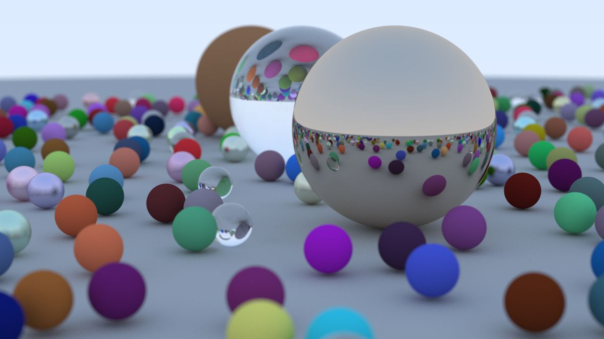

# 14. 接下来去哪？

## 14.1. 最终渲染

让我们制作这本书封面上的图像 —— 充满了随机球体。

```c
int main() {
    hittable_list world;

    auto ground_material = make_shared<lambertian>(color(0.5, 0.5, 0.5));
    world.add(make_shared<sphere>(point3(0,-1000,0), 1000, ground_material));

    for (int a = -11; a < 11; a++) {
        for (int b = -11; b < 11; b++) {
            auto choose_mat = random_double();
            point3 center(a + 0.9*random_double(), 0.2, b + 0.9*random_double());

            if ((center - point3(4, 0.2, 0)).length() > 0.9) {
                shared_ptr<material> sphere_material;

                if (choose_mat < 0.8) {
                    // 漫反射
                    auto albedo = color::random() * color::random();
                    sphere_material = make_shared<lambertian>(albedo);
                    world.add(make_shared<sphere>(center, 0.2, sphere_material));
                } else if (choose_mat < 0.95) {
                    // 金属
                    auto albedo = color::random(0.5, 1);
                    auto fuzz = random_double(0, 0.5);
                    sphere_material = make_shared<metal>(albedo, fuzz);
                    world.add(make_shared<sphere>(center, 0.2, sphere_material));
                } else {
                    // 玻璃
                    sphere_material = make_shared<dielectric>(1.5);
                    world.add(make_shared<sphere>(center, 0.2, sphere_material));
                }
            }
        }
    }

    auto material1 = make_shared<dielectric>(1.5);
    world.add(make_shared<sphere>(point3(0, 1, 0), 1.0, material1));

    auto material2 = make_shared<lambertian>(color(0.4, 0.2, 0.1));
    world.add(make_shared<sphere>(point3(-4, 1, 0), 1.0, material2));

    auto material3 = make_shared<metal>(color(0.7, 0.6, 0.5), 0.0);
    world.add(make_shared<sphere>(point3(4, 1, 0), 1.0, material3));

    camera cam;

    cam.aspect_ratio      = 16.0 / 9.0;
    cam.image_width       = 1200;
    cam.samples_per_pixel = 500;
    cam.max_depth         = 50;

    cam.vfov     = 20;
    cam.lookfrom = point3(13,2,3);
    cam.lookat   = point3(0,0,0);
    cam.vup      = vec3(0,1,0);

    cam.defocus_angle = 0.6;
    cam.focus_dist    = 10.0;

    cam.render(world);
}
```

（注意：上述代码与项目示例代码略有不同：此处的 samples_per_pixel 设置为 500，以获得高质量图像，但渲染时间较长。而项目源代码中则使用了 10，以便在开发和验证过程中具有合理的运行时间。）

这将产生：



图像 23：最终场景

你可能注意到一个有趣的现象：玻璃球几乎没有投下阴影，这使得它们看起来像是漂浮在空中。这不是 bug —— 在现实生活中你也很少看到玻璃球，它们确实看起来有点奇怪，特别是在多云的日子里，看起来像是在漂浮。因为玻璃球下方大球体上的一个点仍然受到大量来自天空的光照，天空光是被重新定向了而不是被阻挡了。

## 14.2. 下一步

你现在已经拥有了一个很酷的光线追踪器！那接下来干什么呢？
第二本书：《Ray Tracing: The Next Week》
本系列的第二本书是在你已经开发的光线追踪器基础上构建的。它包括如下新特性：
运动模糊 —— 真实地渲染移动的物体。
包围体层次结构（BVH） —— 加快复杂场景的渲染速度。
纹理贴图 —— 在物体上贴图像。
Perlin 噪声 —— 一种非常实用的随机噪声生成器，适用于许多技术。
四边形 —— 除了球体以外可以渲染的新物体！同时也是实现圆盘、三角形、圆环或其他二维图元的基础。
光源 —— 为场景添加光源。
变换 —— 用于放置和旋转物体。
体积渲染 —— 渲染烟雾、云和其他气体体积。

第三本书：《Ray Tracing: The Rest of Your Life》
这本书进一步扩展了第二本书的内容。大量内容致力于提升渲染图像的质量与渲染器性能，重点在于生成更合适的射线并正确地累加它们。

本书适合那些认真想编写专业级光线追踪器的读者，或是希望为实现高级效果（如次表面散射、嵌套介质等）打基础的开发者。

其他方向
从这里开始还有许多扩展方向，包括本系列尚未（或未来可能）涉及的技术，例如：

三角形 —— 大多数精美模型都是由三角形构成的。模型的 I/O 是个大坑，几乎每个人都在用别人的代码来处理它。还包括如何高效地处理大型三角网格，它们本身就是一个挑战。

并行化 —— 在 N 个核心上运行 N 个你的程序副本，使用不同的随机种子。对 N 次运行的结果取平均。这个平均可以层次化地进行，比如先两两平均得到 N/2 张图，再两两平均得到 N/4 张，以此类推。这种并行方法可以很好地扩展到成千上万个核心，而只需很少的编码改动。

阴影光线（Shadow Rays） —— 在向光源发射光线时，你可以精确地判断某个点是否被遮挡。利用这一点，你可以渲染清晰或柔和的阴影，为你的场景增加更多真实感。