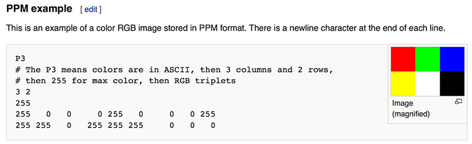

# 2. 输出一张图片
---

## 2.1. PPM 图片格式

<p>
每当你开始编写一个渲染器时，你都需要一种方式来查看图像。最直接的做法就是将图像写入文件。但问题在于，图像格式种类繁多，而且很多都很复杂。我通常会从最简单的文本格式——PPM（Portable Pixmap Format）文件开始。
</p>

<h4>以下是维基百科中对 PPM 格式的一个简要说明：</h4>


图 1：PPM 示例

<h4>让我们编写一些 C++ 代码来输出这样一个文件:</h4>

```c
#include <iostream>

int main() {

    // Image

    int image_width = 256;
    int image_height = 256;

    // Render

    std::cout << "P3\n" << image_width << ' ' << image_height << "\n255\n";

    for (int j = 0; j < image_height; j++) {
        for (int i = 0; i < image_width; i++) {
            auto r = double(i) / (image_width-1);
            auto g = double(j) / (image_height-1);
            auto b = 0.0;

            int ir = int(255.999 * r);
            int ig = int(255.999 * g);
            int ib = int(255.999 * b);

            std::cout << ir << ' ' << ig << ' ' << ib << '\n';
        }
    }
}
```
<div align="center">代码清单 1：[main.cc] 创建你的第一张图像</div>
<br/>

下面是对这段代码的一些说明：

1. 像素是按行输出的。
2. 每一行中的像素是从左到右写出的。
3. 所有的行从图像的顶部到底部依次写出。
4. 按照惯例，RGB（三原色）每个分量在内部通常用浮点数表示，范围为 0.0 到 1.0。在输出到文件前，需要将其缩放为整数值，范围为 0 到 255。
5. 图像中的红色分量在水平方向（从左到右）上从关闭（黑）逐渐过渡到完全开启（亮红）；而绿色分量在垂直方向（从上到下）上从关闭（黑）逐渐过渡到完全开启（亮绿）。
6. 因为红光和绿光混合会形成黄色，所以我们可以预期图像的右下角将是黄色的。


