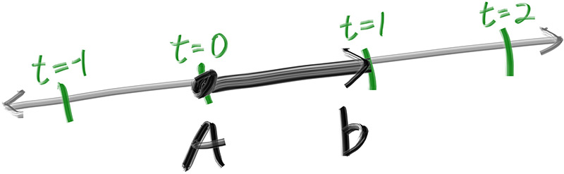
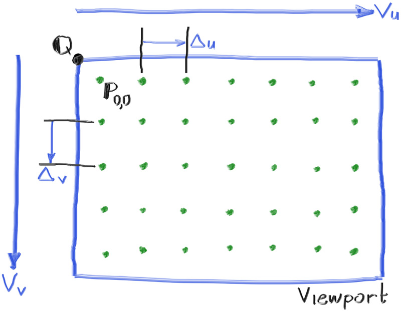

# 4. 光线、简单相机与背景
## 4.1 ray 类
<p>
所有光线追踪器都有一个共同点：都有一个 ray 类，以及一套计算某条光线上能看到什么颜色的机制。我们先从数学上理解“光线”这一概念。我们可以将光线视为一个函数：𝑃(𝑡)=𝐴+𝑡𝑏. 其中：𝑃: 沿着一条三维直线上的某个点。𝐴：光线的起点（origin）。 𝑏：光线的方向向量（direction）。𝑡：一个实数参数（在代码中是 double 类型）。当你向函数 P(t) 传入不同的 𝑡 值，就能得到光线上不同的点。如果 𝑡 为负数，就可以访问起点 𝐴 之前的空间；当 𝑡≥0 时，则表示从起点出发、指向前方的“射线”（也称作“半直线”）。<br/><br/>


<div align="center">此图用来直观表示 𝐴+𝑡𝑏 如何在三维空间中生成光线</div>
<div align="center">图 2：线性插值</div>

<br/>
</p>

我们可以用一个类来表示光线的这个数学概念，同时实现 P(t) 函数，即 ray::at(t)。下面是这个 ray 类的基本结构：
```c
#ifndef RAY_H
#define RAY_H

#include "vec3.h"

class ray {
  public:
    ray() {}

    ray(const point3& origin, const vec3& direction) : orig(origin), dir(direction) {}

    const point3& origin() const  { return orig; }
    const vec3& direction() const { return dir; }

    point3 at(double t) const {
        return orig + t*dir;
    }

  private:
    point3 orig;
    vec3 dir;
};

#endif
```
<p>
对于不熟悉 C++ 的人来说，函数 ray::origin() 和 ray::direction() 都会返回其成员的不可变引用。调用者可以直接使用该引用，也可以根据需要创建一个可变副本。
</p>

## 4.2 将射线发射到场景中
<hr/>
<p>
现在我们已经准备好迈出关键一步，开始构建一个光线追踪器。其核心思想是将射线通过像素发射出去，并计算在这些射线方向上所看到的颜色。主要的步骤包括：
</p>

1. 计算从“眼睛”穿过像素的射线
2. 确定该射线与哪些物体相交；
3. 为最近的交点计算颜色。

<p>
在刚开始开发光线追踪器时，我通常会使用一个简单的相机来使代码尽快运行起来。
</p>
<p>
在调试过程中，我常因使用正方形图像而遇到麻烦，因为我很容易把 x 和 y 搞反。因此，我们将使用一个非正方形图像。正方形图像的宽高比为 1:1，因为其宽度与高度相等。而我们想要一个非正方形图像，16:9 是一个非常常见的选择。16:9 的宽高比意味着图像宽度与高度的比值为 16:9。换句话说，若一个图像的宽高比是 16:9，那么：
</p>
<div align='center'><h3>宽度 / 高度 = 16 / 9 = 1.7778</h3></div>

<p>
举个实际的例子，一个宽 800 像素、高 400 像素的图像，其宽高比就是 2:1。
图像的宽高比可以通过宽度除以高度得到。但由于我们已经有了想要的宽高比，更简单的做法是先设定图像宽度和宽高比，然后据此计算图像高度。这样做的好处是我们可以通过改变图像宽度来缩放图像大小，而不会破坏所需的宽高比。唯一要注意的是，求解图像高度时，结果至少要是 1。
</p>
<p>
除了设定渲染图像的像素尺寸外，我们还需要设定一个虚拟的视口，用于发射场景中的射线。视口是三维世界中的一个虚拟矩形，它包含图像中每个像素的位置网格。如果像素在水平方向和垂直方向上的间距相同，那么这个视口将具有与图像相同的宽高比。两个相邻像素之间的距离称为像素间距，而正方形像素是默认标准。
</p>
<p>
首先，我们可以随意设定一个视口高度为 2.0，然后根据期望的宽高比来缩放视口宽度。下面是这部分代码的大致片段：
</p>

```c
auto aspect_ratio = 16.0 / 9.0;
int image_width = 400;

// Calculate the image height, and ensure that it's at least 1.
int image_height = int(image_width / aspect_ratio);
image_height = (image_height < 1) ? 1 : image_height;

// Viewport widths less than one are ok since they are real valued.
auto viewport_height = 2.0;
auto viewport_width = viewport_height * (double(image_width)/image_height);
```
<div align='center'> Listing 8: Rendered image setup </div>
<p>
如果你在想，为什么我们在计算 viewport_width 时不直接使用 aspect_ratio，那是因为 aspect_ratio 表示的是理想的宽高比，而它可能并不是 image_width 和 image_height 之间的实际比值。如果我们允许 image_height 是一个实数值（而不仅仅是整数），那么直接使用 aspect_ratio 是没有问题的。但由于实际的 image_width 与 image_height 之间的比值受代码中两个部分的影响，所以可能会有所偏差。首先，image_height 会被向下取整为最接近的整数，这可能会增大比值；其次，我们不允许 image_height 小于 1，这也可能导致实际的宽高比发生变化。
</p>
<p>
请注意，aspect_ratio 是一个理想值，我们通过图像宽度除以图像高度的整数比值尽可能地去近似它。为了使视口的比例与图像的比例完全匹配，我们使用计算得到的图像实际宽高比来确定最终的视口宽度。
</p>
<p>
接下来我们将定义相机中心：这是一个位于三维空间中的点，所有场景中的射线都从该点发出（这通常也被称为“眼点”）。从相机中心指向视口中心的向量将与视口正交。我们初始将视口与相机中心之间的距离设置为一个单位长度。这个距离通常称为焦距。
</p>
<p>
为简单起见，我们将相机中心设定在坐标原点 (0, 0, 0)。我们也假设 y 轴朝上，x 轴朝右，负 z 轴为视线方向（这被称为右手坐标系）。
</p>


<div align='center'>Figure 3: Camera geometry </div>

<p>
现在到了不可避免的棘手部分。虽然我们的三维空间采用了上面提到的坐标约定，但这与图像坐标系统存在冲突。在图像坐标中，我们希望第一个像素（像素 0,0）位于图像的左上角，然后向下扫描，直到右下角的最后一个像素。这意味着图像坐标中的 Y 轴方向是反的：Y 值在图像中是向下递增的。
</p>
<p>
当我们扫描图像时，将从左上角的像素 (0, 0) 开始，按行从左到右依次扫描每个像素，再逐行从上到下扫描整个图像。为了在像素网格中进行定位，我们将使用两个向量：一个是从视口左边缘指向右边缘的向量 𝑉𝑢 ，另一个是从视口上边缘指向下边缘的向量 𝑉𝑣。
</p>
<p>
我们的像素网格会从视口边缘向内偏移半个像素间距。这样，视口区域就被均匀地划分为宽度 × 高度个相同大小的子区域（即每个像素占据一个区域）。下面是视口和像素网格的大致结构示意：
</p>


<div align='center'>Figure 4: Viewport and pixel grid</div>

<p>
在这张图中，我们可以看到视口、一个分辨率为 7×5 的像素网格、视口的左上角 
𝑄、像素 𝑃0,0 的位置、视口向量 𝑉𝑢 （viewport_u）、视口向量 𝑉𝑣（viewport_v），以及像素的增量向量 Δ𝑢 和 Δ𝑣。
</p>
<p>
根据上述所有信息，我们可以编写实现相机功能的代码。我们会先占位定义一个函数 ray_color(const ray& r)，它接收一个场景射线并返回其对应的颜色 —— 当前我们先让它始终返回黑色。
</p>

```c
#include "color.h"
#include "ray.h"
#include "vec3.h"

#include <iostream>

color ray_color(const ray& r) {
    return color(0,0,0);
}

int main() {

    // Image

    auto aspect_ratio = 16.0 / 9.0;
    int image_width = 400;

    // Calculate the image height, and ensure that it's at least 1.
    int image_height = int(image_width / aspect_ratio);
    image_height = (image_height < 1) ? 1 : image_height;

    // Camera

    auto focal_length = 1.0;
    auto viewport_height = 2.0;
    auto viewport_width = viewport_height * (double(image_width)/image_height);
    auto camera_center = point3(0, 0, 0);

    // Calculate the vectors across the horizontal and down the vertical viewport edges.
    auto viewport_u = vec3(viewport_width, 0, 0);
    auto viewport_v = vec3(0, -viewport_height, 0);

    // Calculate the horizontal and vertical delta vectors from pixel to pixel.
    auto pixel_delta_u = viewport_u / image_width;
    auto pixel_delta_v = viewport_v / image_height;

    // Calculate the location of the upper left pixel.
    auto viewport_upper_left = camera_center
                             - vec3(0, 0, focal_length) - viewport_u/2 - viewport_v/2;
    auto pixel00_loc = viewport_upper_left + 0.5 * (pixel_delta_u + pixel_delta_v);

    // Render

    std::cout << "P3\n" << image_width << " " << image_height << "\n255\n";

    for (int j = 0; j < image_height; j++) {
        std::clog << "\rScanlines remaining: " << (image_height - j) << ' ' << std::flush;
        for (int i = 0; i < image_width; i++) {
            auto pixel_center = pixel00_loc + (i * pixel_delta_u) + (j * pixel_delta_v);
            auto ray_direction = pixel_center - camera_center;
            ray r(camera_center, ray_direction);

            color pixel_color = ray_color(r);
            write_color(std::cout, pixel_color);
        }
    }

    std::clog << "\rDone.                 \n";
}
```
<div align='center'>Listing 9: [main.cc] Creating scene rays</div>

<p>
请注意，在上面的代码中，我并没有将 ray_direction 归一化为单位向量，因为我认为不进行单位化可以让代码更简单，也稍微更高效一些。
</p>
<p>
接下来我们将填充 ray_color(ray) 函数，实现一个简单的颜色渐变效果。这个函数会根据射线方向中的 y 坐标来在线性地混合白色和蓝色。具体来说，我们会先将射线方向归一化（单位化），然后根据其 y 分量的高度来决定颜色的混合程度（因此 −1.0 < 𝑦 <
1.0）。由于我们是根据归一化后的向量的 y 值来计算的，你会发现除了垂直方向的颜色渐变外，还存在一定的水平方向渐变。
</p>
<p>
我们将使用图形学中一个常见的技巧，将一个变量 𝑎 在线性范围 0.0≤𝑎≤1.0 内缩放。当 𝑎=1.0 时，我们希望得到蓝色；当 𝑎=0.0 时，我们希望得到白色；在中间的值我们则希望是这两种颜色的线性混合。这就是所谓的“线性混合”或“线性插值”（linear interpolation），通常称为 lerp。
线性插值的通用公式是：
</p>
<div align='center'>
blendedValue = (1−𝑎) ⋅ startValue+𝑎⋅endValue
</div>
<p>
其中 𝑎 的取值范围是 0 到 1。
<br/>

把以上内容整合起来，我们就能得到如下的实现代码：
</p>

```c
#include "color.h"
#include "ray.h"
#include "vec3.h"

#include <iostream>


color ray_color(const ray& r) {
    vec3 unit_direction = unit_vector(r.direction());
    auto a = 0.5*(unit_direction.y() + 1.0);
    return (1.0-a)*color(1.0, 1.0, 1.0) + a*color(0.5, 0.7, 1.0);
}

...

```
<div align='center'>
Listing 10: [main.cc] Rendering a blue-to-white gradient
</div>

<p>
示例输出如下:


</p>

<div align='center'>
Image 2: A blue-to-white gradient depending on ray Y coordinate
</div>

## 问题
### 一、为什么归一化后水平方向也会出现渐变？

从代码上看：

```c
vec3 unit_direction = unit_vector(r.direction());
auto a = 0.5 * (unit_direction.y() + 1.0);
```

我们用的是**归一化之后的方向向量的 y 分量**来决定颜色混合因子 `a`，那么为什么明明是用 y 分量计算颜色，却说 **水平方向也会有颜色渐变** 呢？

原因在于归一化这个操作本身是非线性的，影响了 x 和 y 的相对比例：设原始方向向量为 $$\vec{d} = (x, y, z)$$，单位化之后变成：

$$
\vec{u} = \frac{\vec{d}}{|\vec{d}|} =
\left(
\frac{x}{\sqrt{x^2 + y^2 + z^2}},\ 
\frac{y}{\sqrt{x^2 + y^2 + z^2}},\ 
\frac{z}{\sqrt{x^2 + y^2 + z^2}}
\right)
$$

我们用的是单位向量的 y 分量 `u.y` 来混合颜色，也就是说混合因子 `a` 的实际值是：

$$
a = 0.5 * 
    \left( 
        \frac{y}{\sqrt{x² + y² + z²}} + 1.0 
    \right)
$$

你可以看到这里 `a` 受到了 **x、y、z 三个分量**的影响。即便你沿着 **水平方向变化（改变 x）而保持 y 不变**，归一化之后的 y 值也会变化。因此：
**横向（x方向）变化会影响归一化后 y 分量的值，从而影响最终颜色。**

所以就算你沿着水平方向扫描像素（也就是只改 x，不改 y），颜色依然会发生渐变，看起来就像有“横向渐变”一样。

---

### 二、为什么不直接用 y 分量，而要引入 `a`？

原始 y 值归一化后范围是：

```c
-1 <= unit_direction.y() <= 1
```

但是我们希望颜色混合因子 `a` 落在 **[0, 1]** 之间，这样我们才可以用线性插值（lerp）进行颜色混合。所以：

```c
a = 0.5 * (unit_direction.y() + 1.0)
```

这个公式把 y 从 `[-1, 1]` 线性映射到 `[0, 1]`。  
举例：

- 当 `y = -1.0` → `a = 0.0` → 完全白色
- 当 `y =  1.0` → `a = 1.0` → 完全蓝色
- 中间值 → 混合色

这就是为什么要引入 `a` 来作为混合因子，而不是直接使用 y 分量的原因：**它保证颜色混合过程线性且稳定，且值域在 [0,1] 之间。**

### 三、为什么要引入视口这个概念而不直接用图像像素

<h3>图像（image）和视口（viewport）的定义和角色</h3>

| 概念       | 说明 |
|------------|------|
| 图像 (image) | 是二维像素阵列，用于存储渲染结果。例如：800×600 像素的图像就是一个二维数组，每个元素是一个像素的颜色。 |
| 视口 (viewport) | 是 3D 世界空间中的一个矩形面板，放置在摄像机前面，用于定义“我们往哪里投射光线”。它是图像的“投影窗口”或“成像平面”。 |


<h3>为什么不能直接用图像当视口</h3>

<p>
图像是离散的，而视口是连续的。图像是一堆离散像素（整数索引），而视口是一个浮点矩形平面（在世界坐标中）。图像只是结果的“存储容器”。视口是物理上“光线射出的目标面”，必须存在于 3D 空间中。
</p>


---
