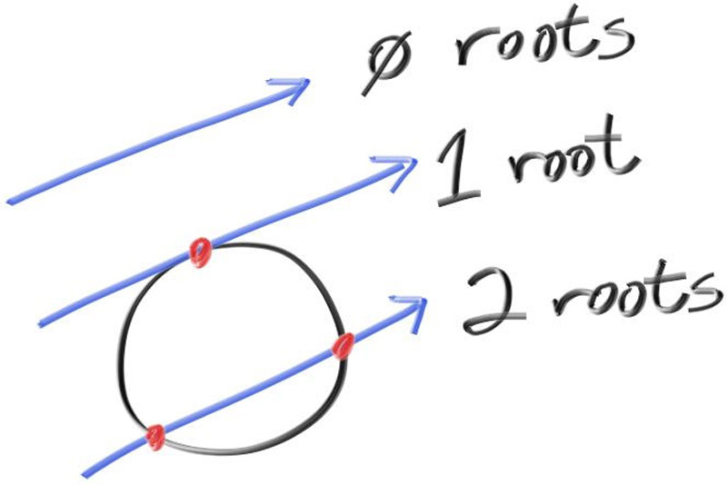

# 5. 添加一个球体
<p>
让我们给光线追踪器添加一个单独的物体。人们通常在光线追踪器中使用球体，因为计算光线是否击中球体相对简单。
</p>

## 5.1 光线-球体相交

半径为 r、中心在原点的球体的方程是一个重要的数学公式：
<h3>
$$
x^2 + y^2 + z^2 = r^2
$$
</h3>
你也可以这样理解：如果给定点 (x,y,z) 在球体表面，则满足:
<h3>
$$
x^2 + y^2 + z^2 = r^2
$$
</h3>
如果点在球体内部，则满足:
<h3>
$$
x^2 + y^2 + z^2 < r^2
$$
</h3>
如果点在球体外部，则满足:
<h3>
$$
x^2 + y^2 + z^2 > r^2
$$
</h3>
如果我们允许球体中心位于任意点 (C_x, C_y, C_z)，则方程变得不那么简洁：
<h3>
$$
(C_x - x)^2 + (C_y - y)^2 + (C_z - z)^2 = r^2
$$
</h3>
在图形学中，你几乎总是希望用向量来表示公式，这样所有的 (x, y, z) 都可以用一个 `vec3` 类简单表示。你可能注意到，从点 P = (x,y,z) 到中心 C = (Cx, Cy, Cz) 的向量是 (C - P)。

如果使用点积的定义：
<h3>
$$
(C - P) \cdot (C - P) = (C_x - x)^2 + (C_y - y)^2 + (C_z - z)^2
$$
</h3>

那么我们可以把球体的方程用向量形式重写为：
<h3>
$$
(C - P) \cdot (C - P) = r^2
$$
</h3>

我们可以理解为“满足这个方程的任意点 P 都在球体表面”。我们想知道光线
<h3>
$$
P(t) = Q + t d
$$
</h3>

是否会在某处击中球体。如果击中球体，则存在某个 t 使得 P(t) 满足球体方程。因此我们需要寻找满足下式的 t：

<h3>
$$
(C - P(t)) \cdot (C - P(t)) = r^2
$$
</h3>

将 P(t) 的展开形式代入：
<h3>
$$
(C - (Q + t d)) \cdot (C - (Q + t d)) = r^2
$$
</h3>

左边有三个向量点积右边的三个向量。如果完全展开点积，会得到九项。你完全可以把它们全部写出来，但其实不必那么繁琐。如果你记得我们要解的是 t，我们可以根据是否含有 t 来分组：
<h3>
$$
(-t d + (C - Q)) \cdot (-t d + (C - Q)) = r^2
$$
</h3>

然后按照向量代数的规则展开点积：
<h3>
$$
t^2 (d \cdot d) - 2 t (d \cdot (C - Q)) + (C - Q) \cdot (C - Q) = r^2
$$
</h3>

将半径的平方移到等式左边：
<h3>
$$
t^2 (d \cdot d) - 2 t (d \cdot (C - Q)) + (C - Q) \cdot (C - Q) - r^2 = 0
$$
</h3>

虽然看不太清这是什么方程，但公式中的向量和 r 都是已知常量。而且所有向量通过点积都变成了标量，唯一未知的是 t，且包含 t^2，说明这是一个二次方程。你可以使用二次方程求根公式来解方程
<h3>
$$
a x^2 + b x + c = 0
$$
</h3>

的解：
<h3>
$$
t = \frac{-b \pm \sqrt{b^2 - 4ac}}{2a}
$$
</h3>


所以在光线-球体相交方程中，a, b, c 对应的值为：
<h3>
$$
a = d \cdot d
$$
$$
b = -2 d \cdot (C - Q)
$$
$$
c = (C - Q) \cdot (C - Q) - r^2
$$
</h3>

利用上述公式你可以求出 t，但其中的平方根部分可能为正（表示有两个实数解）、为负（表示无实数解）、或为零（表示有一个实数解）。在图形学中，代数往往直接对应几何意义。我们得到的结果是：



## 5.2 创建我们的第一幅光线跟踪图像

如果我们将这一数学运算硬编码到程序中，我们可以在 Z 轴-1 处放置一个小球体，然后将与之相交的任何像素染成红色，以此来测试我们的代码。

```c
bool hit_sphere(const point3& center, double radius, const ray& r) {
    vec3 oc = center - r.origin();
    auto a = dot(r.direction(), r.direction());
    auto b = -2.0 * dot(r.direction(), oc);
    auto c = dot(oc, oc) - radius*radius;
    auto discriminant = b*b - 4*a*c;
    return (discriminant >= 0);
}

color ray_color(const ray& r) {
    if (hit_sphere(point3(0,0,-1), 0.5, r))
        return color(1, 0, 0);

    vec3 unit_direction = unit_vector(r.direction());
    auto a = 0.5*(unit_direction.y() + 1.0);
    return (1.0-a)*color(1.0, 1.0, 1.0) + a*color(0.5, 0.7, 1.0);
}
```
<div align='center'>Listing 11: [main.cc] Rendering a red sphere</div>
<br/>

我们得到如下图像:


现在这个实现还缺少很多东西 —— 比如阴影、反射光线、多个物体等等 —— 但我们已经比刚开始时离完成更近了一半！有一件事需要注意：我们目前是通过求解二次方程并检查是否存在解，来判断光线是否与球体相交，但那些带有负值的解 t 也是完全成立的。

如果你把球体的中心改到 z = +1，你仍然会得到完全一样的图像，这是因为当前的解并没有区分相机前方的物体和相机后方的物体。这可不是一个功能特性！我们接下来会修复这些问题。
