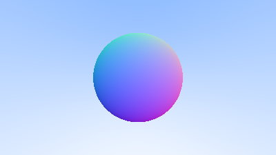

# 6. 表面法线与多个物体

## 6.1 利用表面法线实现着色

首先，让我们先获取表面法线（Surface Normal），这样我们才能进行基本的着色。法线是指在交点处垂直于物体表面的向量。

我们在代码中需要做一个关于法线向量的重要设计决策：到底是允许法线向量具有任意长度，还是强制将其归一化为单位向量。

虽然跳过归一化操作（涉及昂贵的平方根计算）在某些情况下可能看起来更高效，但实际操作中有三个重要的考虑因素：

1. 如果最终还是需要单位长度的法线向量，那不如一开始就归一化，而不是每次用到时都做一次判断和归一化；
2. 实际上，在多个地方我们确实需要单位长度的法线向量；
3. 如果我们强制所有法线都是单位长度，那么我们通常可以结合几何体的特性在构造函数或 `hit()` 函数中高效地生成它。例如，对于球体而言，只需将法线向量除以球体半径就可以直接获得单位长度的法线，完全可以避免使用平方根操作。

综上，我们将采取的策略是：**所有法线向量都归一化为单位长度。**

对于球体来说，外法线的方向是击中点减去球心的方向向量：


<h3>
$$
\text{normal} = \frac{P - C}{\|P - C\|}
$$
</h3>

其中：
- P 是光线与球体的交点；
- C 是球体的中心；
- 分母表示的是向量的长度（我们需要将其归一化）。

由于我们已经决定所有法线向量都为单位长度，因此这是我们之后处理所有法线的基础原则。

在地球上，这意味着从地心指向你的位置的向量就是垂直向上的方向。现在让我们把这个逻辑加到代码中，并实现简单的着色。由于我们目前还没有引入光源或其它高级特效，我们可以用**颜色映射**来可视化法线。

一种常用的法线可视化技巧（因为它简单且直观）是基于这样的假设：**法线向量是单位长度向量**，因此它的每个分量都在 [-1, 1] 区间内。于是，我们可以将每个分量线性映射到 [0, 1] 区间，再将 (x, y, z) 映射到 RGB 颜色的 (red, green, blue)。

为了得到法线，我们需要击中点的位置（而不仅仅是“是否击中”，这正是我们目前计算的内容）。由于场景中只有一个球体，且它正对着相机，我们暂时不考虑负的 t 值。我们只取距离最近的交点（即最小的 t 值）作为我们想要的交点。

代码中的这些改动可以让我们计算并可视化法线向量 n：

```
double hit_sphere(const point3& center, double radius, const ray& r) {
    vec3 oc = center - r.origin();
    auto a = dot(r.direction(), r.direction());
    auto b = -2.0 * dot(r.direction(), oc);
    auto c = dot(oc, oc) - radius*radius;
    auto discriminant = b*b - 4*a*c;

    if (discriminant < 0) {
        return -1.0;
    } else {
        return (-b - std::sqrt(discriminant) ) / (2.0*a);
    }
}

color ray_color(const ray& r) {
    auto t = hit_sphere(point3(0,0,-1), 0.5, r);
    if (t > 0.0) {
        vec3 N = unit_vector(r.at(t) - vec3(0,0,-1));
        return 0.5*color(N.x()+1, N.y()+1, N.z()+1);
    }

    vec3 unit_direction = unit_vector(r.direction());
    auto a = 0.5*(unit_direction.y() + 1.0);
    return (1.0-a)*color(1.0, 1.0, 1.0) + a*color(0.5, 0.7, 1.0);
}
```
于是就有了下面这种图片:



## 6.2. 简化射线与球相交代码

让我们回顾一下该函数:

```c
double hit_sphere(const point3& center, double radius, const ray& r) {
    vec3 oc = center - r.origin();
    auto a = dot(r.direction(), r.direction());
    auto b = -2.0 * dot(r.direction(), oc);
    auto c = dot(oc, oc) - radius*radius;
    auto discriminant = b*b - 4*a*c;

    if (discriminant < 0) {
        return -1.0;
    } else {
        return (-b - std::sqrt(discriminant) ) / (2.0*a);
    }
}
```

回顾一下射线与球体相交的方程:

$$
t^2(d \cdot d) - 2t(d \cdot (C-Q)) + (C - Q)^2 - r^2 = 0
$$

其求根公式为:

$$
t = \frac{-b \pm \sqrt{b^2-4ac}}{2a}
$$

所以在 **光线-球体相交方程** 中，a,b,c 对应的值分别为:
$$
    a = d \cdot d
$$
$$
b = -2d \cdot (C-Q)
$$
$$
c = (C-Q)^2 - r^2
$$

首先回顾一下一个向量与自身点乘等于该向量长度的平方。再次，注意到球根公式中有一个-2的因子。考虑一下如果将 b=-2h 带入公式后的情形:

$$
t = \frac{-b \pm \sqrt{b^2-4ac}}{2a}
$$

$$
t = \frac{-(-2h) \pm \sqrt{(-2h)^2-4ac}}{2a}
$$

$$
t = \frac{2h \pm \sqrt{(-2h)^2-4ac}}{2a}
$$

$$
t = \frac{2h \pm 2\sqrt{(h)^2-ac}}{2a}
$$

$$
t = \frac{h \pm \sqrt{h^2-ac}}{a}
$$

简化的非常好，现在我们带入使用，求得h

$$
    b = -2d \cdot (C-Q) = -2h
$$

$$
    h = d \cdot (C-Q)
$$

利用上述结论，我们可以简化代码为:

```c

double hit_sphere(const point3& center, double radius, const ray& r) {
    vec3 oc = center - r.origin(); // C-Q
    auto a = r.direction().length_squared();// d*d
    auto h = dot(r.direction(), oc);// d * (C-Q)
    auto c = oc.length_squared() - radius*radius;//(C-Q)^2 - r^2
    auto discriminant = h*h - a*c;

    if (discriminant < 0) {
        return -1.0;
    } else {
        // 这里只要最靠近原点的那个解，即 t 最小
        return (h - std::sqrt(discriminant)) / a;
    }
}

```

## 6.3 可被击中的对象抽象

现在，让我们考虑不仅仅是一个球体的情况。虽然使用一个球体数组似乎是一个自然的做法，但一个更干净的解决方案是为所有光线可能击中的对象创建一个“抽象类”，然后让球体和球体列表都实现这个可以被击中的接口。该类的命名其实颇具争议——如果不是因为“面向对象”编程，叫它“对象（object）”其实很合适。“表面（surface）”是一个常见的命名，但它的缺点是我们也许还会想表示体积（如雾、云之类的东西）。而“可被击中（hittable）”强调了那个把它们统一起来的成员函数。我对这些命名都不是特别满意，但我们就先用“hittable”吧。

这个 hittable 抽象类将包含一个 hit 函数，它接受一条光线作为参数。大多数光线追踪器都发现，给击中测试添加一个有效的区间（从 tmin 到 tmax）是很方便的，这样只有当 tmin < t < tmax 时，击中才“有效”。对于初始射出的光线来说，t 是正数，但正如我们将看到的，引入一个 tmin 到 tmax 的区间可以简化我们的代码。一个设计上的问题是：当我们击中某个物体时，是否要立即计算它的法线等信息。因为我们可能在搜索过程中击中一个更近的物体，而我们最终只需要最近那个物体的法线。我会选择一个简单的方案，即将一些信息打包存储在某个结构体中。下面是这个抽象类的定义：

```c

#ifndef HITTABLE_H
#define HITTABLE_H

#include "ray.h"

class hit_record {
  public:
    point3 p;
    vec3 normal;
    double t;
};

class hittable {
  public:
    virtual ~hittable() = default;

    virtual bool hit(const ray& r, double ray_tmin, double ray_tmax, hit_record& rec) const = 0;
};

#endif

```

下面是球体的代码:

```c

#ifndef SPHERE_H
#define SPHERE_H

#include "hittable.h"
#include "vec3.h"

class sphere : public hittable {
  public:
    sphere(const point3& center, double radius) : center(center), radius(std::fmax(0,radius)) {}

    bool hit(const ray& r, double ray_tmin, double ray_tmax, hit_record& rec) const override {
        vec3 oc = center - r.origin();
        auto a = r.direction().length_squared();
        auto h = dot(r.direction(), oc);
        auto c = oc.length_squared() - radius*radius;

        auto discriminant = h*h - a*c;
        if (discriminant < 0)
            return false;

        auto sqrtd = std::sqrt(discriminant);

        // Find the nearest root that lies in the acceptable range.
        auto root = (h - sqrtd) / a;
        if (root <= ray_tmin || ray_tmax <= root) {
            root = (h + sqrtd) / a;
            if (root <= ray_tmin || ray_tmax <= root)
                return false;
        }

        rec.t = root;
        rec.p = r.at(rec.t);
        rec.normal = (rec.p - center) / radius;

        return true;
    }

  private:
    point3 center;
    double radius;
};

#endif

```

请注意，这里我们使用的是 C++ 标准函数 std::fmax()，它返回两个浮点参数的最大值。同样，我们稍后将使用 std::fmin()，它返回两个浮点参数的最小值。

## 6.4 正面与背面
关于法线的第二个设计决策是：法线是否应始终朝外。目前，我们求得的法线始终是从球心指向交点的方向（即法线朝外）。如果光线从球体外部射入，那么法线的方向将与光线方向相反；而如果光线从球体内部射出，由于法线仍然朝外，它的方向就会与光线一致。

另一种做法是让法线始终与光线方向相反。这样的话，当光线来自球体外部时，法线仍然朝外；但当光线来自球体内部时，法线则朝内。


我们需要在上述两种法线处理方式中做出选择，因为最终我们需要知道光线是从物体表面的哪一侧射来的。这在某些物体渲染时非常关键，比如一张双面的纸，其正反面可能印有不同的文字，或者像玻璃球这样的物体，其内外有明显差异。

如果我们决定始终让法线朝外，那么在对光线进行着色时，我们就需要判断光线是从物体的内侧还是外侧射入。我们可以通过将光线方向与法线方向进行比较来判断这一点：如果光线方向和法线方向相同，说明光线位于物体内部；如果方向相反，说明光线在物体外部。

具体地，这可以通过计算这两个向量的点积来实现。如果它们的点积为正，则说明光线与法线方向一致，光线位于球体内部。

```c

if (dot(ray_direction, outward_normal) > 0.0) {
    // ray is inside the sphere
    ...
} else {
    // ray is outside the sphere
    ...
}

```

如果我们决定让法线始终与光线方向相反，那么就无法再通过点积来判断光线是从物体的哪一侧射入了。因为此时不论光线来自内部还是外部，法线都会被人为调整为与光线方向相反。

在这种情况下，我们就需要显式地存储“光线来自表面哪一侧”的信息。也就是说，在计算击中信息（hit record）时，不仅要记录击中点和法线，还要额外记录一个布尔值，指示光线是否来自物体外部。这种方式虽然稍显繁琐，但可以在后续的着色或折射处理中提供必要的判断依据。

```c

bool front_face;
if (dot(ray_direction, outward_normal) > 0.0) {
    // ray is inside the sphere
    normal = -outward_normal;
    front_face = false;
} else {
    // ray is outside the sphere
    normal = outward_normal;
    front_face = true;
}

```

我们可以选择将法线始终设置为从表面“朝外”指向，或者始终设置为与入射光线方向相反。这个决策取决于你希望在几何相交时还是在着色阶段来判断光线是从表面哪一侧射入的。

在本书中，我们定义的材质类型要多于几何体类型，因此为了减少工作量，我们选择在几何相交阶段就确定光线的朝向。这纯粹是个人偏好问题，在相关文献中你可以看到这两种实现方式都有。

为此，我们在 hit_record 类中添加一个 front_face 布尔值，用于记录光线是否击中了物体的正面。同时我们还会添加一个辅助函数 set_face_normal() 来完成该判断。

为了方便，我们约定传入 set_face_normal() 函数的法线向量是单位向量。虽然我们可以在函数内部显式归一化该向量，但让几何计算阶段提供单位向量效率更高，因为在那个阶段更容易获得几何的具体信息，从而提前处理归一化问题。

```c
class hit_record {
  public:
    point3 p;
    vec3 normal;
    double t;
    bool front_face;

    void set_face_normal(const ray& r, const vec3& outward_normal) {
        // Sets the hit record normal vector.
        // NOTE: the parameter `outward_normal` is assumed to have unit length.

        front_face = dot(r.direction(), outward_normal) < 0;
        normal = front_face ? outward_normal : -outward_normal;
    }
};

```

然后，我们将表面侧判定添加到类中：

```c
class sphere : public hittable {
  public:
    ...
    bool hit(const ray& r, double ray_tmin, double ray_tmax, hit_record& rec) const {
        ...

        rec.t = root;
        rec.p = r.at(rec.t);
        vec3 outward_normal = (rec.p - center) / radius;
        rec.set_face_normal(r, outward_normal);

        return true;
    }
    ...
};
```

## 6.5. 可击中对象列表

我们有一个名为 "hittable "的通用对象，射线可以与之相交。现在我们添加一个类，用来存储可击中目标的列表：

```c

#ifndef HITTABLE_LIST_H
#define HITTABLE_LIST_H

#include "hittable.h"

#include <memory>
#include <vector>

using std::make_shared;
using std::shared_ptr;

class hittable_list : public hittable {
  public:
    std::vector<shared_ptr<hittable>> objects;

    hittable_list() {}
    hittable_list(shared_ptr<hittable> object) { add(object); }

    void clear() { objects.clear(); }

    void add(shared_ptr<hittable> object) {
        objects.push_back(object);
    }

    bool hit(const ray& r, double ray_tmin, double ray_tmax, hit_record& rec) const override {
        hit_record temp_rec;
        bool hit_anything = false;
        auto closest_so_far = ray_tmax;

        for (const auto& object : objects) {
            if (object->hit(r, ray_tmin, closest_so_far, temp_rec)) {
                hit_anything = true;
                closest_so_far = temp_rec.t;
                rec = temp_rec;
            }
        }

        return hit_anything;
    }
};

#endif

```

## 6.6. 一些新的 C++ 特性

hittable_list 类的代码使用了一些 C++ 的现代特性，如果你平时不是用 C++ 编程，可能会对这些东西感到困惑：vector、shared_ptr 和 make_shared。

shared_ptr<type> 这是一个智能指针，它指向某种类型的动态分配对象，并具有引用计数语义。也就是说：每次你将一个 shared_ptr 赋值给另一个 shared_ptr（通常通过简单的赋值语句），引用计数就会加一；每当一个 shared_ptr 离开作用域（例如一个函数或代码块结束），引用计数就会减一；当引用计数减到零时，所指向的对象就会自动被安全删除，避免内存泄漏。

通常情况下，共享指针首先用一个新分配的对象进行初始化，类似下面这样：

```c

shared_ptr<double> double_ptr = make_shared<double>(0.37);
shared_ptr<vec3>   vec3_ptr   = make_shared<vec3>(1.414214, 2.718281, 1.618034);
shared_ptr<sphere> sphere_ptr = make_shared<sphere>(point3(0,0,0), 1.0);

```

## 6.7. 常用常量与工具函数
我们需要一些数学常量，因此可以将它们集中定义在一个单独的头文件中。当前我们只需要定义 无穷大（infinity），但也可以提前加入 π（pi） 的定义，后续会用到。除此之外，我们还可以把其他常用常量以及未来会用到的一些工具函数也放在这个文件里。

这个新的头文件通常被命名为 rtweekend.h，将作为我们整个项目的通用主头文件，供各个模块引用。

一个简单的 rtweekend.h 示例可能如下所示：

```c
#ifndef RTWEEKEND_H
#define RTWEEKEND_H

#include <cmath>
#include <iostream>
#include <limits>
#include <memory>


// C++ Std Usings

using std::make_shared;
using std::shared_ptr;

// Constants

const double infinity = std::numeric_limits<double>::infinity();
const double pi = 3.1415926535897932385;

// Utility Functions

inline double degrees_to_radians(double degrees) {
    return degrees * pi / 180.0;
}

// Common Headers

#include "color.h"
#include "ray.h"
#include "vec3.h"

#endif
```

现在 main 修改如下:

```c

#include "rtweekend.h"

#include "color.h"
#include "ray.h"
#include "vec3.h"
#include "hittable.h"
#include "hittable_list.h"
#include "sphere.h"

#include <iostream>

double hit_sphere(const point3& center, double radius, const ray& r) {
    ...
}

color ray_color(const ray& r, const hittable& world) {
    hit_record rec;
    if (world.hit(r, 0, infinity, rec)) {
        return 0.5 * (rec.normal + color(1,1,1));
    }

    vec3 unit_direction = unit_vector(r.direction());
    auto a = 0.5*(unit_direction.y() + 1.0);
    return (1.0-a)*color(1.0, 1.0, 1.0) + a*color(0.5, 0.7, 1.0);
}

int main() {

    // Image

    auto aspect_ratio = 16.0 / 9.0;
    int image_width = 400;

    // Calculate the image height, and ensure that it's at least 1.
    int image_height = int(image_width / aspect_ratio);
    image_height = (image_height < 1) ? 1 : image_height;

    // World

    hittable_list world;

    world.add(make_shared<sphere>(point3(0,0,-1), 0.5));
    world.add(make_shared<sphere>(point3(0,-100.5,-1), 100));

    // Camera

    auto focal_length = 1.0;
    auto viewport_height = 2.0;
    auto viewport_width = viewport_height * (double(image_width)/image_height);
    auto camera_center = point3(0, 0, 0);

    // Calculate the vectors across the horizontal and down the vertical viewport edges.
    auto viewport_u = vec3(viewport_width, 0, 0);
    auto viewport_v = vec3(0, -viewport_height, 0);

    // Calculate the horizontal and vertical delta vectors from pixel to pixel.
    auto pixel_delta_u = viewport_u / image_width;
    auto pixel_delta_v = viewport_v / image_height;

    // Calculate the location of the upper left pixel.
    auto viewport_upper_left = camera_center
                             - vec3(0, 0, focal_length) - viewport_u/2 - viewport_v/2;
    auto pixel00_loc = viewport_upper_left + 0.5 * (pixel_delta_u + pixel_delta_v);

    // Render

    std::cout << "P3\n" << image_width << ' ' << image_height << "\n255\n";

    for (int j = 0; j < image_height; j++) {
        std::clog << "\rScanlines remaining: " << (image_height - j) << ' ' << std::flush;
        for (int i = 0; i < image_width; i++) {
            auto pixel_center = pixel00_loc + (i * pixel_delta_u) + (j * pixel_delta_v);
            auto ray_direction = pixel_center - camera_center;
            ray r(camera_center, ray_direction);

            color pixel_color = ray_color(r, world);
            write_color(std::cout, pixel_color);
        }
    }

    std::clog << "\rDone.                 \n";
}

```

这样得到的图片实际上只是球体位置及其表面法线的可视化。这通常是查看几何模型的任何缺陷或特定特征的好方法。


## 6.8. 区间类

在继续之前，我们将实现一个区间类来管理具有最小值和最大值的实值区间。在接下来的学习中，我们会经常用到这个类。

```c
#ifndef INTERVAL_H
#define INTERVAL_H

class interval {
  public:
    double min, max;

    interval() : min(+infinity), max(-infinity) {} // Default interval is empty

    interval(double min, double max) : min(min), max(max) {}

    double size() const {
        return max - min;
    }

    bool contains(double x) const {
        return min <= x && x <= max;
    }

    bool surrounds(double x) const {
        return min < x && x < max;
    }

    static const interval empty, universe;
};

const interval interval::empty    = interval(+infinity, -infinity);
const interval interval::universe = interval(-infinity, +infinity);

#endif

```

```c
// Common Headers

#include "color.h"
#include "interval.h"
#include "ray.h"
#include "vec3.h"
```

```c
class hittable {
  public:
    ...
    virtual bool hit(const ray& r, interval ray_t, hit_record& rec) const = 0;
};
```

```c
class hittable_list : public hittable {
  public:
    ...
    bool hit(const ray& r, interval ray_t, hit_record& rec) const override {
        hit_record temp_rec;
        bool hit_anything = false;
        auto closest_so_far = ray_t.max;

        for (const auto& object : objects) {
            if (object->hit(r, interval(ray_t.min, closest_so_far), temp_rec)) {
                hit_anything = true;
                closest_so_far = temp_rec.t;
                rec = temp_rec;
            }
        }

        return hit_anything;
    }
    ...
};
```

```c
class sphere : public hittable {
  public:
    ...
    bool hit(const ray& r, interval ray_t, hit_record& rec) const override {
        ...

        // Find the nearest root that lies in the acceptable range.
        auto root = (h - sqrtd) / a;
        if (!ray_t.surrounds(root)) {
            root = (h + sqrtd) / a;
            if (!ray_t.surrounds(root))
                return false;
        }
        ...
    }
    ...
};
```

```c
color ray_color(const ray& r, const hittable& world) {
    hit_record rec;
    if (world.hit(r, interval(0, infinity), rec)) {
        return 0.5 * (rec.normal + color(1,1,1));
    }

    vec3 unit_direction = unit_vector(r.direction());
    auto a = 0.5*(unit_direction.y() + 1.0);
    return (1.0-a)*color(1.0, 1.0, 1.0) + a*color(0.5, 0.7, 1.0);
}
```

