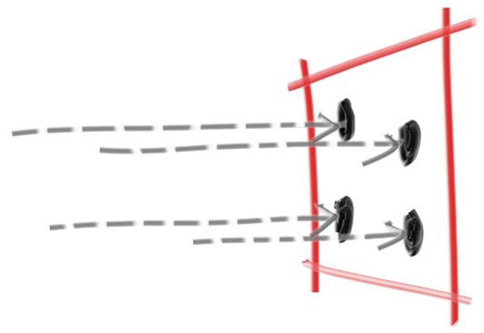

# 8. 抗锯齿（Antialiasing）

如果你放大目前渲染出的图像，你可能会注意到图像边缘存在明显的“阶梯”状锯齿。这种阶梯状的效果通常被称为“走样（aliasing）”或“锯齿（jaggies）”。当现实中的相机拍摄照片时，边缘通常不会出现锯齿现象，因为边缘像素往往是前景和背景颜色的混合。要知道，与我们渲染出的图像不同，真实世界的图像是连续的。换句话说，世界（以及对它的真实图像）本质上是拥有无限分辨率的。我们可以通过对每个像素进行多个采样取平均的方式，获得类似的效果。

目前我们对每个像素仅发出一条射线穿过其中心点，这种方式称为“点采样（point sampling）”。点采样的问题可以通过渲染一个远处的小型棋盘格来说明。假设这个棋盘格是一个 8×8 的黑白格子矩阵，但只有四条射线击中了它，那么这四条射线可能全部命中白格、全部命中黑格，或命中某种奇怪的组合。而在现实中，当我们用肉眼看远处的棋盘时，我们看到的通常是灰色，而不是黑白相间的细点。这是因为我们的眼睛在自然地做一件事：将落在一个离散区域内的（连续变化的）光线进行积分，从而得到一种平均的视觉效果。这正是我们希望光线追踪器能做到的。

显然，如果我们仅仅多次从像素中心发出同一条射线，是不会获得任何额外信息的——每次的结果都是一样的。我们真正需要的是对像素周围区域的光线进行采样，然后将这些采样结果整合起来，以近似真实连续的光照情况。那么，具体该如何对像素周围的光线进行积分呢？

我们将采用最简单的一种模型：对以像素为中心、边界延伸到四周邻近像素中点的一小块正方形区域进行采样。这种方式并不是最优的，但它是最直接易懂的。（如果你想深入了解这个话题，可以参考《A Pixel is Not a Little Square》这篇文章。）





## 8.1. 随机数工具

我们接下来会需要一个能够生成真实随机数（real random numbers）的随机数生成器。这个函数应当返回一个标准随机数（canonical random number），按照惯例，这个数应落在区间 0 ≤ n < 1 之间。注意这个“小于 1”的限制是很重要的，因为我们有时会利用这一点来避免边界问题。

一个简单的实现方式是使用 <cstdlib> 头文件中的 std::rand() 函数。该函数会返回一个介于 0 到 RAND_MAX 之间的整数。因此，我们可以利用下面这段代码来生成一个符合要求的真实随机数，这段代码应添加到 rtweekend.h 文件中：

```c
#include <cmath>
#include <cstdlib>
#include <iostream>
#include <limits>
#include <memory>
...

// Utility Functions

inline double degrees_to_radians(double degrees) {
    return degrees * pi / 180.0;
}

inline double random_double() {
    // Returns a random real in [0,1).
    return std::rand() / (RAND_MAX + 1.0);
}

inline double random_double(double min, double max) {
    // Returns a random real in [min,max).
    return min + (max-min)*random_double();
}
```


C++ 传统上没有标准的随机数生成器，但新版本的 C++ 已通过 <random> 头文件解决了这一问题（有些专家认为这并不完美）。如果你想使用它，可以通过以下方法获得一个符合我们所需的条件的随机数：

```c
...

#include <random>

...

inline double random_double() {
    static std::uniform_real_distribution<double> distribution(0.0, 1.0);
    static std::mt19937 generator;
    return distribution(generator);
}

inline double random_double(double min, double max) {
    // Returns a random real in [min,max).
    return min + (max-min)*random_double();
}

...
```

## 8.2. 多重采样生成像素（Generating Pixels with Multiple Samples）

对于一个使用**多重采样（multiple samples）**生成的像素，我们会从像素周围的区域选取多个采样点，然后对每次采样得到的光照（颜色）值进行平均，得到最终的颜色。

首先，我们需要更新 write_color() 函数，以考虑采样次数：我们需要对所有采样的结果取平均。实现上，在每次采样时累加完整的颜色值，最后在写出颜色之前进行一次除法（除以采样总数）。

为了确保最终的颜色值仍保持在 [0,1] 的合法范围内，我们会引入一个小的辅助函数：interval::clamp(x)，用于对颜色分量进行限制。

这一更新后的逻辑流程如下：

1. 对每个像素进行多次采样；
2. 将每次采样得到的颜色值累加；
3. 将最终总和除以采样次数，得到平均颜色；
4. 使用 clamp() 函数将颜色分量限制在合法范围内；
5. 写出颜色。

这样做不仅可以模拟更真实的连续光照效果，还能有效减轻锯齿问题，实现抗锯齿渲染效果。

```c
class interval {
  public:
    ...

    bool surrounds(double x) const {
        return min < x && x < max;
    }

    double clamp(double x) const {
        if (x < min) return min;
        if (x > max) return max;
        return x;
    }
    ...
};
```

```c
#include "interval.h"
#include "vec3.h"

using color = vec3;

void write_color(std::ostream& out, const color& pixel_color) {
    auto r = pixel_color.x();
    auto g = pixel_color.y();
    auto b = pixel_color.z();

    // Translate the [0,1] component values to the byte range [0,255].
    static const interval intensity(0.000, 0.999);
    int rbyte = int(256 * intensity.clamp(r));
    int gbyte = int(256 * intensity.clamp(g));
    int bbyte = int(256 * intensity.clamp(b));

    // Write out the pixel color components.
    out << rbyte << ' ' << gbyte << ' ' << bbyte << '\n';
}
```

现在我们来更新 camera 类，引入并使用一个新的函数 camera::get_ray(i, j)，用于为每个像素生成不同的采样光线。这个函数将引入一个新的辅助函数 sample_square()，它用于在以原点为中心的单位正方形内生成一个随机采样点。

随后，我们会将这个理想单位正方形中的随机采样点转换回我们当前正在采样的具体像素位置，从而生成具有一定偏移的光线，实现像素内部的随机采样（用于抗锯齿、多重采样等目的）

```c
class camera {
  public:
    double aspect_ratio      = 1.0;  // Ratio of image width over height
    int    image_width       = 100;  // Rendered image width in pixel count
    int    samples_per_pixel = 10;   // Count of random samples for each pixel

    void render(const hittable& world) {
        initialize();

        std::cout << "P3\n" << image_width << ' ' << image_height << "\n255\n";

        for (int j = 0; j < image_height; j++) {
            std::clog << "\rScanlines remaining: " << (image_height - j) << ' ' << std::flush;
            for (int i = 0; i < image_width; i++) {
                color pixel_color(0,0,0);
                for (int sample = 0; sample < samples_per_pixel; sample++) {
                    ray r = get_ray(i, j);
                    pixel_color += ray_color(r, world);
                }
                write_color(std::cout, pixel_samples_scale * pixel_color);
            }
        }

        std::clog << "\rDone.                 \n";
    }
    ...
  private:
    int    image_height;         // Rendered image height
    double pixel_samples_scale;  // Color scale factor for a sum of pixel samples
    point3 center;               // Camera center
    point3 pixel00_loc;          // Location of pixel 0, 0
    vec3   pixel_delta_u;        // Offset to pixel to the right
    vec3   pixel_delta_v;        // Offset to pixel below

    void initialize() {
        image_height = int(image_width / aspect_ratio);
        image_height = (image_height < 1) ? 1 : image_height;

        pixel_samples_scale = 1.0 / samples_per_pixel;

        center = point3(0, 0, 0);
        ...
    }

    ray get_ray(int i, int j) const {
        // Construct a camera ray originating from the origin and directed at randomly sampled
        // point around the pixel location i, j.

        auto offset = sample_square();
        auto pixel_sample = pixel00_loc
                          + ((i + offset.x()) * pixel_delta_u)
                          + ((j + offset.y()) * pixel_delta_v);

        auto ray_origin = center;
        auto ray_direction = pixel_sample - ray_origin;

        return ray(ray_origin, ray_direction);
    }

    vec3 sample_square() const {
        // Returns the vector to a random point in the [-.5,-.5]-[+.5,+.5] unit square.
        return vec3(random_double() - 0.5, random_double() - 0.5, 0);
    }

    color ray_color(const ray& r, const hittable& world) const {
        ...
    }
};

#endif
```

除了上面提到的 sample_square() 函数之外，你还会在 GitHub 的源码中找到一个名为 sample_disk() 的函数。这个函数的目的是为了让你可以尝试使用非方形像素区域进行采样实验，不过本书不会使用它。值得注意的是，sample_disk() 依赖一个稍后定义的函数 random_in_unit_disk()。

```c
int main() {
    ...

    camera cam;

    cam.aspect_ratio      = 16.0 / 9.0;
    cam.image_width       = 400;
    cam.samples_per_pixel = 100;

    cam.render(world);
}
```

放大生成的图像，我们可以看到边缘像素的差异。


