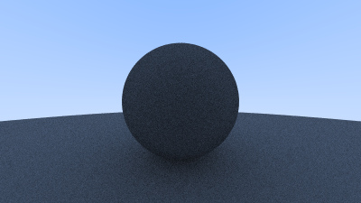

# 9. 漫反射材质（Diffuse Materials）
现在我们已经实现了物体和每个像素的多条射线采样，就可以开始实现一些更真实的材质了。我们将从漫反射材质（也称为哑光材质）开始。一个关键问题是，我们是否要将几何体和材质分离（例如可以给多个球体赋予相同材质，或者给一个球体赋予多个材质），还是将几何体与材质紧密绑定（这在几何和材质紧密耦合的程序化对象中可能更实用）。我们将采用分离的设计方式——这在大多数渲染器中是常见做法——但也请注意，其他设计方式也是存在的。

## 9.1. 简单的漫反射材质

不自行发光的漫反射物体仅仅呈现周围环境的颜色，同时会调制自身固有颜色（intrinsic color）。从漫反射表面反射的光线方向是随机的，因此如果我们向两个漫反射表面之间的缝隙发射三条光线，它们每条都会表现出不同的随机行为：


它们（光线）也可能不是被反射，而是被吸收。表面越暗，光线被吸收的概率就越高（这也是它看起来较暗的原因！）。实际上，任何能够对反射方向进行随机化的算法，都能产生出哑光（matte）效果的表面。我们从最直观的模型开始：一个表面会以完全均匀的方式随机反射光线。对于这种材质，射向表面的光线在表面反弹时，在所有离开表面的方向中具有相同的概率。


这种非常直观的材质是最简单的一种漫反射类型——事实上，许多早期的光线追踪论文都使用了这种漫反射方法（后来才逐步采用更精确的模型，我们稍后也会实现）。

目前我们还没有一种方式来随机地反射一条射线，因此我们需要在向量工具头文件中添加一些新函数。首先，我们需要的是一个功能：生成任意随机向量。

```c
class vec3 {
  public:
    ...

    double length_squared() const {
        return e[0]*e[0] + e[1]*e[1] + e[2]*e[2];
    }

    static vec3 random() {
        return vec3(random_double(), random_double(), random_double());
    }

    static vec3 random(double min, double max) {
        return vec3(random_double(min,max), random_double(min,max), random_double(min,max));
    }
};
```

接下来，我们需要确定如何操作一个随机向量，使其结果只出现在半球面上。虽然有解析方法可以做到这一点，但这些方法实际上理解起来相当复杂，实现起来也较为繁琐。相反，我们将采用通常最简单的算法：拒绝采样法（rejection method）。拒绝采样法的工作原理是反复生成随机样本，直到生成满足条件的样本为止。换句话说，就是不断“拒绝”不符合条件的样本，直到找到合适的那个。

使用拒绝采样法生成半球面上的随机向量，有许多同样有效的方法，但出于简便起见，我们选择以下最简单的方案：

1. 在单位球体内部生成一个随机向量；
2. 对该向量进行归一化，使其延伸到球面上；
3. 如果归一化后的向量位于错误的半球，则将其取反。

首先，我们用拒绝采样法在单位球体内部生成随机向量（单位球指半径为 1 的球体）。具体步骤是：
在包含单位球的立方体内随机选取一点（即 x, y, z 均在区间 [-1, +1] 内）。如果这个点位于单位球体外部，则重新生成，直到找到一个位于单位球内或球面上的点为止。


```c
...

inline vec3 unit_vector(const vec3& v) {
    return v / v.length();
}

inline vec3 random_unit_vector() {
    while (true) {
        auto p = vec3::random(-1,1);
        auto lensq = p.length_squared();
        if (lensq <= 1)
            return p / sqrt(lensq);
    }
}
```

遗憾的是，我们需要处理一个与浮点数精度相关的小问题。由于浮点数具有有限的精度，当数值非常小时，其平方可能会下溢为零。因此，如果向量的三个坐标值都足够小（即非常接近球心），该向量的范数（长度）将会是零，从而归一化时会产生错误结果，即向量变成 [±∞, ±∞, ±∞]。

为了解决这个问题，我们需要拒绝那些位于球心附近“黑洞”区域内的点。使用双精度浮点数（64位浮点数）时，只要数值大于约 10^{-160}，就可以安全地避免这种下溢问题。

下面是我们更健壮的函数实现：

```c
inline vec3 random_unit_vector() {
    while (true) {
        auto p = vec3::random(-1,1);
        auto lensq = p.length_squared();
        if (1e-160 < lensq && lensq <= 1)
            return p / sqrt(lensq);
    }
}
```

现在我们有了一个随机单位向量，可以通过与表面法线进行比较来确定它是否位于正确的半球上：


我们可以利用表面法线与随机矢量的点积来确定矢量是否位于正确的半球。如果点积为正，则说明该向量位于正确的半球。如果点积为负，则需要反转矢量。

```c
...

inline vec3 random_unit_vector() {
    while (true) {
        auto p = vec3::random(-1,1);
        auto lensq = p.length_squared();
        if (1e-160 < lensq && lensq <= 1)
            return p / sqrt(lensq);
    }
}

inline vec3 random_on_hemisphere(const vec3& normal) {
    vec3 on_unit_sphere = random_unit_vector();
    if (dot(on_unit_sphere, normal) > 0.0) // In the same hemisphere as the normal
        return on_unit_sphere;
    else
        return -on_unit_sphere;
}
```
如果一条光线从材质表面反弹时保持了100%的颜色，我们称这种材质为“白色材质”；如果光线反弹时保持了0%的颜色，我们称之为“黑色材质”。

作为我们新漫反射材质的初步演示，我们将把 ray_color 函数设置为在每次反弹时返回原颜色的50%。这样，我们预期最终会得到一种漂亮的灰色效果。

```c
class camera {
  ...
  private:
    ...
    color ray_color(const ray& r, const hittable& world) const {
        hit_record rec;

        if (world.hit(r, interval(0, infinity), rec)) {
            vec3 direction = random_on_hemisphere(rec.normal);
            return 0.5 * ray_color(ray(rec.p, direction), world);
        }

        vec3 unit_direction = unit_vector(r.direction());
        auto a = 0.5*(unit_direction.y() + 1.0);
        return (1.0-a)*color(1.0, 1.0, 1.0) + a*color(0.5, 0.7, 1.0);
    }
};
```



## 9.2 限制子光线的数量

在这里潜藏着一个潜在的问题。注意 ray_color 函数是递归的。那么它什么时候会停止递归呢？当它没有击中任何物体时就会停止。然而在某些情况下，这可能需要很长时间——长到可能导致栈溢出（stack overflow）。为了防止这种情况，我们可以限制最大递归深度，当递归深度用尽时，直接返回零光贡献（黑色）：

```c

class camera {
  public:
    double aspect_ratio      = 1.0;  // Ratio of image width over height
    int    image_width       = 100;  // Rendered image width in pixel count
    int    samples_per_pixel = 10;   // Count of random samples for each pixel
    int    max_depth         = 10;   // Maximum number of ray bounces into scene

    void render(const hittable& world) {
        initialize();

        std::cout << "P3\n" << image_width << ' ' << image_height << "\n255\n";

        for (int j = 0; j < image_height; j++) {
            std::clog << "\rScanlines remaining: " << (image_height - j) << ' ' << std::flush;
            for (int i = 0; i < image_width; i++) {
                color pixel_color(0,0,0);
                for (int sample = 0; sample < samples_per_pixel; sample++) {
                    ray r = get_ray(i, j);
                    pixel_color += ray_color(r, max_depth, world);
                }
                write_color(std::cout, pixel_samples_scale * pixel_color);
            }
        }

        std::clog << "\rDone.                 \n";
    }
    ...
  private:
    ...
    color ray_color(const ray& r, int depth, const hittable& world) const {
        // If we've exceeded the ray bounce limit, no more light is gathered.
        if (depth <= 0)
            return color(0,0,0);

        hit_record rec;

        if (world.hit(r, interval(0, infinity), rec)) {
            vec3 direction = random_on_hemisphere(rec.normal);
            return 0.5 * ray_color(ray(rec.p, direction), depth-1, world);
        }

        vec3 unit_direction = unit_vector(r.direction());
        auto a = 0.5*(unit_direction.y() + 1.0);
        return (1.0-a)*color(1.0, 1.0, 1.0) + a*color(0.5, 0.7, 1.0);
    }
};

```


```c
int main() {
    ...

    camera cam;

    cam.aspect_ratio      = 16.0 / 9.0;
    cam.image_width       = 400;
    cam.samples_per_pixel = 100;
    cam.max_depth         = 50;

    cam.render(world);
}
```


## 9.3 修复“阴影痤疮（Shadow Acne）”问题

我们还需要解决一个微妙的 Bug。当光线与物体表面相交时，会尝试精确计算出交点。不幸的是，这个计算容易受到浮点数舍入误差的影响，导致交点的位置略有偏差。这意味着下一条反弹光线（即从表面随机发出的光线）的起点不一定完全贴合表面：它可能恰好位于表面之上；
也可能在表面之下。如果光线的起点刚好落在表面之下，那么它可能会再次与这个表面相交。
也就是说，它会在非常接近 t = 0.00000001 的位置检测到一次命中（或其它浮点近似值），从而导致光线错误地命中自身表面。解决这个问题的最简单方式是：忽略距离起点非常近的相交点。我们只需要在调用 world.hit() 时，把光线允许的最近交点限制为 0.001，避免误判“击中自己”：

```c
class camera {
  ...
  private:
    ...
    color ray_color(const ray& r, int depth, const hittable& world) const {
        // If we've exceeded the ray bounce limit, no more light is gathered.
        if (depth <= 0)
            return color(0,0,0);

        hit_record rec;

        if (world.hit(r, interval(0.001, infinity), rec)) {
            vec3 direction = random_on_hemisphere(rec.normal);
            return 0.5 * ray_color(ray(rec.p, direction), depth-1, world);
        }

        vec3 unit_direction = unit_vector(r.direction());
        auto a = 0.5*(unit_direction.y() + 1.0);
        return (1.0-a)*color(1.0, 1.0, 1.0) + a*color(0.5, 0.7, 1.0);
    }
};
```

## 9.4 真正的朗伯反射（True Lambertian Reflection）

在半球上均匀散射反射光线虽然可以产生柔和的漫反射效果，但我们实际上可以做得更好。更准确地表示真实世界中的漫反射物体的方法是使用朗伯分布（Lambertian distribution）。朗伯分布会以与 cos(ϕ) 成正比的方式散射反射光线，其中 ϕ 是反射光线方向与表面法线之间的夹角。这意味着，反射光线最可能向接近法线的方向散射，而越偏离法线的方向越不可能。这种非均匀的朗伯散射比我们之前的均匀散射模型更真实地模拟了材料的反射行为。

如何实现朗伯散射? 我们可以通过将一个随机单位向量加到法线向量上来实现这种分布。在物体表面的交点处，有两个关键量：交点位置：p 表面法线：n; 在这个交点处，物体表面拥有两个方向，因此可以以这个交点为切点建立两个单位球面（每个方向一个），它们的中心将分别偏移一个单位长度，即球的半径：一个单位球心在 P + n 方向（位于表面外侧）一个单位球心在 P - n 方向（位于表面内侧）。因此，这两个单位球分别正好贴合表面，只在一点接触。

我们希望选择与光线原点位于同一侧的那个单位球面。接着，从该单位球面上随机选择一个点 S，并从交点 P 发出一条指向 S 的射线，也就是 S - P。


图 14：根据朗伯分布随机生成一个向量


只需要对之前的代码做如下小改动即可：

```c
class camera {
    ...
    color ray_color(const ray& r, int depth, const hittable& world) const {
        // 如果递归深度超过限制，返回黑色（无光贡献）
        if (depth <= 0)
            return color(0,0,0);

        hit_record rec;

        if (world.hit(r, interval(0.001, infinity), rec)) {
            // 使用朗伯散射（法线 + 随机单位向量）
            vec3 direction = rec.normal + random_unit_vector();
            return 0.5 * ray_color(ray(rec.p, direction), depth-1, world);
        }

        vec3 unit_direction = unit_vector(r.direction());
        auto a = 0.5*(unit_direction.y() + 1.0);
        return (1.0-a)*color(1.0, 1.0, 1.0) + a*color(0.5, 0.7, 1.0);
    }
};
```


渲染结果对比


渲染后的图像看起来与之前的效果相似，但在当前仅有两个球体的简单场景中，仍能观察到两个重要变化：

阴影变得更深了
两个球体被天空染上了蓝色
这两个变化都归因于光线的散射分布更集中于法线方向：
对于漫反射物体，它们会显得更暗，因为更少的光线朝向相机方向反弹；
对于阴影区域，更多光线垂直向上反弹，从而使球体下方的区域变得更暗。


## 9.5 使用伽玛校正以获得准确的颜色强度

请注意球体下方的阴影。画面整体看起来非常暗，但我们的球体每次反弹仅吸收一半的能量，因此它们的反射率为 50%。在现实中，这样的球体应当看起来相当明亮（类似浅灰色），但图像中的球体却显得非常暗。如果我们完整地走一遍漫反射材质的亮度范围，这一点会更加明显。我们首先将 ray_color 函数中的反射率从 0.5（50%）改为 0.1（10%）：

```c
class camera {
    ...
    color ray_color(const ray& r, int depth, const hittable& world) const {
        // 如果光线反弹次数超出限制，不再收集光。
        if (depth <= 0)
            return color(0,0,0);

        hit_record rec;

        if (world.hit(r, interval(0.001, infinity), rec)) {
            vec3 direction = rec.normal + random_unit_vector();
            return 0.1 * ray_color(ray(rec.p, direction), depth-1, world);
        }

        vec3 unit_direction = unit_vector(r.direction());
        auto a = 0.5*(unit_direction.y() + 1.0);
        return (1.0-a)*color(1.0, 1.0, 1.0) + a*color(0.5, 0.7, 1.0);
    }
};
```

我们以新的 10% 反射率渲染图像，然后再将反射率设置为 30%，继续渲染。之后依次使用 50%、70%、最后是 90% 进行渲染。你可以将这些图像从左至右叠加在你喜欢的图像编辑器中，就能直观地看到亮度范围（gamut）逐渐变亮的效果。这就是我们目前为止所使用的亮度范围：


如果你仔细观察，或者使用取色工具查看，你会发现 50% 反射率的渲染图像（中间的那一幅）远远不够亮，无法称得上是黑白之间的中灰色。实际上，70% 反射率的图像更接近中灰。其原因在于，几乎所有的计算机程序都假设图像在写入文件之前已经经过“伽玛校正”。这意味着 0 到 1 之间的颜色值在存储为字节前已经经过某种变换。未经过此变换的数据被称为线性空间（linear space）图像，而经过变换的数据则被称为伽玛空间（gamma space）图像。很可能你正在使用的图像查看器期望的是伽玛空间图像，而我们提供的是线性空间图像。这就是图像看起来比实际应该的亮度要暗的原因。

图像采用伽玛空间存储有很多合理的原因，但对于我们的目的而言，只需意识到这一点就够了。我们将把数据转换到伽玛空间，以便图像查看器能更准确地显示图像。作为一个简单的近似方法，我们可以使用“伽玛 2”作为变换，即从伽玛空间到线性空间的幂。我们需要从线性空间转向伽玛空间，这就意味着使用其反幂，即 1/gamma，对于 gamma = 2 来说，就是平方根（√）。我们还需确保稳健地处理负数输入。

```c
inline double linear_to_gamma(double linear_component)
{
    if (linear_component > 0)
        return std::sqrt(linear_component);

    return 0;
}

void write_color(std::ostream& out, const color& pixel_color) {
    auto r = pixel_color.x();
    auto g = pixel_color.y();
    auto b = pixel_color.z();

    // 对每个颜色分量应用从线性空间到伽玛空间的转换，使用 gamma 2
    r = linear_to_gamma(r);
    g = linear_to_gamma(g);
    b = linear_to_gamma(b);

    // 将 [0,1] 区间的颜色值转换为字节范围 [0,255]
    static const interval intensity(0.000, 0.999);
    int rbyte = int(256 * intensity.clamp(r));
    int gbyte = int(256 * intensity.clamp(g));
    int bbyte = int(256 * intensity.clamp(b));

    // 输出像素颜色分量
    out << rbyte << ' ' << gbyte << ' ' << bbyte << '\n';
}
```

通过使用这种伽玛校正方法，我们现在得到了一个从暗到亮更一致、过渡更平滑的亮度渐变效果：


```c

```
