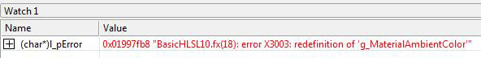

# Effects（Direct3D 11）

DirectX Effect 是一组管线状态的集合，这些状态由 HLSL 编写的表达式以及特定于 effect 框架的语法设置。

在编译一个 effect 之后，可以使用 effect 框架的 API 进行渲染。effect 的功能可以非常简单，比如一个用于变换几何体的顶点着色器和一个输出纯色的像素着色器；也可以非常复杂，比如一个需要多个渲染通道的渲染技术，它使用图形管线的所有阶段，并操控着色器状态以及非可编程着色器相关的管线状态。

第一步是组织你想通过 effect 控制的各种状态。这些状态包括着色器状态（顶点、细分控制、细分评估、几何、像素和计算着色器）、着色器使用的纹理和采样器状态，以及其他非可编程的管线状态。你可以将 effect 作为文本字符串在内存中创建，但通常随着其规模增大，最好将其存储在一个 effect 文件中（以 .fx 为扩展名的文本文件）。要使用一个 effect，你必须先对其进行编译（检查 HLSL 语法以及 effect 框架语法），通过 API 调用初始化 effect 状态，并修改渲染循环以调用渲染相关的 API。

一个 effect 将某一特定效果所需的所有渲染状态封装到一个称为“technique（技术）”的渲染函数中。一个“pass（通道）”是 technique 的子集，包含渲染状态。若要实现一个多通道的渲染效果，可以在一个 technique 中实现一个或多个 pass。例如，假设你想使用一组深度/模板缓冲渲染几何体，然后在其上方绘制一些精灵。你可以在第一个 pass 中实现几何体渲染，在第二个 pass 中实现精灵绘制。要渲染这个效果，只需在渲染循环中依次渲染两个 pass 即可。一个 effect 可以实现任意数量的 technique。当然，technique 数量越多，effect 的编译时间也越长。你可以利用这种功能，创建适用于不同硬件的多种 technique。这允许应用程序根据检测到的硬件能力，优雅地降级性能表现。

多个 technique 可以被组织在一个组中（使用语法 fxgroup）。technique 的分组方式是灵活的。例如，可以为每种材质创建一个组；每个材质对应一个 technique 集合，用于不同硬件等级；每个 technique 又包含一组 pass，用以定义该硬件上的材质表现。

## 在效果中组织状态（Direct3D 11）

**在 Direct3D 11 中，某些管线阶段的 effect 状态是通过结构体来组织的。以下是这些结构体的对应关系**

| 管线状态阶段                | 对应结构体                                           |
| --------------------- | ----------------------------------------------- |
| 光栅化（Rasterization）    | `D3D11_RASTERIZER_DESC`                         |
| 输出合并阶段（Output Merger） | `D3D11_BLEND_DESC` 和 `D3D11_DEPTH_STENCIL_DESC` |
| 着色器（Shaders）          | 见下文说明                                           |

对于着色器阶段，由于状态变更的控制需要更精细，状态被进一步细分为常量缓冲区状态（constant buffer state）、采样器状态（sampler state）、着色器资源状态（shader resource state），以及（针对像素和计算着色器）无序访问视图状态（unordered access view state）。这种划分使得应用程序可以仅更新发生变化的状态，从而减少需要传输到 GPU 的数据量，提高性能。

## 那么，如何在 effect 中组织管线状态呢？

答案是顺序并不重要。全局变量不必放在文件顶部。但 SDK 中的所有示例都遵循相同的顺序，这是良好的实践，有助于统一数据结构。因此，以下是 DirectX SDK 示例中数据组织的简要说明：

- 全局变量（Global Variables）
- 着色器（Shaders）
- 组（Groups）、技术（Techniques）与通道（Passes）

## 全局变量（Global Variables）
和标准 C 语言的实践一样，全局变量通常声明在文件顶部。这些变量大多数会由应用程序初始化，然后被 effect 使用。有些变量初始化后保持不变，另一些则每帧更新。effect 变量的作用域类似于 C 函数规则：声明在函数之外的变量是全局可见的，而函数内部声明的变量仅在函数内可见。

以下是 BasicHLSL10.fx 文件中声明变量的示例：

```c
// Global variables
float4 g_MaterialAmbientColor;      // Material's ambient color

Texture2D g_MeshTexture;            // Color texture for mesh

float    g_fTime;                   // App's time in seconds
float4x4 g_mWorld;                  // World matrix for object
float4x4 g_mWorldViewProjection;    // World * View * Projection matrix


// Texture samplers
SamplerState MeshTextureSampler
{
    Filter = MIN_MAG_MIP_LINEAR;
    AddressU = Wrap;
    AddressV = Wrap;
};
```

effect 变量的语法详见 [Effect Variable Syntax（Direct3D 11）](https://learn.microsoft.com/en-us/windows/win32/direct3d11/d3d11-effect-variable-syntax)，采样器的语法详见 [Sampler Type（DirectX HLSL）](https://learn.microsoft.com/en-us/windows/desktop/direct3dhlsl/dx-graphics-hlsl-sampler)。

## 着色器（Shaders）

着色器是小型可执行程序。可以将其视为封装了“着色器状态”的代码模块，HLSL 代码定义了着色器的功能。图形管线中最多包含五种类型的着色器：

- 顶点着色器（Vertex Shader）：处理顶点数据。一个输入顶点对应一个输出顶点。
- 细分控制着色器（Hull Shader）：处理补丁数据。控制点阶段每次调用输出一个控制点；Fork 与 Join 阶段输出补丁常量数据。

- 细分评估着色器（Domain Shader）：处理原始图元数据。一个输入图元可能输出 0、1 或多个图元。

- 几何着色器（Geometry Shader）：处理图元数据。一个输入图元可能输出 0、1 或多个图元。

- 像素着色器（Pixel Shader）：处理像素数据。一个输入像素对应一个输出像素（除非被裁剪）。

此外，计算着色器（Compute Shader）可用于任意数据类型：

- 计算着色器（Compute Shader）：处理任意数据，其输出与线程数量无关。

着色器是局部函数，遵循 C 风格的函数规则。当编译 effect 时，每个着色器都会单独编译，并在内部保存其函数指针。编译成功后会返回一个 ID3D11Effect 接口，表示已进入中间表示格式。

要获取已编译着色器的更多信息，可使用 着色器反射（Shader Reflection），这类似于向运行时请求“反编译”，以返回关于着色器的详细结构信息。以下是顶点和像素着色器的示例：

```c
struct VS_OUTPUT
{
    float4 Position   : SV_POSITION; // vertex position 
    float4 Diffuse    : COLOR0;      // vertex diffuse color
    float2 TextureUV  : TEXCOORD0;   // vertex texture coords 
};

VS_OUTPUT RenderSceneVS( float4 vPos : POSITION,
                         float3 vNormal : NORMAL,
                         float2 vTexCoord0 : TEXCOORD,
                         uniform int nNumLights,
                         uniform bool bTexture,
                         uniform bool bAnimate )
{
    VS_OUTPUT Output;
    float3 vNormalWorldSpace;
 
    ....    
    
    return Output;    
}


struct PS_OUTPUT
{
    float4 RGBColor : SV_Target;  // Pixel color
};

PS_OUTPUT RenderScenePS( VS_OUTPUT In,
                         uniform bool bTexture ) 
{ 
    PS_OUTPUT Output;

    if( bTexture )
        Output.RGBColor = g_MeshTexture.Sample(MeshTextureSampler, In.TextureUV) * In.Diffuse;
    ....

    return Output;
}
```

着色器函数语法详见 [Effect Function Syntax (Direct3D 11)](https://learn.microsoft.com/en-us/windows/win32/direct3d11/d3d11-effect-function-syntax)。

## 组（Groups）、技术（Techniques）与通道（Passes）

一个 group（组） 是多个 technique（技术） 的集合，而一个 technique 是多个 pass（通道） 的集合（至少包含一个 pass）。每个 pass（与渲染循环中一个 pass 的作用相似）定义了用于渲染几何体所需的着色器状态和其他管线状态。

组是可选的。所有未指定组的技术默认归属一个匿名组。其他组则必须命名。

以下是 BasicHLSL10.fx 中的 technique 示例，其中包括一个 pass：

```c
technique10 RenderSceneWithTexture1Light
{
    pass P0
    {
        SetVertexShader( CompileShader( vs_4_0, RenderSceneVS( 1, true, true ) ) );
        SetGeometryShader( NULL );
        SetPixelShader( CompileShader( ps_4_0, RenderScenePS( true ) ) );
    }
}

fxgroup g0
{
    technique11 RunComputeShader
    {
        pass P0
        {
            SetComputeShader( CompileShader( cs_5_0, CS() ) );
        }
    }
}
```

技术与通道的语法详见 [Effect Technique Syntax（Direct3D 11）](https://learn.microsoft.com/en-us/windows/win32/direct3d11/d3d11-effect-technique-syntax)

# 效果系统接口（Direct3D 11）

效果系统定义了若干用于管理效果状态的接口。这些接口分为两类：一类是运行时用于渲染效果的接口，另一类是用于获取和设置效果变量的反射接口。

## 效果运行时接口
使用运行时接口来渲染一个效果。

| 运行时接口                    | 描述                   |
| ------------------------ | -------------------- |
| `ID3DX11Effect`          | 表示一个或多个用于渲染的组和技术的集合。 |
| `ID3DX11EffectPass`      | 表示状态分配的集合。           |
| `ID3DX11EffectTechnique` | 表示一个或多个 Pass 的集合。    |
| `ID3DX11EffectGroup`     | 表示一个或多个技术的集合。        |


## 效果反射接口
反射功能在效果系统中实现，用于支持读取（和写入）效果状态。可以通过多种方式访问效果变量。

### 设置状态组
使用以下接口来获取和设置一组状态。

| 反射接口                                | 描述            |
| ----------------------------------- | ------------- |
| `ID3DX11EffectBlendVariable`        | 获取和设置混合状态。    |
| `ID3DX11EffectDepthStencilVariable` | 获取和设置深度-模板状态。 |
| `ID3DX11EffectRasterizerVariable`   | 获取和设置光栅化状态。   |
| `ID3DX11EffectSamplerVariable`      | 获取和设置采样器状态。   |


### 设置效果资源
使用以下接口来获取和设置资源。

| 反射接口                                       | 描述                 |
| ------------------------------------------ | ------------------ |
| `ID3DX11EffectConstantBuffer`              | 访问纹理缓冲区或常量缓冲区中的数据。 |
| `ID3DX11EffectDepthStencilViewVariable`    | 访问深度-模板资源中的数据。     |
| `ID3DX11EffectRenderTargetViewVariable`    | 访问渲染目标中的数据。        |
| `ID3DX11EffectShaderResourceVariable`      | 访问着色器资源中的数据。       |
| `ID3DX11EffectUnorderedAccessViewVariable` | 访问无序访问视图中的数据。      |


## 设置其他效果变量
使用以下接口根据变量类型获取和设置状态。

| 反射接口                                 | 描述        |
| ------------------------------------ | --------- |
| `ID3DX11EffectClassInstanceVariable` | 获取类实例。    |
| `ID3DX11EffectInterfaceVariable`     | 获取和设置接口。  |
| `ID3DX11EffectMatrixVariable`        | 获取和设置矩阵。  |
| `ID3DX11EffectScalarVariable`        | 获取和设置标量。  |
| `ID3DX11EffectShaderVariable`        | 获取着色器变量。  |
| `ID3DX11EffectStringVariable`        | 获取和设置字符串。 |
| `ID3DX11EffectType`                  | 获取变量类型。   |
| `ID3DX11EffectVectorVariable`        | 获取和设置向量。  |

所有反射接口均派生自 ID3DX11EffectVariable。

# 特化接口（Direct3D 11）

ID3DX11EffectVariable 提供了若干方法，可以将该接口转换为你所需的特定类型接口。这些方法的命名形式为 AsType，每种效果变量类型都对应一个方法（例如 AsBlend、AsConstantBuffer 等）。

例如，假设你有一个效果包含两个全局变量：时间和世界变换矩阵。

```c
float    g_fTime;
float4x4 g_mWorld;
```

下面是一个获取这些变量的示例：

```c
ID3DX11EffectVariable*        g_pVariable;
ID3DX11EffectMatrixVariable*  g_pmWorld;
ID3DX11EffectScalarVariable*  g_pfTime;

g_pVariable = g_pEffect11->GetVariableByName("g_mWorld");
g_pmWorld = g_pVariable->AsMatrix();
g_pVariable = g_pEffect11->GetVariableByName("g_fTime");
g_pfTime = g_pVariable->AsScalar();

```

通过对接口进行特化，可以将代码简化为一次调用：

```c

g_pmWorld = (g_pEffect11->GetVariableByName("g_mWorld"))->AsMatrix();
g_pfTime  = (g_pEffect11->GetVariableByName("g_fTime"))->AsScalar();

```

继承自 ID3DX11EffectVariable 的接口也包含这些方法，但它们被设计为返回无效对象；只有从 ID3DX11EffectVariable 发起的调用才会返回有效对象。
应用程序可以通过调用 ID3DX11EffectVariable::IsValid 来测试返回的对象是否有效。

# 效果中的接口与类

在 Effects 11 中，可以通过多种方式使用类和接口。有关接口和类的语法，请参阅 Interfaces and Classes。

以下各节将详细说明如何向使用接口的着色器指定类实例。我们将在示例中使用如下接口和类：

```c

interface IColor
{
  float4 GetColor();
};

class CRed : IColor
{
  float4 GetColor() { return float4(1,0,0,1); }
};
class CGreen : IColor
{
  float4 GetColor() { return float4(0,1,0,1); }
};

CRed pRed;
CGreen pGreen;
IColor pIColor;
IColor pIColor2 = pRed;

```

注意，接口实例可以初始化为类实例。类和接口实例的数组也是受支持的，并可以像以下示例中那样初始化：

```c
CRed pRedArray[2];
IColor pIColor3 = pRedArray[1];
IColor pIColorArray[2] = {pRed, pGreen};
IColor pIColorArray2[2] = pRedArray;

```

# Uniform 接口参数

与其他 uniform 数据类型一样，uniform 接口参数必须在 CompileShader 调用中指定。接口参数可以被分配给全局接口实例或全局类实例：

当分配给全局接口实例时，着色器会依赖于该接口实例，因此必须将其设置为某个类实例；

当分配给全局类实例时，编译器会像处理其他 uniform 数据类型一样对着色器进行特化，以使用该类。

这对于以下两种场景尤为重要：

具有 4_x 目标的着色器可以使用接口参数，前提是这些参数是 uniform 的且分配给全局类实例（即不使用动态链接）；

用户可以选择编译多个特化着色器而不使用动态链接，或只编译少量着色器并使用动态链接。

```c
float4 PSUniform( uniform IColor color ) : SV_Target
{
  return color;
}

technique11
{
  pass
  {
    SetPixelShader( CompileShader( ps_4_0, PSUniform(pRed) ) );
  }
  pass
  {
    SetPixelShader( CompileShader( ps_5_0, PSUniform(pIColor2) ) );
  }
}

```

如果 pIColor2 在 API 中未被修改，那么上述两个 pass 在功能上是等价的：第一个使用 ps_4_0 的静态着色器，而第二个使用带动态链接的 ps_5_0 着色器。
如果 pIColor2 通过 effects API 被修改（见下节“设置类实例”），那么第二个 pass 中像素着色器的行为可能发生变化。

# 非 Uniform 接口参数

非 uniform 接口参数会为着色器创建接口依赖。在应用带接口参数的着色器时，必须通过 BindInterfaces 调用来为这些参数赋值。可以在 BindInterfaces 中指定全局接口实例或全局类实例。

```c

float4 PSAbstract( IColor color ) : SV_Target
{
  return color;
}

PixelShader pPSAbstract = CompileShader( ps_5_0, PSAbstract(pRed) );

technique11
{
  pass
  {
    SetPixelShader( BindInterfaces( pPSAbstract, pRed ) );
  }
  pass
  {
    SetPixelShader( BindInterfaces( pPSAbstract, pIColor2 ) );
  }
}

```

如果 pIColor2 在 API 中未被修改，那么上述两个 pass 在功能上是等价的，并都使用动态链接。
如果 pIColor2 通过 effects API 被修改（见下节“设置类实例”），那么第二个 pass 中像素着色器的行为可能会发生变化。

# 设置类实例

当将带动态着色器链接的着色器设置到 Direct3D 11 设备时，必须同时指定类实例。如果使用 NULL 类实例设置此类着色器，将会导致错误。因此，着色器引用的所有接口实例必须关联一个类实例。

以下示例展示了如何从一个 effect 中获取类实例变量，并将其设置给一个接口变量：

```c

ID3DX11EffectPass* pPass = pEffect->GetTechniqueByIndex(0)->GetPassByIndex(1);

ID3DX11EffectInterfaceVariable* pIface = pEffect->GetVariableByName( "pIColor2" )->AsInterface();
ID3DX11EffectClassInstanceVariable* pCI = pEffect->GetVariableByName( "pGreen" )->AsClassInstance();
pIface->SetClassInstance( pCI );
pPass->Apply( 0, pDeviceContext );

// 使用不同的类实例再次应用相同的 pass
pCI = pEffect->GetVariableByName( "pRedArray" )->GetElement(1)->AsClassInstance();
pIface->SetClassInstance( pCI );
pPass->Apply( 0, pDeviceContext );

```

# 效果渲染（Direct3D 11）

一个效果（effect）可以用于存储信息，或是通过一组渲染状态进行渲染。每一个技术（technique）指定一组顶点着色器（vertex shaders）、外壳着色器（hull shaders）、域着色器（domain shaders）、几何着色器（geometry shaders）、像素着色器（pixel shaders）、计算着色器（compute shaders）、着色器状态（shader state）、采样器和纹理状态（sampler and texture state）、无序访问视图状态（unordered access view state）以及其他管线状态（pipeline state）。因此，一旦你将渲染状态组织成一个效果，你就可以通过创建和渲染该效果，将由这些状态所定义的渲染效果封装起来。

要准备一个效果用于渲染，有几个步骤。第一个步骤是编译，这个过程会根据 HLSL 语言的语法和效果框架的规则检查类似 HLSL 的代码。你可以在应用程序中使用 API 调用来编译一个效果，或者使用效果编译工具 fxc.exe 离线编译效果。一旦效果成功编译，你需要通过调用另一组（但非常相似的）API 来创建该效果。

效果创建完成后，使用它还需要两个步骤。首先，你必须初始化效果状态值（即效果变量的值），这可以通过多种设置状态的方法来实现，如果这些变量在 HLSL 中没有初始化的话。对于某些变量，在创建效果时设置一次即可；而另一些变量则需要在每次应用程序调用渲染循环时进行更新。一旦效果变量被正确设置，你就可以通过应用某个技术（technique）来通知运行时进行渲染。以下内容将对这些主题进行更详细的讨论。

使用效果自然也涉及性能方面的考量。这些考量在不使用效果时也大致相同，例如：最小化状态更改的次数，按更新频率组织变量等。这些策略旨在尽量减少从 CPU 到 GPU 传输的数据量，从而最小化潜在的同步问题。

# 编译一个 Effect（Direct3D 11）

在创建好一个效果（effect）之后，下一步就是编译代码，以检查语法错误。

你可以通过调用编译相关的 API 来完成这一操作（如 D3DX11CompileFromFile、D3DX11CompileFromMemory 或 D3DX11CompileFromResource）。这些 API 会调用效果编译器 fxc.exe，该编译器用于编译 HLSL 代码。这也是为什么效果文件中的代码语法与 HLSL 十分类似（虽然有些细节例外，稍后会说明）。fxc.exe 工具包含在 SDK 的 utilities 文件夹中，你也可以选择将着色器或效果文件离线编译。参见命令行运行编译器的相关文档。

## 示例

以下是一个编译效果文件的示例：

```c

WCHAR str[MAX_PATH];
DXUTFindDXSDKMediaFileCch( str, MAX_PATH, L"BasicHLSL10.fx" );

hr = D3DX11CompileFromFile( str, NULL, NULL, pFunctionName, pProfile, D3D10_SHADER_ENABLE_STRICTNESS, NULL, NULL, &pBlob, &pErrorBlob, NULL );

```

## 包含文件（Includes）

编译 API 的一个参数是包含文件接口（include interface）。如果你希望在编译器读取包含文件时加入自定义行为，可以生成一个该接口的实例。每当编译器创建或编译一个使用 include 指针的效果时，都会执行这些自定义行为。要实现自定义的 include 行为，可继承 ID3DInclude 接口，该接口提供了 Open 和 Close 两个方法，你可以在这两个方法中实现自定义逻辑。

## 搜索包含文件

编译器传入 include 处理器的 Open 方法中的 pParentData 参数，可能并不指向包含你需要的 #include 文件的容器。换句话说，pParentData 可能是 NULL。因此，建议你的 include 处理器维护一份自己的 include 文件位置列表，并在 Open 方法中动态添加新路径。

例如，假设着色器代码的包含文件都存储在 somewhereelse 目录中。当编译器调用 include 处理器的 Open 方法以打开 somewhereelse\foo.h 时，处理器可以保存该目录的位置。之后，当编译器需要读取 bar.h 时，处理器可以自动在 somewhereelse 目录中查找。

```c

// Main.hlsl:
#include "somewhereelse\foo.h"

// Foo.h:
#include "bar.h"

```

## 宏（Macros）

在编译效果文件时，也可以传入宏定义。例如，你希望在 BasicHLSL10 中使用两个宏：zero 和 one。效果代码如下：

```c

if( bAnimate )
    vAnimatedPos += float4(vNormal, zero) *  
        (sin(g_fTime+5.5)+0.5)*5;

Output.Diffuse.a = one;

```

对应的宏声明如下：

```c

D3D10_SHADER_MACRO Shader_Macros[3] = { "zero", "0", "one", "1.0f", NULL, NULL };

```

这是一个以 NULL 结尾的宏数组，每个宏通过 D3D10_SHADER_MACRO 结构体定义。

将这些宏指针传递给编译 API，如下：

```c

D3DX11CompileFromFile( str, Shader_Macros, NULL, pFunctionName, 
                       pProfile, D3D10_SHADER_ENABLE_STRICTNESS, NULL, 
                       NULL, &pBlob, &pErrorBlob, NULL );

```

## HLSL 着色器标志（HLSL Shader Flags）

着色器编译标志（flags）为 HLSL 编译器指定约束条件。这些标志会影响编译器生成代码的方式，例如：

- 优化代码体积；
- 包含调试信息（这可能阻止控制流优化）；
- 影响编译目标，决定是否能在旧硬件上运行。

这些标志可以进行逻辑组合，只要没有冲突即可。相关标志列表请参考 D3D10_SHADER 常量文档。

## FX 标志（FX Flags）
创建效果时使用这些标志，可以指定编译行为或运行时效果行为。相关标志列表请参考 D3D10_EFFECT 常量文档。

## 错误检查（Checking Errors）

如果编译过程中出现错误，API 会返回一个包含错误信息的接口 ID3DBlob。虽然这个接口不是直接可读的，但你可以通过返回一个指向其内部缓冲区的指针（其中存储的是字符串）来查看编译错误信息。

以下是一个包含错误的示例（BasicHLSL.fx 文件中同一变量声明了两次）：

```c

float4 g_MaterialAmbientColor;      // 材质的环境光颜色

// 再次声明相同变量
float4 g_MaterialAmbientColor;      // 材质的环境光颜色

```

这个错误会导致编译器返回如下错误信息，如下图所示（Visual Studio 的 Watch 窗口截图）。



由于编译器将错误信息返回为 LPVOID 指针，你可以在 Watch 窗口中将其强制转换为字符字符串查看。

以下是处理编译错误的代码示例：

```c

// 读取 D3DX 效果文件
WCHAR str[MAX_PATH];
ID3DBlob*   l_pBlob_Effect = NULL;
ID3DBlob*   l_pBlob_Errors = NULL;
hr = DXUTFindDXSDKMediaFileCch( str, MAX_PATH, L"BasicHLSL10.fx" );
hr = D3DX11CompileFromFile( str, NULL, NULL, pFunctionName, 
                       pProfile, D3D10_SHADER_ENABLE_STRICTNESS, NULL, 
                       NULL, &pBlob, &pErrorBlob, NULL );

LPVOID l_pError = NULL;
if( pErrorBlob )
{
    l_pError = pErrorBlob->GetBufferPointer();
    // 然后将其转换为 char* 类型以在本地变量窗口中查看
}

```

# 创建一个 Effect（Direct3D 11）

一个 effect 的创建过程是将编译后的 effect 字节码加载到 effect 框架中。与 Effects 10 不同，在 Direct3D 11 中，effect 必须在创建之前就已经完成编译。已经加载到内存中的 effect 可以通过调用 D3DX11CreateEffectFromMemory 来创建。


# 设置 Effect 状态（Direct3D 11）

某些 effect 常量只需初始化一次。一旦初始化，这些状态在整个渲染循环中将被持续应用到设备上。而其他变量则需要在每次调用渲染循环时更新。下面分别展示了设置各种类型变量的基本代码。

Effect 封装了执行一个渲染通道所需的全部渲染状态。从 API 的角度看，Effect 封装了三种类型的状态：

- 常量状态（Constant State）
- 着色器状态（Shader State）
- 纹理状态（Texture State）

## 常量状态（Constant State）

首先，使用 HLSL 数据类型在 Effect 中声明变量：

```c
float4 g_MaterialAmbientColor;      // 材质的环境光颜色
float4 g_MaterialDiffuseColor;      // 材质的漫反射颜色
int g_nNumLights;

float3 g_LightDir[3];               // 世界空间中的光照方向
float4 g_LightDiffuse[3];           // 光源的漫反射颜色
float4 g_LightAmbient;              // 光源的环境光颜色

Texture2D g_MeshTexture;            // 网格的颜色纹理

float    g_fTime;                   // 应用的运行时间（单位：秒）
float4x4 g_mWorld;                  // 世界矩阵
float4x4 g_mWorldViewProjection;    // 世界 * 视图 * 投影 矩阵

```

其次，在应用程序中声明变量，并设置这些值以更新 Effect 变量：

```c

D3DXMATRIX  mWorldViewProjection;
D3DXVECTOR3 vLightDir[MAX_LIGHTS];
D3DXVECTOR4 vLightDiffuse[MAX_LIGHTS];
D3DXMATRIX  mWorld, mView, mProj;

mWorld = g_mCenterMesh * *g_Camera.GetWorldMatrix();
mProj = *g_Camera.GetProjMatrix();
mView = *g_Camera.GetViewMatrix();

```

在 OnD3D11CreateDevice() 中初始化变量指针：

```c

g_pLightDir = g_pEffect11->GetVariableByName("g_LightDir")->AsVector();
g_pLightDiffuse = g_pEffect11->GetVariableByName("g_LightDiffuse")->AsVector();
g_pmWorldViewProjection = g_pEffect11->GetVariableByName("g_mWorldViewProjection")->AsMatrix();
g_pmWorld = g_pEffect11->GetVariableByName("g_mWorld")->AsMatrix();
g_pfTime = g_pEffect11->GetVariableByName("g_fTime")->AsScalar();
g_pMaterialAmbientColor = g_pEffect11->GetVariableByName("g_MaterialAmbientColor")->AsVector();
g_pMaterialDiffuseColor = g_pEffect11->GetVariableByName("g_MaterialDiffuseColor")->AsVector();
g_pnNumLights = g_pEffect11->GetVariableByName("g_nNumLights")->AsScalar();

```

然后，在 OnD3D11FrameRender() 中更新 Effect 变量：

```c

g_pLightDir->SetRawValue(vLightDir, 0, sizeof(D3DXVECTOR3) * MAX_LIGHTS);
g_pLightDiffuse->SetFloatVectorArray((float*)vLightDiffuse, 0, MAX_LIGHTS);
g_pmWorldViewProjection->SetMatrix((float*)&mWorldViewProjection);
g_pmWorld->SetMatrix((float*)&mWorld);
g_pfTime->SetFloat((float)fTime);
g_pnNumLights->SetInt(g_nNumActiveLights);

```

## 获取 Effect 变量中的状态的两种方式

已加载的 Effect 变量中可以通过两种方式获取状态：

方法一： 从 ID3DX11EffectVariable 转换为采样器接口，并获取其状态描述：

```c

D3D11_SAMPLER_DESC sampler_desc;
ID3D11EffectSamplerVariable* l_pD3D11EffectVariable = NULL;

if (g_pEffect11) {
    l_pD3D11EffectVariable = g_pEffect11->GetVariableByName("MeshTextureSampler")->AsSampler();
    if (l_pD3D11EffectVariable->IsValid())
        hr = l_pD3D11EffectVariable->GetBackingStore(0, &sampler_desc);
}

```


方法二： 获取 ID3D11SamplerState，再通过其描述符获取状态：

```c

ID3D11SamplerState* l_ppSamplerState = NULL;
D3D11_SAMPLER_DESC sampler_desc;
ID3D11EffectSamplerVariable* l_pD3D11EffectVariable = NULL;

if (g_pEffect11) {
    l_pD3D11EffectVariable = g_pEffect11->GetVariableByName("MeshTextureSampler")->AsSampler();
    if (l_pD3D11EffectVariable->IsValid()) {
        hr = l_pD3D11EffectVariable->GetSampler(0, &l_ppSamplerState);
        if (l_ppSamplerState)
            l_ppSamplerState->GetDesc(&sampler_desc);
    }
}

```

## 着色器状态（Shader State）

在 Effect 的 technique 的 pass 中声明并分配着色器状态：

```c

VertexShader vsRenderScene = CompileShader(vs_4_0, RenderSceneVS(1, true, true));  

technique10 RenderSceneWithTexture1Light {
    pass P0 {
        SetVertexShader(vsRenderScene);
        SetGeometryShader(NULL);
        SetPixelShader(CompileShader(ps_4_0, RenderScenePS(true)));
    }
}

```

这与未使用 Effect 时的处理方式类似，调用三个函数分别设置顶点、几何和像素着色器。注意该 pass 中未设置 HullShader 和 DomainShader，意味着当前绑定的 Hull/Domain 着色器状态将保持不变。

## 纹理状态（Texture State）

纹理状态设置比普通变量更复杂，因为纹理数据需要通过采样器进行访问。需定义纹理变量以及对应的采样器状态：

```c
Texture2D g_MeshTexture;  // 网格的颜色纹理

SamplerState MeshTextureSampler {
    Filter = MIN_MAG_MIP_LINEAR;
    AddressU = Wrap;
    AddressV = Wrap;
};

```

应用程序中设置纹理的流程如下：

第一步： 获取指向纹理变量的指针：

```c

ID3D11EffectShaderResourceVariable* g_ptxDiffuse = NULL;
g_ptxDiffuse = g_pEffect11->GetVariableByName("g_MeshTexture")->AsShaderResource();

```

第二步： 提供一个资源视图用于访问纹理：
```c

OnD3D11FrameRender() {
    ID3D11ShaderResourceView* pDiffuseRV = NULL;
    ...
    pDiffuseRV = g_Mesh11.GetMaterial(pSubset->MaterialID)->pDiffuseRV11;
    g_ptxDiffuse->SetResource(pDiffuseRV);
    ...
}
```

从应用的角度来看，无序访问视图（Unordered Access Views，UAV）和着色器资源视图（SRV）的处理方式类似。然而，在像素着色器和计算着色器中，UAV 是被直接读取/写入的，不能用于采样操作。


# 应用 Technique（Direct3D 11）

## 一、在设备中设置非着色器状态（Set Non-Shader State）

一些渲染管线的状态并不会由 effect 设置。例如，清除渲染目标（Render Target）和深度模板缓冲区（Depth Stencil）是渲染前的准备工作，这些需要手动调用 API 设置。

示例：清除输出缓冲区

```c
// 清除渲染目标和深度模板缓冲区
float ClearColor[4] = { 0.0f, 0.25f, 0.25f, 0.55f };
ID3D11RenderTargetView* pRTV = DXUTGetD3D11RenderTargetView();
pD3DDevice->ClearRenderTargetView(pRTV, ClearColor);

ID3D11DepthStencilView* pDSV = DXUTGetD3D11DepthStencilView();
pD3DDevice->ClearDepthStencilView(pDSV, D3D11_CLEAR_DEPTH, 1.0, 0);
```


## 二、在设备中设置 Effect 状态（Set Effect State）

设置 Effect 状态的过程通常在渲染循环中进行。方式是从外到内进行：

- 选择一个 Technique
- 依次遍历该 Technique 的 每个 Pass
- 对每个 Pass 应用其状态并执行绘制命令

示例代码如下：


```c

D3D11_TECHNIQUE_DESC techDesc;
pRenderTechnique->GetDesc(&techDesc);

for (UINT p = 0; p < techDesc.Passes; ++p)
{
    pRenderTechnique->GetPassByIndex(p)->Apply(0, pd3dDeviceContext);
    
    pd3dDeviceContext->DrawIndexed(
        (UINT)pSubset->IndexCount,
        0,
        (UINT)pSubset->VertexStart
    );
}

```

说明：
GetPassByIndex(p)->Apply(...)：设置该 pass 的所有状态（着色器、常量缓冲区、纹理等）到 GPU 渲染上下文中。

DrawIndexed(...)：执行实际的渲染操作，此函数并不是由 effect 本身提供的，它使用当前 GPU 状态完成绘制。

小结
Effect 本质上不执行渲染本身，而是用于组织和封装 GPU 状态（包括着色器、纹理、采样器、常量等）。
真正的绘制操作（例如 DrawIndexed）是在设置完 effect 状态后调用的。

# 克隆 Effect

克隆一个 effect 会创建该 effect 的第二份几乎相同的副本。为何说它不是完全相同，请参阅后文中关于 single 修饰符的解释。克隆后的副本在多线程使用效果框架时非常有用，因为为了保持高性能，effect 的运行时本身不是线程安全的。

由于设备上下文（Device Context）也不是线程安全的，因此不同线程应当向 ID3DX11EffectPass::Apply 方法传入不同的设备上下文。

可以使用以下语法克隆一个 effect：

```c

ID3DX11Effect* pClonedEffect = NULL;
UINT Flags = D3DX11_EFFECT_CLONE_FORCE_NONSINGLE;
HRESULT hr = pEffect->CloneEffect( Flags, &pClonedEffect );

```

在上述示例中，克隆后的副本将封装与原始 effect 相同的状态，无论原始 effect 当前所处状态如何。具体包括以下几点：

- 如果 pEffect 是优化过的，则 pClonedEffect 也是优化过的
- 如果 pEffect 包含一些用户管理（user-managed）的变量，pClonedEffect 也将包含相同的用户管理变量（参见下文对 single 的描述）
- 在调用 Apply 更新设备状态之前，pEffect 中任何待更新的变量，在 pClonedEffect 中也将处于待更新状态

以下 Direct3D 11 的设备对象是不可变的，或不会被效果框架更新，因此克隆的 effect 将指向与原始 effect 相同的对象：

- 状态块对象（State block objects）：ID3D11BlendState,ID3D11RasterizerState,ID3D11DepthStencilState,ID3D11SamplerState
- 着色器（Shaders）
- 类实例（Class instances）
- 纹理（Textures）（不包括纹理缓冲区）
- 无序访问视图（Unordered access views）

以下 Direct3D 11 的设备对象既是不可变的又可能被 effect 运行时修改（除非是用户管理的或在克隆中为 single），因此当克隆为非 single 时会创建新的副本：
- 常量缓冲区（Constant buffers）
- 纹理缓冲区（Texture Buffers）

## 单常量缓冲区与纹理缓冲区

请注意，以下讨论适用于常量缓冲区与纹理，但为了阅读方便，以下默认以常量缓冲区为例。

在某些情况下，常量缓冲区可能只由一个线程进行更新，但被多个线程中的克隆 effect 使用。例如，主 effect 更新 world 和 view 矩阵，而这些矩阵在克隆的 effect 中虽被引用却不发生变化。在这种情形下，克隆的 effect 应引用当前的常量缓冲区，而不是重新创建一个。

实现该效果有两种方式：

- 在克隆的 effect 中调用 ID3DX11EffectConstantBuffer::SetConstantBuffer 将其设为用户管理；

- 在 HLSL 代码中将常量缓冲区标记为 single，使得在克隆后，effect 运行时将其视作用户管理。

上述两种方法之间有两个区别：第一种方法中，在调用 SetConstantBuffer 之前将创建一个新的 ID3D11Buffer；当在克隆 effect 中调用 UndoSetConstantBuffer 后，第一种方法下的变量将指向新建的缓冲区（Apply 调用将会更新该缓冲区），而第二种方法中的变量将继续指向原始缓冲区（Apply 不会更新该缓冲区）。

HLSL 示例代码如下：

```c

cbuffer ObjectData
{
    float4 Position;
};

single cbuffer ViewData
{
    float4x4 ViewMatrix;
};

```

在克隆过程中，克隆的 effect 会为 ObjectData 创建一个新的 ID3D11Buffer，并在 Apply 时填充其内容；而对于 ViewData，则继续引用原始的 ID3D11Buffer。若设置了 D3DX11_EFFECT_CLONE_FORCE_NONSINGLE 标志，则在克隆过程中会忽略 single 修饰符。


# 流输出语法（Stream Out Syntax）

使用流输出（Stream Out）的几何着色器（geometry shader）需使用特定的语法进行声明。本文将说明这种语法。在效果运行时（effect runtime）中，此语法会被转换为调用 ID3D11Device::CreateGeometryShaderWithStreamOutput。

## 构造语法（Construct Syntax）

```c

[ StreamingShaderVar = ] ConstructGSWithSO( ShaderVar, "OutputDecl0" )

```
| 名称                 | 描述                                                                                                                       |
| ------------------ | ------------------------------------------------------------------------------------------------------------------------ |
| StreamingShaderVar | 可选。一个 ASCII 字符串，用于唯一标识具有流输出的几何着色器变量名称。该参数是可选的，因为 `ConstructGSWithSO` 也可以直接用于 `SetGeometryShader` 或 `BindInterfaces` 调用中。 |
| ShaderVar          | 一个几何着色器或顶点着色器变量。                                                                                                         |
| OutputDecl0        | 一个字符串，定义第 0 号流中应被输出的着色器输出项。语法见下文。                                                                                        |


这种语法定义于 fx_4_0 文件中。需要注意，在 gs_4_0 和 vs_x 着色器中，只有一个数据流。生成的着色器会将一个数据流输出到流输出单元和光栅化器单元。

```c

[ StreamingShaderVar = ] ConstructGSWithSO( ShaderVar, "OutputDecl0", "OutputDecl1", "OutputDecl2", 
                                            "OutputDecl3", RasterizedStream )

```

| 名称                 | 描述                                                                                                                       |
| ------------------ | ------------------------------------------------------------------------------------------------------------------------ |
| StreamingShaderVar | 可选。一个 ASCII 字符串，用于唯一标识具有流输出的几何着色器变量名称。该参数是可选的，因为 `ConstructGSWithSO` 也可以直接用于 `SetGeometryShader` 或 `BindInterfaces` 调用中。 |
| ShaderVar          | 一个几何着色器或顶点着色器变量。                                                                                                         |
| OutputDecl0        | 一个字符串，定义第 0 号流中应被输出的着色器输出项。                                                                                              |
| OutputDecl1        | 一个字符串，定义第 1 号流中应被输出的着色器输出项。                                                                                              |
| OutputDecl2        | 一个字符串，定义第 2 号流中应被输出的着色器输出项。                                                                                              |
| OutputDecl3        | 一个字符串，定义第 3 号流中应被输出的着色器输出项。                                                                                              |
| RasterizedStream   | 一个整数，指定哪个流将被发送到光栅化器。                                                                                                     |


需要注意，gs_5_0 着色器最多可以定义四个数据流。生成的着色器会为每个非 NULL 的输出声明向流输出单元发送一个数据流，并向光栅化器单元发送一个数据流。

## 流输出声明语法（Stream Out Declaration Syntax）

```c

"[ Buffer: ] Semantic[ SemanticIndex ] [ .Mask ]; [ ... ; ] ... [ ... ;]"

```

| 名称            | 描述                                         |
| ------------- | ------------------------------------------ |
| Buffer        | 可选。一个整数，0 <= Buffer < 4，指定该值将被写入的流输出缓冲区编号。 |
| Semantic      | 一个字符串，与 `SemanticIndex` 一起指定要输出的值。         |
| SemanticIndex | 可选。与 `Semantic` 相关联的索引号。                   |
| Mask          | 可选。一个分量掩码，指示要输出该值的哪些分量。                    |


有一个特殊的语义标识符为 $SKIP，表示空语义，即保留流输出缓冲区中相应内存位置的原值不变。$SKIP 语义不能包含 SemanticIndex，但可以使用 Mask。
整个流输出声明也可以为 NULL。

## 示例（Example）

```c

struct GSOutput
{
    int4 Pos : Position;
    int4 Color : Color;
    int4 Texcoord : Texcoord;
};

[maxvertexcount(1)]
void gsBase(inout PointStream<GSOutput> OutputStream, inout PointStream<GSOutput> OutputStream1)
{
    GSOutput output;
    output.Pos = int4(1,2,3,4);
    output.Color = int4(5,6,7,8);
    output.Texcoord = int4(9,10,11,12);
    OutputStream.Append(output);

    output.Pos = int4(1,2,3,4);
    output.Color = int4(5,6,7,8);
    output.Texcoord = int4(9,10,11,12);
    OutputStream1.Append(output);
};

```

```c

GeometryShader pGSComp = CompileShader(gs_5_0, gsBase());
GeometryShader pGSwSO = ConstructGSWithSO(pGSComp, "0:Position.xy; 1:Position.zw; 2:Color.xy", 
                                                   "3:Texcoord.xyzw; 3:$SKIP.x;", NULL, NULL, 1);
```

以下两个 pass 执行相同的操作：

```c

technique11 SOPoints
{
    pass 
    {
        SetGeometryShader(ConstructGSWithSO(pGSComp, "0:Position.xy; 1:Position.zw; 2:Color.xy", 
                                                     "3:Texcoord.xyzw; 3:$SKIP.x;", NULL, NULL, 1));
    }
    pass 
    {
        SetGeometryShader(pGSwSO);
    }
}
```